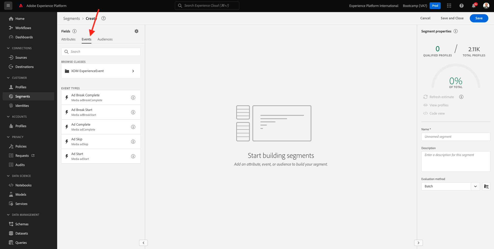

# 1.3标准区段 — UI

Neste experactício， você irá criar summento usando o Constructor de Segmentos da Adobe Experience Platform。

## 希斯托里亚

阿塞斯 [Adobe Experience Platform](https://experience.adobe.com/platform). 登录后，我会在Adobe Experience Platform。

连续性，职业是选择者 **沙盒**. 没人会用沙盒做选择 ``Bootcamp``. É posível fazer isso clicando no texto **[!UICONTROL 生产产品]** na linha azul na parte superior da tela。 在沙箱里自行选择 [!UICONTROL 沙盒] 专门的。

没有菜单 **区段**. Nesta página， você tem uma visão geral de todos os segmentos exists。 Clium no botão + Criar segmento para começar a criar novo segmento。

Quando estiver no no novo constructor de segmentos， você irá perceber imediatamente a opção de menu **属性** 是个反向链接 **XDM个人配置文件**.

XDM是一种语言，是一种语言，是一种关于建筑师的基础。 Todos os dados ingeridos na plataforma devemem ser mapeados relação ao XDM e， portanto， todos dados se tornam parte do memo modelo de dados， independementte da origem desdos。 Isso提供uma grand vantagem ao criar segmentos， pois a partier dessa interface do usuário do constructor de segmento， e possivel combinar dados de qualquer origem no mesmo fluxo de trabalho。 Os segmentos criados no Construtor de segmentos podem ser enviados para soluções como， Adobe Campaign e Adobe Audience Manager para ativação。

Agora você precisa criar um segmento de todos os clientes que visualizaram o producto **Real-Time CDP**.

Para construir este segmento， vocêisa adicionar um Evento de experincia。 Você pode encontror todos os Eventos de experincia clicando no icone **事件** na barra de menu **字段**.

埃姆·塞吉达，那就是 **XDM ExperienceEvents** 你的上级。 团 **XDM ExperienceEvent**.

阿塞斯 **产品列表项**.

选择项 **名称** e arraste e solto o objeto **名称** 做segmentos na seção **事件**. 塞吉达，塞金特·塞拉：

比多拉桑·德韦·泽尔 **等于** e，没有坎波德恩特拉达， insira **Real-time CDP**.

Sempre que adicionar um elemento ao constructor de segmentos， você pode clicar no botão **刷新估计** para obter uma nova estimativa da população em seu segmento.

段 **评价方法**，选择一项 **Edge**.

拜托菲姆，你们要去救我吧。

Como modelo de nomenclatura，使用：

- `yourLastName - Interest in Real-Time CDP`

Em seguida，帮不了 **保存并关闭** 塞尔瓦·塞门托。

Agora você irá reconn a página de visão geral do segmento， onde verá uma visualização de amostra dos perfis de clientes se qualificam para o seu segmento。

Agora você pode continuars no próximo excresio e usar seu segmento com o Adobe Target。

埃塔帕： [1.4阿桑：恩维埃·塞门托·帕拉·Adobe Target](./ex4.md)

[乌萨里奥1号河畔](./uc1.md)

[托多斯 — 莫杜洛斯](../../overview.md)
