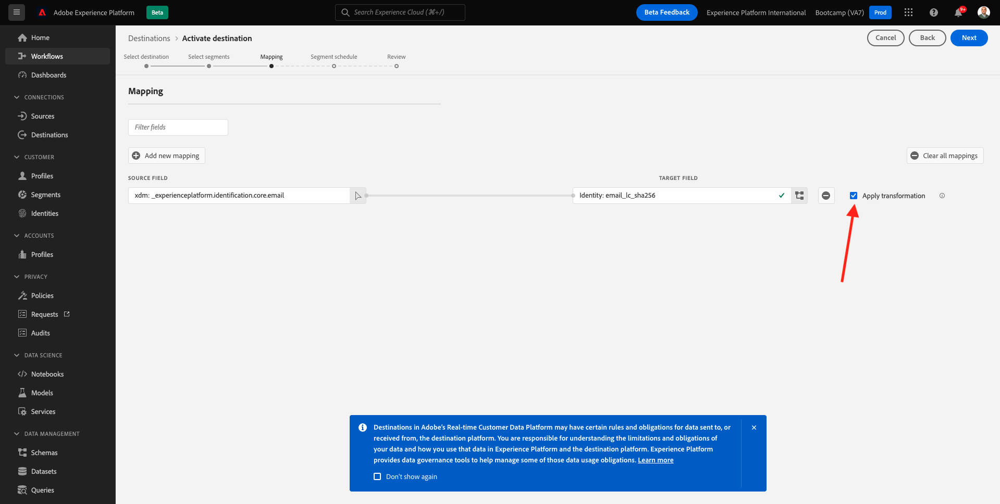
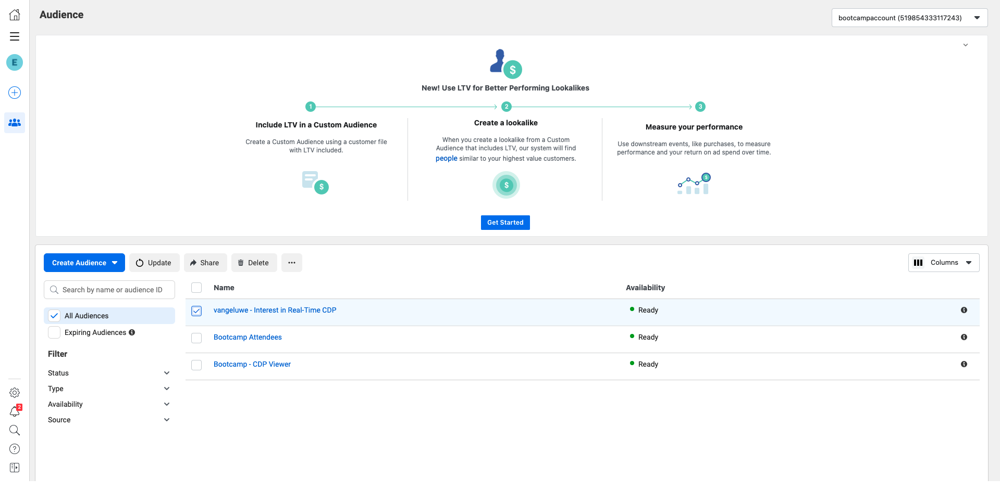

# 1.5 Açao：Facebook环境工作分类法

访问 [Adobe Experience Platform](https://experience.adobe.com/platform). Depois de fazer登录，voce irá访问página inicial da Adobe Experience Platform。

永恒的万年期，先有先兆 **沙盒**. 做沙箱也不行，我是布特坎普。 你这小嘴真不赖啊 **[!UICONTROL 生产产品]** 娜丽莎·阿苏尔·娜帕特·苏必利尔·达·泰拉。 Depois de selecionar o sandbox apriado， voce verá a tela mudando e agora voce está em seu [!UICONTROL 沙盒] 奉献精神。

没有esquerda菜单，vá para **目标** e，em seguida，vá para **目录**. 沃切维拉o **目标目录**. Em **目标**，小团体 **激活区段** 无卡套 **facebook自定义受众**.

选择一个o **bootcamp-facebook** 小团体 **下一个**.

选择区段时，前方没有练习。 小团体 **下一个**.

那帕吉纳 **映射**，验证了caixa de seleção **应用转换** 就是玛卡达。 小团体 **下一个**.

那帕吉纳 **区段计划**，选择a **受众的来源** e defina como **直接来自客户**. 小团体 **下一个**.

帕金，帕吉娜 **审核**，小团体 **完成**.

facebook圣母玛利亚圣母玛利亚圣母玛利亚圣母玛利亚圣母玛利亚圣母玛利亚圣母玛利亚圣母玛利亚圣母玛利亚圣母玛利亚圣母玛利亚圣母玛利亚圣母玛利亚圣母玛利亚圣母玛利亚圣母玛利亚圣母玛利亚圣母玛利亚圣母玛利亚圣母玛利亚圣母玛利亚圣母玛利亚。 Sempre que um cliente se qualificar para esse segmento， um sinal será enviado ao lado do servidor （服务器端） do Facebook para incluir esse cliente no Público Personalizado no lado do Facebook。

没有Facebook，我是Adobe Experience Platform的朋友。

Agora voce pode ver seu público personalizado aparecer no Facebook：

[Retornar para Fluxo de Usuário 1](./uc1.md)

[莫杜洛斯·托多斯·托诺纳尔](../../overview.md)
