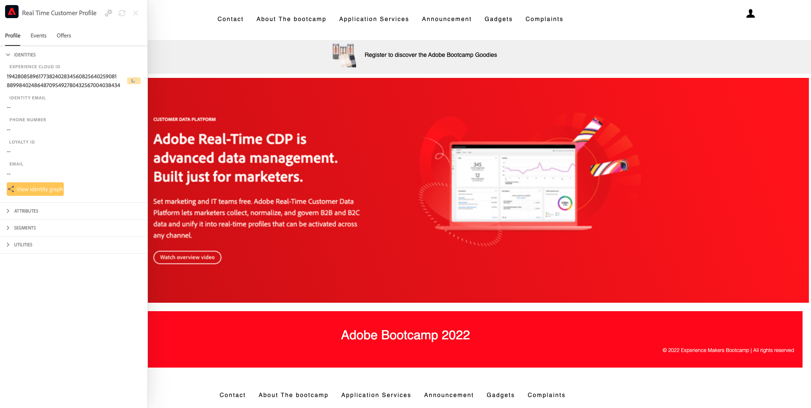

# 2.1访问网站关键内容

## Contexto

作为马卡斯·图阿尔梅特、assim como a jornada do cliente、da aquisição à retencao等人。

一张Adobe Experience Platform德塞姆彭尼亚纸的重要纸张，涅萨·乔纳达。 在科穆尼卡索岛建一个平台， **体验记录系统**.

Plataforma é um ambiente em que a palavra cliente engloba mais do que clientes conhecidos. Um visitante desconhecido no site também é um cliente do ponto de vista da Plataforma e， como tal， todo o comportamento de um visitante desconhecido também é enviado à Plataforma. Gracas a essa abordagem， quando esse visitante eventualmente se torna um cliente conhecido， uma marca também pode visualizar o que aconteceu antes daquele momento. Isso ajuda a partitir de uma perspectiva de otimização de atribuicao e experiencia.

## Fluxo da jornada do cliente

访问 [https://bootcamp.aepdemo.net](https://bootcamp.aepdemo.net). 小团体 **全部允许**. Com base no seu comportamento de navegação no fluxo de usuário anterior， voce verá a personalização acontecer na página inicial do site.

这个小圈子没有可以上级esquerdo da tela para abrir或Visualizador de perfil的Adobe。 Verifique o painel do Visualizador de perfil no Perfil do cliente em tempo real com o **EXPERIENCE CLOUDID** 确定客户身份的主要primário。

Voce também pode ver todos os Eventos de experiencia coletados com base no comportamento do cliente.

小圈子 **个人资料** 没有上级的迪雷伊托·达·泰拉。

小团体 **创建帐户**.

Preencha todos os campos do formulário. 使用um valor real para endereco de email e número de telefone， pois será usado em exercícios posteriores para envio de email e SMS.

在社区中发挥作用 **注册**.

我终于能说清楚了。

Voce também receberá o seguinte电子邮件：

E alguns minutos depois， voce também receberá o seguinte电子邮件：

Vamos conferir a seguir como essa jornada de onboarding foi configurada.

甲壳虫 [2.2 Crie seu evento](./ex2.md)

[Retornar para Fluxo de Usuário 2](./uc2.md)

[莫杜洛斯·托多斯·托诺纳尔](../../overview.md)
