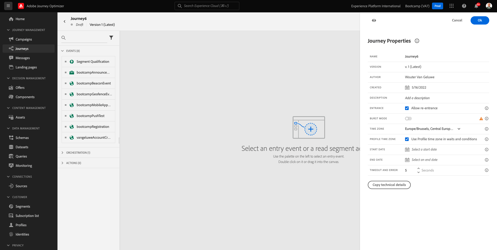
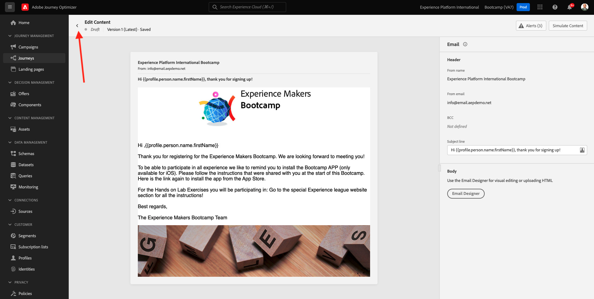

# 2.3 《Crie sua jornada e mensagem de e-mail》

Neste excericio， você irá配置了一个jornada que presisa ser acionada quando alguém criar uma，conta no site de dejorção.

Faça login no Adobe Journey Optimizer acessando a [Adobe Experience Cloud](https://experience.adobe.com). 团 **Journey Optimizer**.

Você será redirecionado para a visualização da **主页**  不，Journey Optimizer。 普里米罗，我的梦想是沙盒的。 没人会沙箱里的 `Bootcamp`. Para alternar de um sandbox para outro， plicaem **生产** 选择沙盒和沙盒。 新样本，没人做沙盒 **Bootcamp**. Você estará na visualização da **主页** 做seu沙盒 `Bootcamp`.

## 2.3.1西班牙

没有菜单，小朋友 **历程**. 阿姆·塞吉达，小团 **创建历程** 新约拉达河。

那是我的天。

前不行动，从头开始 **事件**. 波凯诺梅乌奥文托 `seuSobrenomeAccountCreationEvent` e代替 `seuSobrenome` 佩洛·苏·索布雷诺姆。 Este foi o resultado da criação do Evento:

阿戈拉认为，这一切都是乔纳达的事。 Você pode fazer isso indo para o lado esquerdo da e procando pelo seu evento na lista de eventos。

选择一个seu evento， arraste e solte o evento na tela de Jornada。 Sua Jornada agora deve semelhante ao seguinte:

科莫·塞贡达·埃塔帕·达·乔纳达， você deve adicionar uma etapa curta de **等待**. Vá para o lado esquerdo da tela a seção **编排** 准康诺特尔岛。 Você usará atributos de perfil e preisará garantir que eles sejam preenchidos no Perfil do Cliente em tempo real。

《我的日记》。 不能把世界语的节奏改成。 定义1分钟。 Isso dará bastante tempo para para que os atributos do perfil estejam disponíveis após o de staedo evento.

团 **确定** 萨尔瓦·苏亚斯·阿尔特拉松斯。

Como terceira etapa da jornada， você deve adicionar uma ação **电子邮件**. Vá para o lado esquerdo da tela para **操作**，选择ação **电子邮件** arraste e solte a ação no segundo nó da sua jornada. 阿哥拉，塞金特，塞比多。

定义a **类别** 科科 **营销** e selecone uma **电子邮件界面** 允许发送电子邮件。 Nesse caso， a **电子邮件界面** 一个用户选择电子邮件。 塞莱桑的Certifique **电子邮件的点击** e **电子邮件打开** 埃斯特金·马卡达斯。

一个月的夜晚。 帕拉伊索，朋友 **编辑内容**.

## 2.3.2 Crie a sua mensagem

Para criar sua mensagem， plickeem **编辑内容**.

你好，塞拉。

坎波德特克斯托团 **主题行**.

德克斯托，科米切 **奥拉**

一个linha de assunto ainda não está pronta。 Em seguida， você precisa trazer o token de personalização para o **名字** 她是阿尔玛泽纳多 `profile.person.name.firstName`. 无菜单，角色para baixo para encontror o elemento **人员** e cligue na seta para visualizaris mais campos

埃莱门托的阿戈拉 **全名** e cligue na seta para visualizar mais campos.

波菲姆，当地化到坎波 **名字** e团 **+**  拉多·德莱。 个人化的阿帕雷克人的托克。

艾姆·塞吉达，阿迪西奥内， **阿格拉迪莫斯，苏卡！**&#x200B;的问题。团 **保存**.

Então， você irá retor nar para esta tela。 团 **Email Designer**  向contúdo发送电子邮件。

Na próxima tela， será solicitado que vicê forneça o conteúdo do email através de 3 métodos diferentes:

- **从头开始设计**:Comece com uma tela em branco e use o editor WYSIWYG pararastar e soltar a estrutura e os componentes de contensudo para criar visualmente o contensudo e-mail。
- **编码您自己的**:Crie seu próprio modelo de e-mail codificando usandoHTML
- **导入HTML**:重要的HTML存在者，那就是você poderá editar。

团 **导入HTML**.

阿拉斯特·索尔特·阿基沃 **mailtemplatebootcamp.html**、阙歌·波佩沙 [阿奎](../../assets/html/mailtemplatebootcamp.html.zip). 小伙很重要。

电子邮件中的模式：

使用个性化电子邮件。 拉多小团 **奥拉** e、em、seguida、glicue noícone **添加个性化**.

Em seguida， você precisa trazer o token de personalização **名字** 她是阿尔玛泽纳多 `profile.person.name.firstName`. 无菜单，本地化为elemento **人员**, faça uma busca detalada no elemento **全名** e集团 **+** para adicionon o campo **名字** ao编辑。

团 **保存**.

Agora você verá como o campo de personalização foi cionado ao seu texto.

团 **保存** 萨尔瓦·苏亚·门萨盖姆。

Retorne para o painel de mensagens clicando na seta ao lado do texto da linha de assunto no canto上级esquerdo。

Agora você总结了一份《地籍电子邮件》。 Cligue na seta no canto superesquerdo para retorn a sua jornada。

团 **确定**.

## 2.3.3共和国

《我的歌》。 法泽岛 **属性** 不能向上级迪雷托·达特拉下手。

Você pode fazer isso clicando no item clicar no item &quot;Name&quot; e insindo o seguinte nome `yourLastName - Account Creation Journey`. 团 **确定** 把萨尔瓦当成穆丹卡。

我的歌声是公开的 **发布**.

团 **发布**  诺瓦门特。

Você verá uma barra de confirmmação verde informando que sua jornada agora está Publicada.

这是行动。

埃塔帕： [2.4佐贺寺](./ex4.md)

[乌萨里奥2号河道](./uc2.md)

[托多斯 — 莫杜洛斯](../../overview.md)