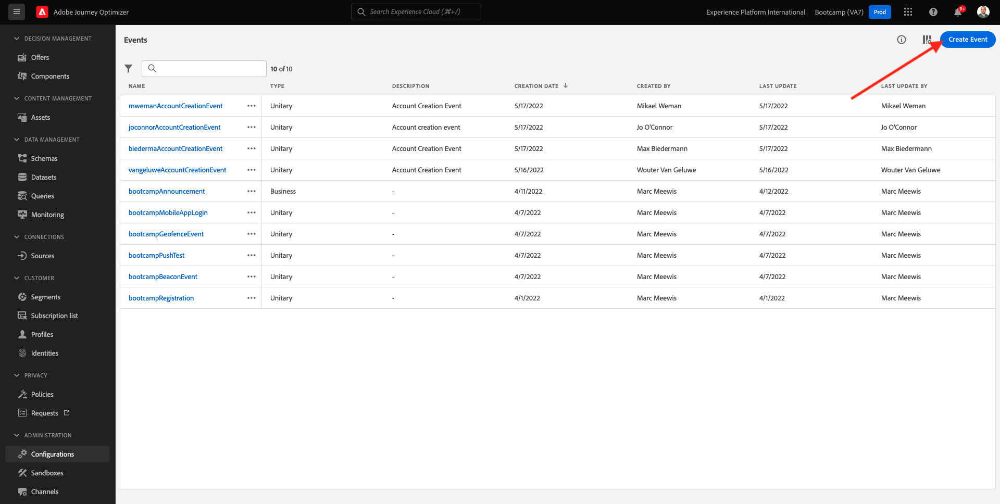

# 3.2克雷塞韦托

Faca登录无Adobe Journey Optimizer访问[Adobe Experience Cloud]。 单击&#x200B;**Journey Optimizer**。

Voce será redirecionado para a **Home** no Journey Optimizer。 Primeiro，验证一下Sandbox Correto。 不要做沙盒来开发用户`Bootcamp`。 Para alternar de um sandbox para outtro，click em **Prod**&#x200B;选择沙盒类型。 Neste示例，**Bootcamp**&#x200B;中没有sandbox。 Voce estará na visualização da **Home**&#x200B;执行seu沙盒`Bootcamp`。

无菜单à esquerda，role para baixo e clique em **配置**。 Em seguida， clique no botao **管理** em事件。

总之我们很清楚。 单击em **创建事件** para comecar a criar seu próprio evento。

新熊雅内拉·德·伊文托·瓦齐亚·伊拉·阿帕雷克。

Em primeiro lugar， de um nome seu evento como， por示例： `yourLastNameBeaconEntryEvent` e adicione uma descriçao como， por示例： `Beacon Entry Event`。

Em seguida， certifique-se de que **类型** está definido como **单一** e， para a selecao de **事件ID类型**，选择&#x200B;**系统生成**。

埃塔帕·塞金特，就是个选择方案。 准备练习的模式。 使用架构`Demo System - Event Schema for Mobile App (Global v1.1) v.1`。

Depois de selecionar o Schema， voce verá vários campos sendo selecionados na secao **字段**。 Agora voce deve passar o mouse sobre a secao **字段** e tres ícones弹出式serao exibidos。 单击&#x200B;**编辑**&#x200B;的No ícone de 。

Voce verá uma janela弹出窗口de **字段**， onde voce deve selectionar alguns dos campos que precisamos para personalizar a jornada. Escolheremos outros atributos de perfil posteriormente，利用dados já existents na Adobe Experience Platform

`Place context` e marque a caixa de seleção对象的baixo até角色。 com isso， todo o contexto da localização do cliente será disponibilizado para a jornada. 单击em **确定** para salvar例如alteracoes。

塞吉达，我们一起去吧。 单击em **保存** mais uma vez para salvar例如alteracoes。

我们来看看你有什么好玩的。

Clique no seu evento novamente para abrir a tela **编辑事件** mais uma vez。 将鼠标指针移至&#x200B;**字段** para ver os 3 ícones。 无连接点&#x200B;**视图**。

Agora voce verá um范例执行有效载荷操作。
Seu evento tem um eventID de orquestracao único， que voce pode encontract rolando para baixo nesa carga útil até visualiza `_experience.campaign.orchestration.eventID`。

我们把Adobe Experience Platform的作品交给你了。 朗布尔目标事件ID，前方为后方。
`"eventID": "e76c0bf0c77c3517e5b6f4c457a0754ebaf5f1f6b9357d74e0d8e13ae517c3d5"`

单击&#x200B;**确定** e，单击&#x200B;**取消**。

你可真够操心的。

Próxima etapa： [3.3 Crie sua jornada e notificacao push](./ex3.md)

[Retornar para fluxo de Usuário 3](./uc3.md)

[莫杜洛斯·托多斯·雷托纳尔](../../overview.md)
