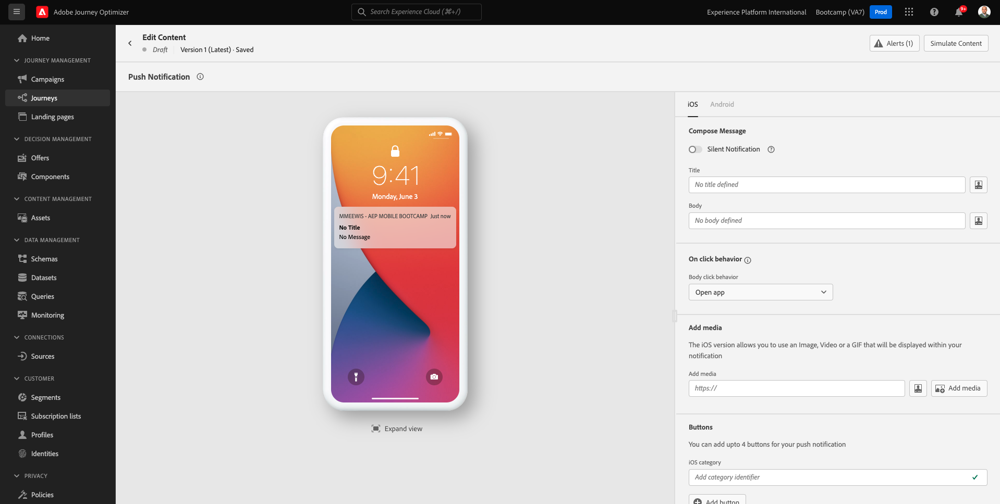
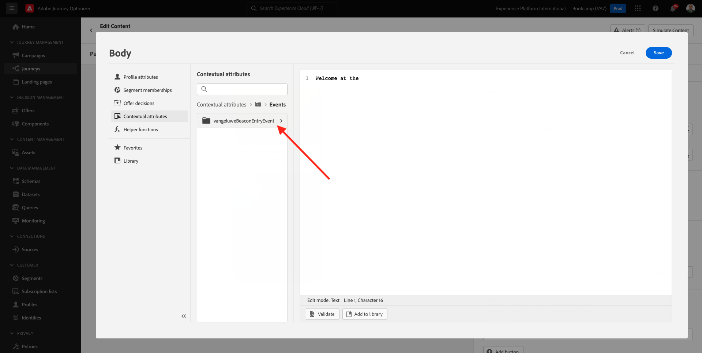
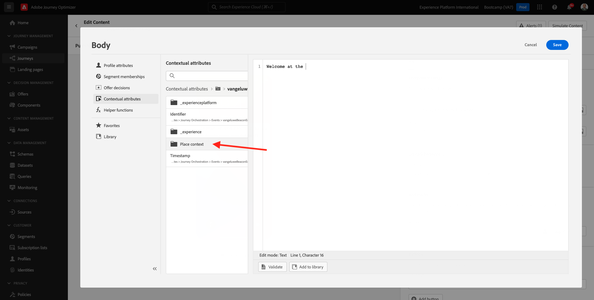
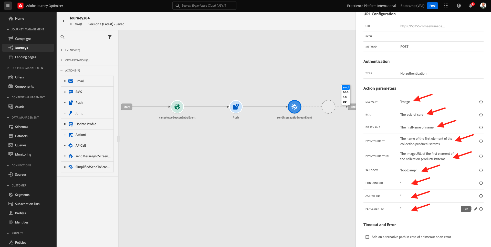

# 3.3 Crie sua jornada e notificação push

Neste exercício， voce irá configurar a jornada e a mensagem que ser acionada quando alguém inserir uma sinalização （信标） usando o o aplicativo móvel.

Faca登录无Adobe Journey Optimizer访问权限 [Adobe Experience Cloud](https://experience.adobe.com). 小团体 **Journey Optimizer**.

Voce será redirecionado para a visualização da **主页** 没有Journey Optimizer。 Primeiro，验证一下Está对Sandbox Correto的评价。 我做沙盒也行 `Bootcamp`. Para alternar de um sandbox para outtro， clique em **Prod** 选择沙盒和沙盒。 Neste示例，不要做沙盒 **Bootcamp**. 达维斯达拉之家 **主页**  执行seu sandbox `Bootcamp`.

## 3.3.1金球奖

没有菜单，小朋友们 **历程**. 塞吉达，小集团 **创建历程** para criar uma nova jornada.

我们来看看吧。

前方没有锻炼，前方没有锻炼 **事件**. Voce nomeou o evento `yourLastNameBeaconEntryEvent` e替代 `yourLastName` 佩洛·塞乌·索布雷诺姆。 Este foi o resultado da criação do Evento：

Agora voce deve考虑了este evento como o o início desta Jornada。 Voce pode fazer isso indo para o lado esquerdo da tela e procurando pelo seu evento na lista de eventos.

选择selecione seu evento， arraste e solte o evento na tela de jornada。 苏亚·乔纳达·阿古拉·德韦斯为塞梅尔汗特·奥·塞甘特效力。 小团体 **确定** 如变体。

Como segunda etapa da jornada， voce deve adicionar uma acao **推送**. Vá para o lado esquerdo da tela para **操作**，选择a acao **推送** 我绝对不会罢休。

没有lado direito da tela，agora voce deve criar sua notificação push.

定义a **类别** como **营销** 选择推送表面que permite environments push。 Nesse caso，一个超级推车 **mmeeewis-app-mobile-bootcamp**.

## 3.3.2基本框架

小团体 **编辑内容**.

Em seguida是前科的阿巴伊克索牧场：

Vamos definir o conteúdo da notificação推送。

小团体无坎波·德特克斯托 **标题**.

我叫科米斯 **奥拉**. 没有个人化的集团。

Agora voce precisa trazer o token de personalização para o campo **名字** 我是个阿玛泽纳多人 `profile.person.name.firstName`. 无菜单，选择 **配置文件属性**，baixo/navegue para encontract o elemento的作用 **人员** 我这个小集团在坎波岛上开阔阔阔阔阔阔阔地生活 `profile.person.name.firstName`. 小圈子 **+** 是泰拉的坎波。 小团体 **保存**.

恩陶，听我说，我回过头来。 小集团是个性化的集团 **正文**.

艾瑞亚·德·特克斯托，埃斯克雷瓦 `Bem-vindo(a)`.

塞吉达，小集团  **上下文属性** e **Journey Orchestration**.

小团体 **事件**.

这个小圈子不叫我做我自己，我做我自己： **yourLastNameBeaconEntryEvent**.

小团体 **地标上下文**.

小团体 **POI交互**.

小团体 **POI详细信息**.

小团体否 **+** 图标否 **POI名称**.
我终于能说清楚了。 小团体 **保存**.

我们一起吃吧。 小团体不能作为上级的陪审团。

小团体 **确定**.

## 3.3.2 Envire uma mensagem para uma tela

Como terceira etapa da jornada， voce deve adicionar uma açao  **sendMessageToScreen**. Vá para o lado esquerdo da tela para **操作**，选择a acao **sendMessageToScreen** 我绝对不会罢休。 塞吉达，敬请光临。

**sendMessageToScreen** uma acao personalizada que irá publicar uma mensagem no **端点** 乌萨多·佩拉·埃西比考·纳·洛哈。 A acao **sendMessageToScreen** 我们很想去墨西哥城吃点什么。 Voce pode visualizar essas variáveis rolando para baixo até ver **操作参数**.

Agora voce先定义os valores para cada parametero de acao。 圣内塞萨里奥斯 — 昂德岛上圣塔贝拉para entender quais valores são necessários e onde。

| 参数 | 值 |
|:-------------:| :---------------:|
| 投放 | `'image'` |
| ECID | `@{yourLastNameBeaconEntryEvent._experienceplatform.identification.core.ecid}` |
| 名字 | `#{ExperiencePlatform.ProfileFieldGroup.profile.person.name.firstName}` |
| 事件主题 | `#{ExperiencePlatform.ProductListItems.experienceevent.first(currentDataPackField.eventType == "commerce.productViews").productListItems.first().name}` |
| EVENTSUBJECTURL | `#{ExperiencePlatform.ProductListItems.experienceevent.first(currentDataPackField.eventType == "commerce.productViews").productListItems.first()._experienceplatform.core.imageURL}` |
| 沙盒 | `'bootcamp'` |
| CONTAINERID | `''` |
| ACTIVITYID | `''` |
| PLACEMENTID | `''` |

{style="table-layout:auto"}

准确定义的贵族，没有伊科的小集团 **编辑**.

Em seguida，选择 **高级模式**.

我打了个电话，我打了个电话。 小团体 **确定**.

Repita esse processo para adicionar valores para cada campo.

>[!IMPORTANT]
>
>Para o campo ECID， há uma referencia ao evento`yourLastNameBeaconEntryEvent`. 朗布雷斯德代替  `yourLastName` 佩洛·塞乌·索布雷诺姆。

最后的结果是塞梅尔汉特王子：

角色与集群 **确定**.

您仍需要为历程命名。 要执行此操作，请单击 **属性** 图标。

沃斯·波德插入了nome da jornada aqui。 使用 `yourLastName - Beacon Entry Journey`. 小团体 **确定** 如变体。

Agora voce pode publicar sua jornada clicando em **Publish**.

小团体 **Publish** 诺瓦门特。

西班牙公共事业部向游客提供咨询。

我们来做个小朋友。

沃斯·特米努埃斯特·艾希西奥。

埃塔帕： [3.4乔尔纳达测验](./ex4.md)

[Retornar para Fluxo de Usuário 3](./uc3.md)

[莫杜洛斯·托多斯·托诺纳尔](../../overview.md)
