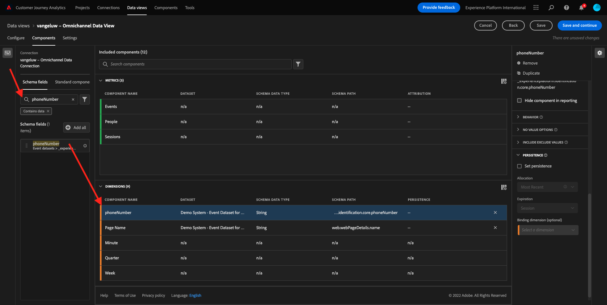
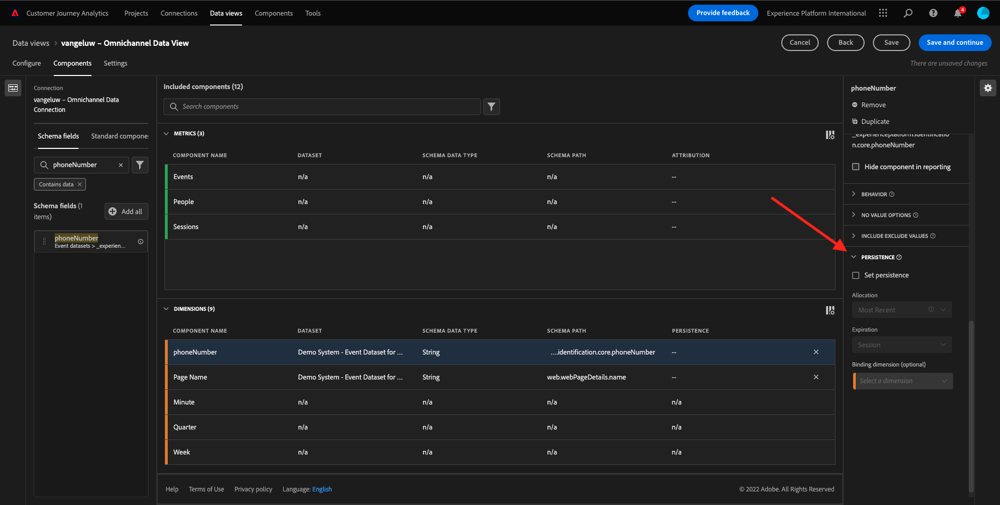
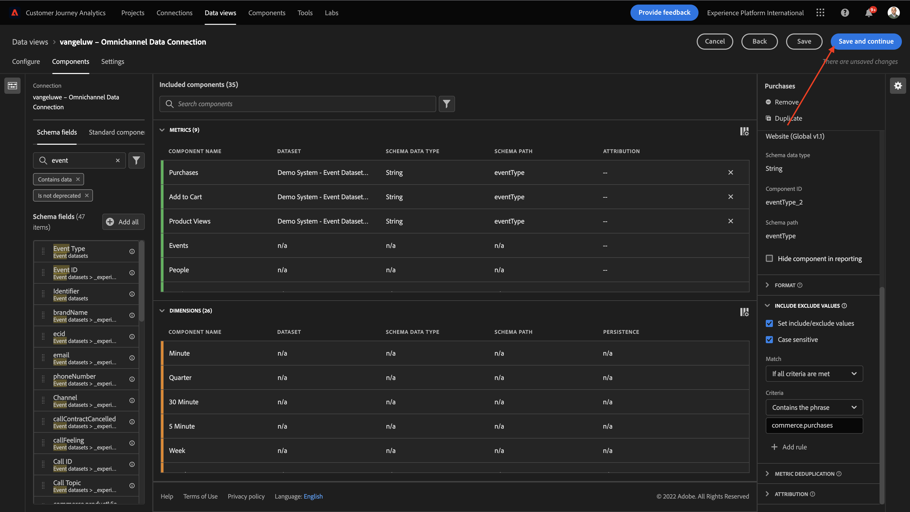

# 4.3 Crie uma Visualização de Dados

## 目标

- Entenda a UI de Visualização de Dados
- Compreenda as configuracoes básicas de definicao de visita
- Compreenda a attribuicao e a Persistencia em uma Visualização de

## 4.3.1达多斯的可视化图表

Agora， com sua conexão conclouída， é possível progredir para influenciar a visualização. Uma diferenca entre o Adobe Analytics e o CJA é que o CJA precia de uma visualização de dados para limpar e preparar os dados antes da visualização.

Uma Visualização de Dados é semelhante ao conceito de Virtual Report Suites no Adobe Analytics， onde voce establete as definicoes de visita com reconnececimento de contexto， filtragem e também como os componentes sao chamados.

塞拉·内塞萨里奥，没有米尼莫，乌马维苏阿里萨索·德·达多斯·波尔·科内克桑。 没有entanto， para alguns casos de uso， é ótimo ter múltiplas Visualizacoes de Dados para mesma conexao， com o objetvo de fornecer insights differentities para equipes distinta. 我们非常希望能够适应这样的环境。 Alguns示例：

- Métricas de UX apenas para equipe de UX Design
- 使用os mesmos nomes para KPIs e métricas para oGoogle Analyticse paraCustomer Journey Analytics，para que a equipe de análise digital fale apenas 1 idioma。
- Visualização de Dados filtrada para mostrar， por explo， dados para apenas um mercado， ou uma marca， ou apenas para Dispositivos móveis.

Na tela de **连接** 一个可以选购的caixa de seleção da conexao que voce acabou de criar。 小团体  **创建数据视图**.

Voce será redirecionado para o fluxo de trabalho **创建数据视图** 工作流。

## 4.3.2达多斯可视化概论

Agora voce pode configurar as definicoes básicas para sua Visualização de dados.

A **连接** 你最好别再操心了。 Sua conexao se chama `yourLastName – Omnichannel Data Connection`.

Em seguida， de um nome à sua Visualização de Dados seguindo este modelo de nomenclatura： `yourLastName – Omnichannel Data View`.

Insira o mesmo valor para a descrição： `yourLastName – Omnichannel Data View`.

| 名称 | 描述 |
| ----------------- |-------------| 
| `yourLastName – Omnichannel Data View` | `yourLastName – Omnichannel Data View` |

段落 **时区**，选择胡索霍拉里奥 **贝利姆、埃斯托科尔莫、罗马、贝尔纳、布鲁克塞拉斯、维耶纳、阿姆斯特达GMT+01:00**. Este é um cenário realmente interessante， pois algumas empresas operam em diferences países e geografias. Alocar o fuso horário certo para cada país evitará erros típicos de dados， como， por exemplo， acreditar que a maioria das pessoas compra camisetas à 4h no Peru.

Voce também pode modificar a nomenclatura das métricas principais (Pessão， Sessao e Evento)。 Isso nao é obrigatório， mas alguns clientes gostam de usar Pessoas， Visitas e Acessos em vez de Pessoa， Sessao e Eventos (convencao de nomenclatura padrao do Customer Journey Analytics)。

Agora voce deve as seguintes configuracoes definidas：

小团体 **保存并继续**.

## 4.3.3达多斯的可视化图表

Neste exercício，voce irá configurar os components necessários para analisar os dados e visualizá-los usando o o Analysis Workspace。 内斯塔·尤说：

- Lado esquerdo： Components disponíveis dos datasets selectionados
- Meio： Adicionados à Visualização de Dados组件
- Lado目录：组件配置

>[!IMPORTANT]
>
>Se voce nao contract uma métrica ou dimensao específica， verifique se o campo `Contains data` Foi removido de sua visualização de dados. 卡索·康塔里奥，不包括坎波。
>
>

Agora voce precisa arrastar e soltar os components essários para análise nos **添加的组件**. Para isso， voce deve selectionar os components no menu à esquerda e arrastá-los e soltá-los na tela no meio.

Vamos comecar com o primeiro组件： **名称(web.webPageDetails.name)**. 请问组件如何排列 — 如何 — 如何 — 如何 — 如何 — 如何 — 如何 — 如何 — 来。

Esse componente é o nome da página， como voce pode derivar da leitura do campo do schema `(web.webPageDetails.name)`.

不行，乌萨尔 **名称** 我们来做一个关于我们共同事业的演讲吧。

Vamos mudar o nome para **页面名称**. 没有组成要塞的小集团 **组件设置**.

作为持久化配置sao **持久性设置**. Os conceitos de eVars e prop nao existem no CJA， mas as configuracoes de Persistencia possibilitam um comportamento semelhante.

Se voce nao alterate essas configuracoes， o CJA irá interpretar a dimensão como um **属性** （尼维尔·德奥科伦西亚）。 Além disso， podemos alterrar a Persistencia para tornar a dimensao uma **eVar** （佩西斯尔·奥朗戈·达·乔纳达）。

请随时联系我们熟悉的eVars e Props， [莉亚·梅斯·索布雷·伊索·纳库曼塔考](https://experienceleague.adobe.com/docs/analytics/landing/an-key-concepts.html)..

Vamos deixar o Nome da Página como Prop. 德萨·福尔马，先声不再 **持久性设置**.

| 要搜索的组件名称 | 新名称 | 持久性设置 |
| ----------------- |-------------| --------------------| 
| 名称(web.webPageDetails.name) | 页面名称 |          |

埃姆·塞吉达， **phonenumber** 再来一次吧。 O novo nome deve ser **电话号码**.

Por fim， vamos alterar as Configuracoes de persistencia， pois o Número do Celular deve persisting no nível do usuário.

Para alteran a Persistencia， role para baixo no menu à direita e abra a aba **持久性**：

将caixa de seleção para modificar标记为持久性配置。 选择器 **最近** e o escopo **人员（“报表”窗口）**，pois nos preocumamos apenas com o último número de celular da pessoa. 我们来看看那些有远见的人，看看未来会不会来。

| 要搜索的组件名称 | 新名称 | 持久性设置 |
| ----------------- |-------------| --------------------| 
| phonenumber | 电话号码 | 最近，人员（报告窗口） |

O próximo component é `web.webPageDetails.pageViews.value`.

没有菜单，请点菜 `web.webPageDetails.pageViews.value`. 我们很荣幸能见到你。

无名段落 **页面查看次数** 在 **组件设置**.

| 要搜索的组件名称 | 新名称 | 归因设置 |
| ----------------- |-------------| --------------------| 
| web.webPageDetails.pageViews.value | Page Views |         |

para as configuracoes de atribuicao， deixaremos em branco.

Observação： As configuracoes de persistencia nas métricas também podem ser alteradas no Analysis Workspace. Em alguns casos， voce pode optar por configurá-las aqui para evitar que os usuários de negócios tenham que pensar qual é o melhor modelo de persistencia.

我懂了，我懂了，我懂了。

### 尺寸

| 要搜索的组件名称 | 新名称 | 持久性设置 |
| ----------------- |-------------| --------------------| 
| brandName | 品牌名称 | 最近，会话 |
| callfeely | 通话感觉 |          |
| 调用ID | 呼叫交互类型 |          |
| callTopic | 调用主题 | 最近，会话 |
| ecid | ECID | 最近，人员（报告窗口） |
| 电子邮件 | 电子邮件ID | 最近，人员（报告窗口） |
| 付款类型 | 付款类型 |          |
| 产品添加方法 | 产品添加方法 | 最近，会话 |
| 事件类型 | 事件类型 |         |
| 名称(productListItems.name) | 产品名称 |         |
| SKU | SKU（会话） | 最近，会话 |
| Transaction ID | Transaction ID |         |
| URL (web.webPageDetails.URL) | URL |         |
| 用户代理 | 用户代理 | 最近，会话 |

### 梅特里卡

| 要搜索的组件名称 | 新名称 | 归因设置 |
| ----------------- |-------------| --------------------| 
| 数量 | 数量 |          |
| commerce.order.priceTotal | 收入 |         |

Sua configuração deve ser semelhante ao seguinte：

Nao se esqueca de Salvar sua Visualização de Dados. 恩陶集团 **保存**.

## 4.3.4梅特里卡斯计算器

Embora tenhamos organizado todos os componentes na Visualização de dados， voce ainda deve adaptar alguns deles para que os usuários de negócios estejam prontos para iniciar suas análises.

Seo voce se lembra， nao trouxemos specificamente Métricas como Adicionar ao Carrinho， Visualização do producto ou Compras para a Visualização de dados. 不行，我们来看看吧： **事件类型**. Entao， vamos derivar esses tipos de interacao criando 3 métricas calculadas.

Vamos comecar com a primeira Métrica： **产品查看次数**.

没有拉多·埃斯奎多，佩斯基斯 **事件类型** 选择维度。 埃姆·塞吉达，《再见吧，再见吧》 **包含的组件**.

新墨西哥州选区集团 **事件类型**.

Agora altere o nome e a descrição do componente para os seguintes valores：

| 组件名称 | 组件描述 |
| ----------------- |-------------| 
| 产品查看次数 | 产品查看次数 |

Agora vamos contar apenas eventos de **产品查看次数**. Para fazer isso， para baixo em的作用 **组件设置** 瓦洛雷斯·德阿泰 **包括/排除值**. 奥普考的哈比利塔证书 **设置包括/排除值**.

科莫·克雷莫斯·孔塔亚佩纳 **产品查看次数**，特别是 **commerce.productViews** 没有克里泰里奥斯。

真是个不错的玩意儿！

Em seguida， repita o mesmo processo para os eventos **添加到购物车** e **购买**.

### 添加到购物车

Primeiro，细细细细分 **事件类型**.

Voce verá um alerta popup de um Campo Duplicado， pois estamos usando a mesma variável. 小团体 **仍要添加**：

Agora， siga o mesmo processo que fizemos para a métrica Visualizacoes de produto：
- Primeiro altere o nome e a descrição.
- 朋友们，阿迪奥内 **commerce.productListAdds** como critério para contar apenas Add To Cart

| 名称 | 描述 | 标准 |
| ----------------- |-------------| -------------|
| 添加到购物车 | 添加到购物车 | commerce.productListAdds |

### 购买

Primeiro，细细细细分 **事件类型** 科莫·菲泽莫斯·帕拉，作为前方的duas métricas。

Voce verá um alerta popup de um Campo Duplicado， pois estamos usando a mesma variável. 小团体 **仍要添加**：

Agora， siga o mesmo processo que fizemos para as métricas产品查看e添加到购物车：
- Primeiro altere o nome e a descrição.
- 朋友们，阿迪奥内 **commerce.purchases** Compras的como critérios para conbilizar apenas

| 名称 | 描述 | 标准 |
| ----------------- |-------------| -------------|
| 购买 | 购买 | commerce.purchases |

苏亚组态最后精灵塞梅兰特·奥塞甘特。 小团体 **保存并继续**.

## 4.3.5 Configuração de Dados组件

Voce deve ser redirecionado para esta tela：

Nesta aba， voce pode modificar algumas configurations important para alterate a forma como os dados sao processados. Vamos漫画定义 **会话超时** 科莫30分钟。 Gracas ao registro de data e hora de cada evento de experiencia， voce pode estender o conceito de uma sessão em todos os canais. 您是呼叫中心访问现场的联系人的吗？ Usando Tempos Limite de Sessao personalizados， voce tem muita flexibilidade para decisir o que é uma sessao e como essa sessao irá mesclar os dados.

Nesta aba voce pode modificar outtras coisas como filtrar os dados usando um segmento/filtro. Voce nao precisará fazer需要练习。

全都终端，小集团 **保存并完成**.

>[!NOTE]
>
>Voce pode voltar a esta Visualização de dados posteriormente e alterar as configuracoes e os components a qualquerer momento. 作为圣莫斯特拉多斯历史教区的Alteracoes afetarao a forma como os dados historicos。

Agora voce pode continuar com a parte de visualização e análise！

埃塔帕： [4.4 Preparação de dados emCustomer Journey Analytics](./ex4.md)

[Retornar para Fluxo de Usuário 4](./uc4.md)

[莫杜洛斯·托多斯·托诺纳尔](./../../overview.md)
