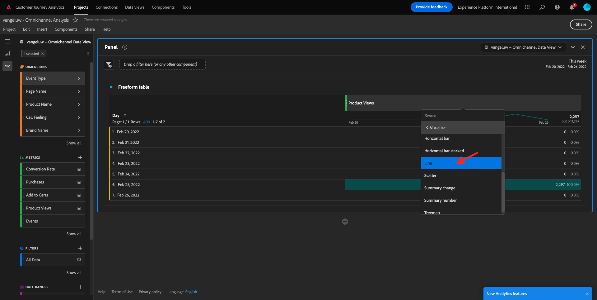
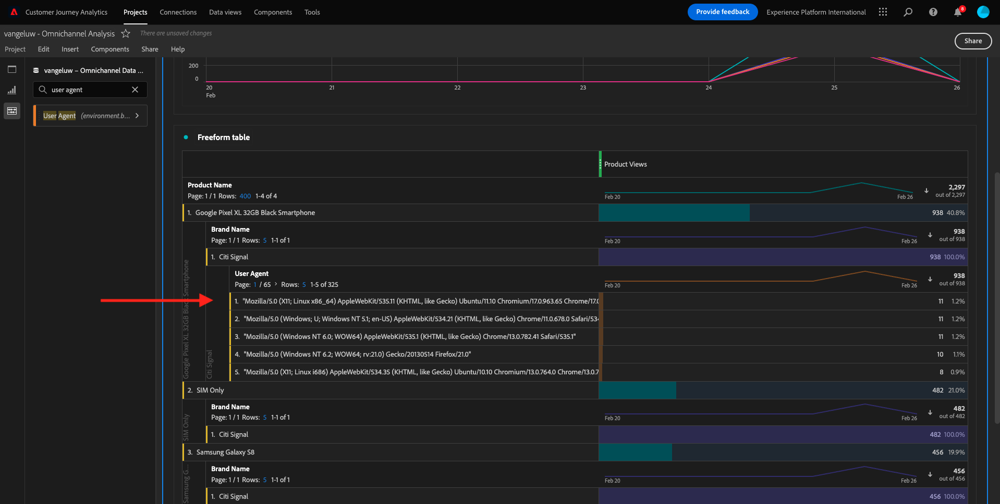
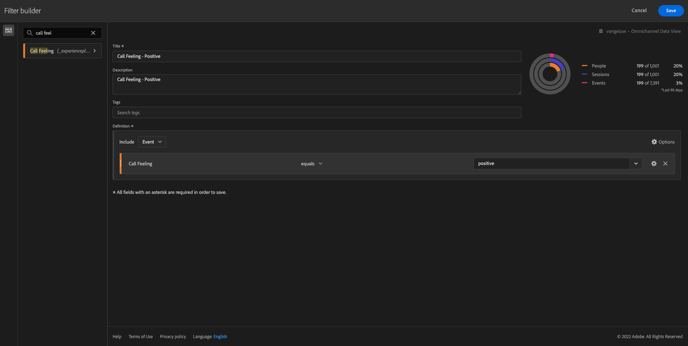

# 4.5可视化UsandoCustomer Journey Analytics

## 奥别蒂沃斯

- 了解UI到Analysis Workspace
- Conheça alguns会反复出现Analysis Workspace的tornam或diferente。
- Aprenda a analysirar no CJA usando o Analysis Workspace

## 上下文

Neste experacticio， você usará o Analysis Workspace no CJA paraanalisar visualizações de produtos， funis de productos， rotatividade等

我们要求你  [4.4 《达多斯准备》，Analysis Workspace](./ex4.md), então acesse [https://analytics.adobe.com](https://analytics.adobe.com).

阿布拉苏普罗耶托 `yourLastName - Omnichannel Analysis`.

Com seu projeto aberto e Visualização de dados `yourLastName - Omnichannel Analysis` selectionado， você está pronto para começar a construcia suas primeiras visualizações。

## Quantas visualizações de productos temos diariamente?

Em primeiro lugar，precisamos selecionar作为数据。 菜单暂停时，日历就是。 要选择数据的交集。

>[!IMPORTANT]
>
>数据间选择 **本周** 欧 **本月**. 2022年，Os dados disponíveis mais为am aspovidos em 19 de setembro de 2022年的am asponíveis mais提供了新的支持。

没有菜单可以称为lado esquerdo(area de componentes)，可以称为métricas calculadas **产品查看**. 选择 — 作为e arraste e solte na tela，不加上上级direito da tabela de forma livre。

自动修改维度 **日** 塞拉·阿迪西奥纳达·帕拉·克里亚·苏阿·普里米拉·塔贝拉。 Agora vicê pode ver sua pergunta respondida imediatamente.

Em seguida， cligue com o botão direito do mouse no resuso da métrica.

团 **可视化图表** e selecione **折线图** como visualização.

Você verá as suas visualizações de produto por dia.

我们的乐趣 **设置** 可视化。

无门小弟 **折线图** e **管理数据源**.

阿姆·塞吉达，小团 **锁定选择** e selecione **选定项目** para bloquear esta visualização para que ela sempre exiba uma linha do tempo de Visualizações de produtos.

## 5件肉制品

圣奥斯5件产品是维斯托斯吗？

我们要从救世主到临时主义。

| 操作系统 | 短切 |
| ----------------- |-------------| 
| Windows | Control + S |
| Mac | Command + S |

吸吧，就是五个产品。 没有菜单，没有菜单，没有菜单，没有菜单 — 维圣。

阿戈拉·阿拉斯特·索尔特 **产品名称** para suplity a dimensão **日**:

这是结果。

Em seguida， tente dividir um dos produts por Nome da marca. 佩斯基塞 **brandName** arraste para baixo do primeiro nome do produto.

《乌萨里奥之家》 佩斯基塞 **用户代理** arraste-o para baixo do nome da marca。

Em seguida， será exibida a tela abaixo:

Por fim， você po de adicionar mais visualizações. 没有lado esquerdo， em visualizações， pesquise `Donut`. 佩格 `Donut`, arraste e solta na tela sob visualizção **折线图** 

接下来，在表中，选择前5个 **用户代理**  在 **Google Pixel XL 32GB黑色智能手机** > **花旗信号**. 选择5行时，按住 **CTRL** 按钮（在Windows上）或 **命令** 按钮(在Mac上)。

塞吉达，塔贝拉，选择primeiras 5 linhas de **用户代理** 德塔拉门托，菲泽莫斯 **Google Pixel XL 32GB黑色智能手机** > **花旗信号**. Ao selecionar为5 linhas，segure o botão **CTRL** （无Windows）ou o botão **命令** (不是Mac)。

不过，我要带你们去玩：

Você pode até adaptar o design par ser mais legível， tornando o gráfico de **折线图** 德格拉菲科 **圆环** um pouco menor para que sejam exibidos lado lado:

无门小弟 *圆环**第段 **管理数据源**. 阿姆·塞吉达，小团 **锁定选择** para bloquear essa visualização para que ela sempre exiba uma linha do tempo de Visualizações de produto.

Saiba mais sobre visualizações usando o Analysis Workspace em:

- [https://experienceleague.adobe.com/docs/analytics/analyze/analysis-workspace/visualizations/freeform-analysis-visualizations.html](https://experienceleague.adobe.com/docs/analytics/analyze/analysis-workspace/visualizations/freeform-analysis-visualizations.html)
- [https://experienceleague.adobe.com/docs/analytics/analyze/analysis-workspace/visualizations/t-sync-visualization.html](https://experienceleague.adobe.com/docs/analytics/analyze/analysis-workspace/visualizations/t-sync-visualization.html)

## Funil de interção do produto， da visualização à compra

现有muitas formas de resolver esta questão。 Uma delas e usar o Tipo de Interção de Produto e usá-lo em uma tabela de forma to livre. 乌特拉形式 **流失可视化图表**. Vamos usar oúltimo， pois queremos visualizar e analisar ao mesmo tempo.

Feche o painel atual clicando aqui:

新的阿吉奥拉 **+添加空白面板**.

可视化图表团 **流失**.

前面有心肌间肌间肌间肌动。

Em seguida， vicê verá:

包含维度 **事件类型** nos组件no lado esquerdo:

Cligue na seta para abrir a dimensu:

Você verá todos os Tipos de eventos disponíveis.

选择项目 **commerce.productViews** e arraste e solte o no campo **添加接触点** 登特罗达 **流失可视化图表**.

Faça o mesmo com **commerce.productListAdds** 和 **commerce.purches** e solte-os no campo **添加接触点** 登特罗达  **流失可视化图表**. Sua visualização agora deve semelhante ao seguinte:

我的父母都是天真的。 Alguns执行员：比较ao longo do tempo，比较cada passo por dispositivo ou比较por fidelidade。 没有entanto， se quisermos analisar coisas ittes santes como porque os clientes não compram depois de adicionar um item a o carrinho， podemos usar a melhor ferramenta do CJA:clicar com o botão direito.

Cligue com o botão direito在鼠标接触点 **commerce.productListAdds**. 阿姆·塞吉达，小团 **此接触点的划分流失**.

Uma nova tabela de formato livre será criada para analisar o que as pessoas fizeram se não comparam.

Altere o **事件类型** by **页面名称**, nova tabela de formato livre， para em quais páginas eles estão indo， em vez da Página de confirmmação de compra。

## 不是说，你们的站点上有个Passoas，Cancelar，Serviço?

诺瓦门特，我的明明明明明明。 我们要去一个，一个，一个，一个，一个，，一个，，一个，，和，一个，和，一个，和，一个，和，一个，和，一个，和，一个，，和，和，和，一个，和，和，和，和，和，和，和，和，和，和，和，和，和，和，和，和，和，和，和，和，和，和，和，和，和，和，和，和，和。

Feche o painel atual clicando aqui:

新的阿吉奥拉 **+添加空白面板**.

可视化图表团 **流量**.

塞吉达，塞拉：

前面有心肌间肌间肌间肌动。

包含维度 **页面名称** nos组件no lado esquerdo:

Cligue na seta para abrir a dimensu:

那就象天窗一样。 我们的朋友： **取消服务**.
Arraste e solte **取消服务** na Visualização de fluxo no campo do meio:

塞吉达，塞拉：

Vamos agora anarisar se os clientes que visitaram a página C **取消服务** 没有现场também ligaram para o call center e qual foi o resultado。

Nas dimensões， retwen encontre e Tipo de interção de chamada. Arraste e solte **调用交互类型** para suplitia interação à direita **流量可视化图表**.

Agora você visualiza o ticket de suporte dos clientes que ligaram para a central de a a tadendimento depois de visitar a página **取消服务**.

Em seguida， nas dimensionsões， procure **通话感觉**. Arraste e solte para supitir a primeira interção à direita na visualização de fluxo.

塞吉达，塞拉：

Como Pode ver， executamos uma análise omnichannel usando a visualização de fluxo. Graças a isso， descobrimos qu alguns clientes que estavam pensando em cancerar o serviço tiveram uma avaliação positiva depois de ligar para o call center. 塔尔韦斯坦哈莫斯穆达多·德伊亚·科姆·马普罗苏？

## Qual e o desempenho dos clientes com um contato de Call center Positivo em relação aos principais KPIs?

期酒、扇贝、达多斯、达多斯、阿普纳斯·苏阿里奥斯·科姆查马达斯 **积极**. 没有CJA，Segmentos são chamados de Filtros。 Acesse para filtros na area de componentes(no lado esquerdo)e cliue **+**.

Dentro do Construtor de filtro， dê um nome ao filtro

| 名称 | 描述 |
| ----------------- |-------------| 
| 通话感觉 — 积极 | 通话感觉 — 积极 |

Nos组件(dentro do Construtor de filtro), encontre **通话感觉** arraste e solte na Definitição do construtor de filtro.

Agora selecione **积极** como valor para o filtro.

Altere o escopo para o nível **人员**.

Para finalizar， basta clicar em **保存**.

Então， você irá retor nar para esta tela。 我们前面有艾恩达·诺·托努，前面有止痛药。

新的阿吉奥拉 **+添加空白面板**.

前面有心肌间肌间肌间肌动。

团 **自由格式表**.

Agora arraste e solte o filtro que vice abou de criar.

奥拉·德·阿尔古马斯·梅特里卡斯。 Comece com **产品查看**. Arraste e solte na tabela de forma livre. 梅特里加州独家 **事件**.

Faça o mesmo com **人员**, **添加到购物车** e **购买**. Você vai acabar com uma tabela com a seguinte.

Graças à primeira análise de fluxo， uma nova pergunta surgiu. Então decidimos criar esta tabela e verificar alguns KPIs em segmento para responder a essa pergunta。 Como você pode ver， to tempo de insight de muito mais rápido do usar SQL ou usar outras soluções de BI。

## 重述Analysis WorkspaceCustomer Journey Analytics

科莫·阿普伦德乌·内斯特·拉沃拉托里奥，Analysis Workspace·雷乌内·达多斯·托多斯·卡纳斯·帕拉纳利萨·约纳达·科尔纳达·科尔内特。 Além disso， lembre-se de que você pode trazer dados para o mesmo workspace que não está vinculado à jornada。 Pode ser muitoútil trazer dados desconectados para sua análise par a contextulazar a jornada。 Alguns的执行人员包括：coisas como dados NPS、pesquisas、eventos de anúncios do Facebook ou interções offline(não identifiadas)。

埃塔帕： [4.6阿桑](./ex6.md)

[Retornar para Fluxo de Uuário 4](./uc4.md)

[托多斯 — 莫杜洛斯](./../../overview.md)
