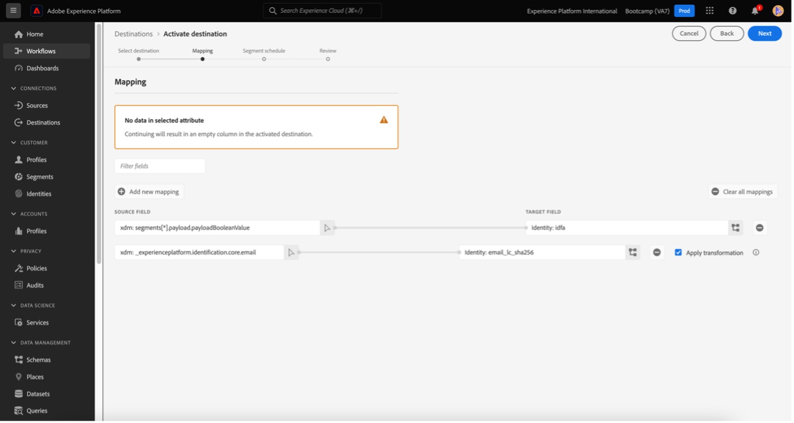

# 4.6 Dos insights à acao

## 目标

- Entenda como criar um público com base em uma visao coletada无Customer Journey Analytics
- 使用esse público no CDP em tempo real e no Adobe Journey Optimizer

## 4.6.1 Crie uma audiencia e publicque-a

我们先做个计划，先做个筛选 **呼叫感情** e conseguiu visualizar a quantidade de usuários que tiveram suas ligacoes ao call center classificadas como **正面**. Agora， voce poderá criar um segmento com essuários e ativacao-los em jornadas ou em canais de comunicacao.

O primeiro passo é： No painel criado no último exercício， selecione a linha **1. 通话感觉 — 正面**，clique com o botao direito de seu mouse e selecione a opcao **从所选内容创建受众**：

Em seguida， de um nome para a sua audiencia seguindo o modelo **yourLastName - cia受众通话感觉良好**：

关于预览声音的注释：

准最终化，小集团 **公共**：

## 4.6.2使用sua audiencia como parte de um segmento

Voltando para a Adobe Experience Platform **区段>浏览** 我们把目光投向了视觉，视觉，视觉，视觉，视觉，视觉，视觉，视觉，视觉，视觉，视觉，视觉，视觉，视觉，视觉，视觉，视觉！

阿古拉岛乌萨岛区段em uma ativacao no Facebook e em uma jornada do cliente！

## 4.6.3使用seu segmento na Real-Time CDP em tempo real

那是Adobe Experience Platform **区段>浏览** 我们请观众来听听CJA的演讲：

Clique no seu segmento e， em seguida， clique em **激活到目标**：

选择a destination chamada bootcamp-facebook e， em seguida， clique em下一步：

Em seguida，小团体em Next novamente：

选择一个opcao **受众的来源** e defina como **直接来自客户** 小团体下一步：

帕金，帕吉娜 **审核** 小团体，完成！

普伦托！ 我们来看看这个Facebook吧。
阿戈拉，阿莫斯用完了，别再说了！

## 4.6.4使用seu segmento no Adobe Journey Optimizer

Na interface da Adobe Experience Platform clique em Journey Optimizer e， em seguida，无菜单侧边快捷键， clique em **历程** 我们来听听一个叫criar uma jornada clicando em **创建历程**：

Em seguida，无菜单侧边栏，em事件，选择 **区段鉴别** 我为约纳达的阿拉斯特：

Em seguida， em **区段** 小团体 **编辑** para selectionar um segmento：

选择听众，无论他们是什么团体 **保存**：

普伦托！ 一个当事人可以说，他们要求被监禁者必须拥有被隔离的资格！

[返回用户流程4](./uc4.md)

[Voltar para todos os módulos](./../../overview.md)
