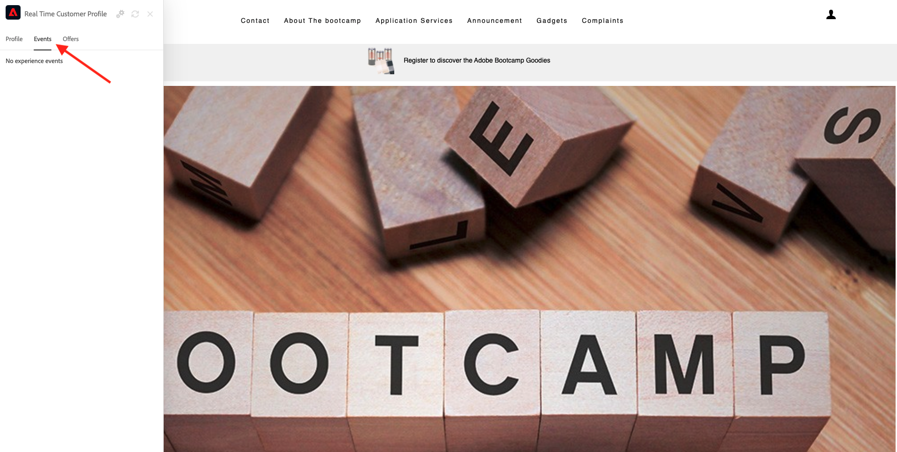

# 1.1从未知到网站上已知

## 上下文

从未知到已知的历程是当今品牌中最重要的主题之一，从客户获取到客户维系的历程也是如此。

Adobe Experience Platform在这个历程中扮演着重要角色。 平台是沟通的大脑， **体验记录系统**.

平台是一个环境，在该环境中，客户一词比已知客户更广。 从Platform的角度来看，网站上的未知访客也是客户，因此，作为未知访客的所有行为也会发送到Platform。 多亏了这种方法，当这位访客最终成为已知客户时，品牌也可以直观地显示此刻之前发生的情况。 这有助于从归因和体验优化的角度进行分析。

## 客户历程流程

转到 [https://bootcamp.aepdemo.net](https://bootcamp.aepdemo.net). 单击 **允许全部**.

单击屏幕左上角的Adobe徽标图标以打开“配置文件查看器”。

查看“配置文件查看器”面板和“实时客户配置文件”，其中 **Experience CloudID** 作为此当前未知客户的主要标识符。

您还可以查看根据客户行为收集的所有体验事件。 列表当前为空，但很快会发生更改。

转到 **应用程序服务** 菜单选项，然后单击产品 **Real-Time CDP**.

然后，您将看到产品详细信息页面。 类型的体验事件 **产品查看** 现已使用您在模块1中查看的Web SDK实施发送到Adobe Experience Platform。 打开“配置文件查看器”面板，并查看 **体验事件**.

转到 **应用程序服务** 菜单选项，然后单击产品 **Adobe Journey Optimizer**. 另一个体验事件已发送到Adobe Experience Platform。

打开“配置文件查看器”面板。 您现在将看到2个类型的体验事件 **产品查看**. 虽然行为是匿名的，但每次点击都会被跟踪并存储在Adobe Experience Platform中。 一旦匿名客户知晓，我们便能够自动将所有匿名行为与已知用户档案合并。

现在，让我们分析您的客户配置文件，然后使用您的行为对网站上的客户体验进行个性化。

下一步： [1.2可视化您自己的实时客户用户档案 — UI](./ex2.md)

[返回到用户流量1](./uc1.md)

[返回到所有模块](../../overview.md)
