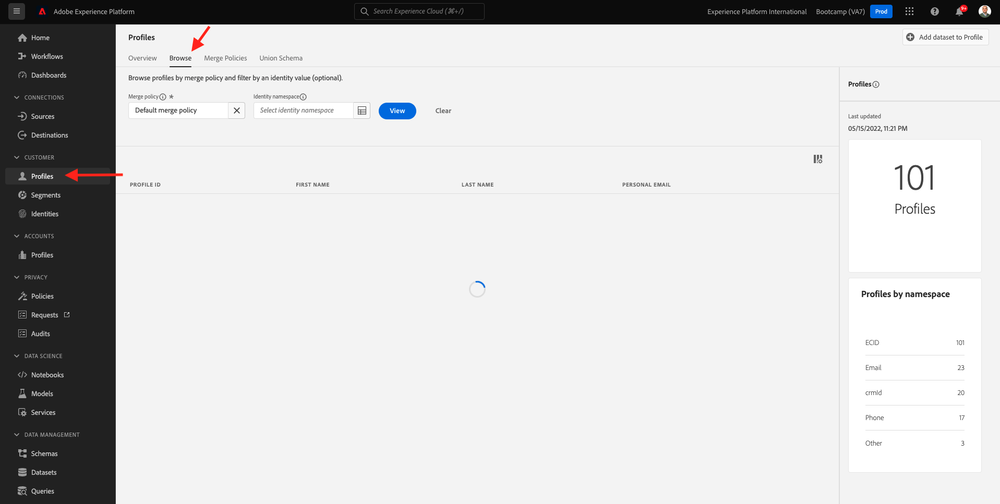
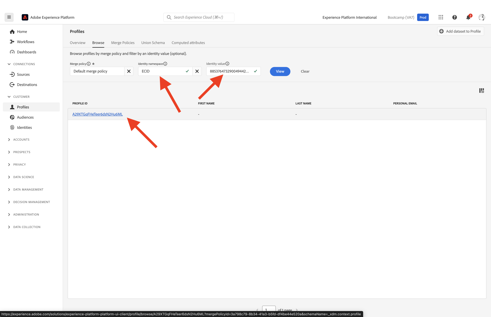

# 1.2可视化您自己的实时客户用户档案 — UI

在本练习中，您将登录Adobe Experience Platform，并在UI中查看您自己的实时客户资料。

## Story

在“实时客户资料”中，所有资料数据都与事件数据以及现有区段成员资格一起显示。 显示的数据可以从任何位置、Adobe应用程序和外部解决方案获取。 这是Adobe Experience Platform最有力的观点，真正的体验体系。

## 1.2.1使用Adobe Experience Platform中的“客户配置文件视图”

转到 [Adobe Experience Platform](https://experience.adobe.com/platform). 登录后，您将登陆Adobe Experience Platform的主页。

在继续之前，您需要选择 **沙盒**. 要选择的沙盒已命名 ``Bootcamp``. 您可以通过单击 **[!UICONTROL 生产产品]** 的蓝线。 选择相应的 [!UICONTROL 沙盒]，您将看到屏幕更改，现在，您已加入您的专述 [!UICONTROL 沙盒].

在左侧菜单中，转到 **用户档案** 和 **浏览**.

在您网站的“配置文件查看器”面板上，您可以找到身份概述。 每个身份都链接到一个命名空间。

在“配置文件查看器”面板上，您当前可以看到此标识：

| 命名空间 | 标识 |
|:-------------:| :---------------:|
| Experience Cloud ID (ECID) | 19428085896177382402834560825640259081 |

有了Adobe Experience Platform，所有ID都同样重要。 以前，ECID是Adobe上下文中最重要的ID，所有其他ID都以层级关系链接到ECID。 对于Adobe Experience Platform，情况已不再如此，并且每个ID都可以被视为主要标识符。

通常，主标识符取决于上下文。 如果你问你的呼叫中心， **最重要的ID是什么？** 他们可能会回答， **电话号码！** 但如果你问你的CRM团队，他们会回答， **电子邮件地址！**  Adobe Experience Platform理解这种复杂性，并为您进行管理。 每个应用程序(无论是Adobe应用程序还是非Adobe应用程序)都将通过引用它们视为主ID来与Adobe Experience Platform沟通。 它很管用。

对于字段 **身份命名空间**，选择 **ECID** 和 **标识值** 输入可在bootcamp网站的“配置文件查看器”面板中找到的ECID。 单击 **查看**. 然后，您会在列表中看到您的个人资料。 单击 **配置文件ID** 以打开您的个人资料。

现在，您将看到以下几个重要 **配置文件属性** 客户资料。

转到 **事件**，您可以在其中查看链接到用户档案的每个体验事件的条目。

最后，转到菜单选项 **区段成员资格**. 现在，您将看到符合此用户档案资格的所有区段。

现在，让我们创建一个新区段，以便您为匿名或了解的客户提供个性化的客户体验。

下一步： [1.3创建区段 — UI](./ex3.md)

[返回到用户流量1](./uc1.md)

[返回到所有模块](../../overview.md)
