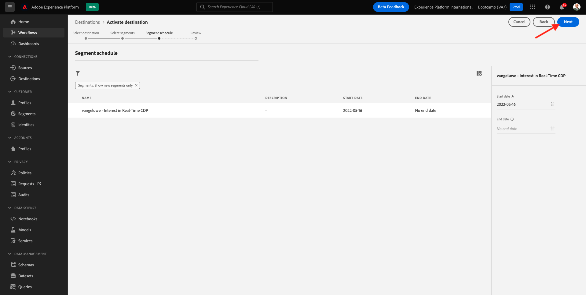
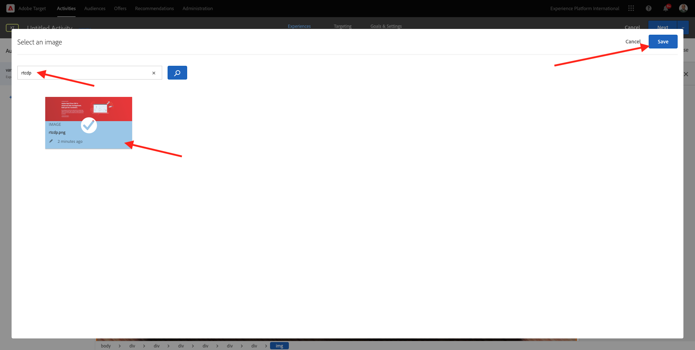

# 1.4操作：将受众发送到Adobe Target

转到 [Adobe Experience Platform](https://experience.adobe.com/platform). 登录后，您将登录到Adobe Experience Platform的主页。

在继续之前，您需要选择 **沙盒**. 要选择的沙盒已命名 ``Bootcamp``. 您可以通过单击文本来执行此操作 **[!UICONTROL 生产生产]** 在屏幕顶部的蓝线上。 选择适当的 [!UICONTROL 沙盒]，您将会看到屏幕更改，现在您已进入专用页面 [!UICONTROL 沙盒].

## 1.4.1将受众激活到Adobe Target目标

Adobe Target可作为Real-Time CDP的目标。 要设置Adobe Target集成，请转到 **目标**，至 **目录**.

单击 **个性化** 在 **类别** 菜单。 您随后将看到 **Adobe Target** 目标卡。 单击 **激活受众**.

选择目标 ``Bootcamp Target`` 并单击 **下一个**.

在可用受众列表中，选择您在中创建的受众 [1.3创建受众](./ex3.md)，名为 `yourLastName - Interest in Real-Time CDP`. 然后，单击 **下一个**.

在下一页，单击 **下一个**.

单击&#x200B;**完成**。

您的受众现已激活到Adobe Target。

>[!IMPORTANT]
>
>当您刚刚在Real-Time CDP中创建Adobe Target目标时，可能需要长达一小时的时间才能激活目标。 由于设置了后端配置，这是一个一次性等待时间。 完成初始1小时的等待时间和后端配置后，发送到Adobe Target目标的新添加的边缘受众将可以实时定位。

## 1.4.2配置基于Adobe Target表单的活动

现在，您的Real-Time CDP受众已配置为发送到Adobe Target，您可以在Adobe Target中配置体验定位活动。 在本练习中，您将配置一个基于可视化体验编辑器的活动。

转到Adobe Experience Cloud主页，然后转到 [https://experiencecloud.adobe.com/](https://experiencecloud.adobe.com/). 单击 **Target** 打开它。

在 **Adobe Target** 在主页上，您将看到所有现有的活动。
单击 **+创建活动** 以创建新活动。

选择 **体验定位**.

选择 **可视化** 并设置 **活动URL** 到 `https://bootcamp.aepdemo.net/content/aep-bootcamp-experience/language-masters/en/exercises/particpantXX.html`，但在执行此操作之前，请将XX替换为介于01和30之间的数字。

>[!IMPORTANT]
>
>每个支持参与者应使用单独的网页，以避免各种Adobe Target体验发生冲突。 您可以通过转到以下位置来选择网页并查找URL： [https://bootcamp.aepdemo.net/content/aep-bootcamp-experience/language-masters/en/exercises.html](https://bootcamp.aepdemo.net/content/aep-bootcamp-experience/language-masters/en/exercises.html).
>
>所有页面共享相同的基本URL，并以参与者的数量结尾。
>
>例如，参与者1应使用URL `https://bootcamp.aepdemo.net/content/aep-bootcamp-experience/language-masters/en/exercises/particpant01.html`，参与者30应使用URL `https://bootcamp.aepdemo.net/content/aep-bootcamp-experience/language-masters/en/exercises/particpant30.html`.

选择工作区 **AT Bootcamp**.

单击&#x200B;**下一步**。

您现在位于可视化体验编辑器中。 网站完全加载可能需要20-30秒。

默认受众当前为 **所有访客**. 单击 **3个点** 旁边 **所有访客** 并单击 **更改受众**.

您现在可以看到可用受众的列表，您之前创建并发送到Adobe Target的Adobe Experience Platform受众现在包含在此列表中。 选择您之前在Adobe Experience Platform中创建的受众。 单击 **分配受众**.

您的Adobe Experience Platform受众现在已成为此体验定位活动的一部分。

在更改主页图像之前，您需要单击 **全部允许** 在Cookie横幅上。

要执行此操作，请转到 **浏览**

接下来，单击 **全部允许**.

接下来，返回到 **撰写**.

现在，让我们更改网站主页上的主页图像。 单击网站上的默认主页图像，然后单击 **替换内容** 然后选择 **图像**.

搜索图像文件 **rtcdp.png**. 选择它，然后单击 **保存**.

然后，您将看到所选受众的新图像体验。

单击左上角的活动标题可对其进行重命名。

对于名称，请使用：

- `yourLastName - RTCDP - XT (VEC)`

单击&#x200B;**下一步**。

单击&#x200B;**下一步**。

在 **目标和设置**  — 页面，转到 **目标量度**.

将主要目标设置为 **参与** - **Time On Site**. 单击“**保存并关闭**”。

您现在位于 **活动概述** 页面。 您仍需要激活活动。

单击字段 **不活动** 并选择 **激活**.

然后，您将获得一条可视化确认消息，确认您的活动现已上线。

您的活动现在处于实时状态，可以在bootcamp网站上进行测试。

如果您现在返回演示网站，并访问的产品页面 **Real-Time CDP**，您将立即获得所创建受众的资格，并且您将看到Adobe Target活动实时显示在主页上。

>[!IMPORTANT]
>
>每个支持参与者应使用单独的网页，以避免各种Adobe Target体验发生冲突。 您可以通过转到以下位置来选择网页并查找URL： [https://bootcamp.aepdemo.net/content/aep-bootcamp-experience/language-masters/en/exercises.html](https://bootcamp.aepdemo.net/content/aep-bootcamp-experience/language-masters/en/exercises.html).
>
>所有页面共享相同的基本URL，并以参与者的数量结尾。
>
>例如，参与者1应使用URL `https://bootcamp.aepdemo.net/content/aep-bootcamp-experience/language-masters/en/exercises/particpant01.html`，参与者30应使用URL `https://bootcamp.aepdemo.net/content/aep-bootcamp-experience/language-masters/en/exercises/particpant30.html`.

下一步： [1.5操作：将受众发送到Facebook](./ex5.md)

[返回用户流程1](./uc1.md)

[返回所有模块](../../overview.md)
