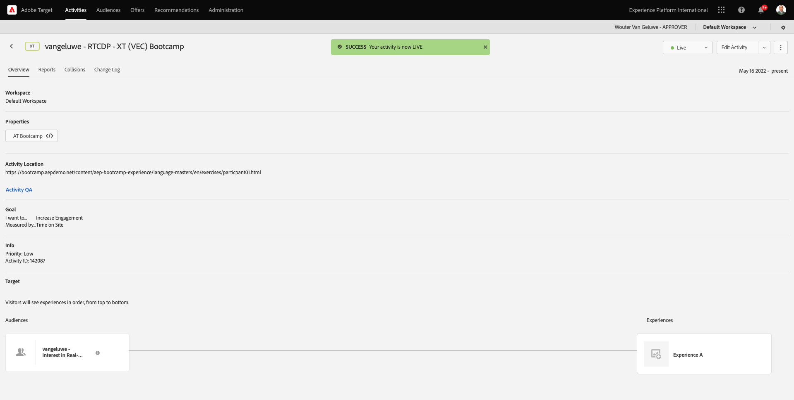

# 1.4操作：将受众发送到Adobe Target

转到[Adobe Experience Platform](https://experience.adobe.com/platform)。 登录后，您将登录到Adobe Experience Platform的主页。

在继续之前，您需要选择一个&#x200B;**沙盒**。 要选择的沙盒名为``Bootcamp``。 您可以通过单击屏幕顶部蓝线中的文本&#x200B;**[!UICONTROL Production Prod]**&#x200B;来执行此操作。 选择适当的[!UICONTROL 沙盒]后，您将看到屏幕更改，现在您已经进入专用的[!UICONTROL 沙盒]。

## 1.4.1将受众激活到Adobe Target目标

Adobe Target可作为Real-Time CDP的目标。 要设置您的Adobe Target集成，请转到&#x200B;**目标**，转到&#x200B;**目录**。

在&#x200B;**类别**&#x200B;菜单中单击&#x200B;**Personalization**。 您随后将看到&#x200B;**Adobe Target**&#x200B;目标卡。 单击&#x200B;**激活受众**。

选择目标``Bootcamp Target``并单击&#x200B;**下一步**。

在可用受众列表中，选择您在[1.3中创建的受众。3创建名为`yourLastName - Interest in Real-Time CDP`的受众](./ex3.md)。 然后，单击&#x200B;**下一步**。

在下一页，单击&#x200B;**下一步**。

单击&#x200B;**完成**。

您的受众现已激活到Adobe Target。

>[!IMPORTANT]
>
>当您刚刚在Real-Time CDP中创建Adobe Target目标时，可能需要长达一小时的时间才能激活目标。 由于设置了后端配置，这是一个一次性等待时间。 完成初始1小时的等待时间和后端配置后，发送到Adobe Target目标的新添加的边缘受众将可以实时定位。

## 1.4.2配置基于Adobe Target表单的活动

现在，您的Real-Time CDP受众已配置为发送到Adobe Target，您可以在Adobe Target中配置体验定位活动。 在本练习中，您将配置一个基于可视化体验编辑器的活动。

转到[https://experiencecloud.adobe.com/](https://experiencecloud.adobe.com/)以转到Adobe Experience Cloud主页。 单击&#x200B;**Target**&#x200B;以将其打开。

在&#x200B;**Adobe Target**主页上，您将看到所有现有活动。
单击**+创建活动**&#x200B;以创建新活动。

选择&#x200B;**体验定位**。

选择&#x200B;**Visual**&#x200B;并将&#x200B;**活动URL**&#x200B;设置为`https://bootcamp.aepdemo.net/content/aep-bootcamp-experience/language-masters/en/exercises/particpantXX.html`，但在执行此操作之前，请将XX替换为01到30之间的数字。

>[!IMPORTANT]
>
>每个支持参与者应使用单独的网页，以避免各种Adobe Target体验发生冲突。 您可以通过转到以下位置选择网页并查找URL： [https://bootcamp.aepdemo.net/content/aep-bootcamp-experience/language-masters/en/exercises.html](https://bootcamp.aepdemo.net/content/aep-bootcamp-experience/language-masters/en/exercises.html)。
>
>所有页面共享相同的基本URL，并以参与者的数量结尾。
>
>例如，参与者1应使用URL `https://bootcamp.aepdemo.net/content/aep-bootcamp-experience/language-masters/en/exercises/particpant01.html`，参与者30应使用URL `https://bootcamp.aepdemo.net/content/aep-bootcamp-experience/language-masters/en/exercises/particpant30.html`。

选择工作区&#x200B;**AT Bootcamp**。

单击&#x200B;**下一步**。

您现在位于可视化体验编辑器中。 网站完全加载可能需要20-30秒。

默认受众当前为&#x200B;**所有访客**。 单击&#x200B;**所有访客**&#x200B;旁边的&#x200B;**3点**，然后单击&#x200B;**更改受众**。

您现在可以看到可用受众的列表，您之前创建并发送到Adobe Target的Adobe Experience Platform受众现在包含在此列表中。 选择您之前在Adobe Experience Platform中创建的受众。 单击&#x200B;**分配受众**。

您的Adobe Experience Platform受众现在已成为此体验定位活动的一部分。

在更改主页图像之前，您需要单击Cookie横幅上的&#x200B;**全部允许**。

为此，请转到&#x200B;**浏览**

接下来，单击&#x200B;**全部允许**。

接下来，返回&#x200B;**撰写**。

现在，让我们更改网站主页上的主页图像。 单击网站上的默认主页图像，单击&#x200B;**替换内容**，然后选择&#x200B;**图像**。

搜索图像文件&#x200B;**rtcdp.png**。 选择它，然后单击&#x200B;**保存**。

然后，您将看到所选受众的新图像体验。

单击左上角的活动标题可对其进行重命名。

对于名称，请使用：

- `yourLastName - RTCDP - XT (VEC)`

单击&#x200B;**下一步**。

单击&#x200B;**下一步**。

在&#x200B;**目标和设置** — 页面上，转到&#x200B;**目标量度**。

将主要目标设置为&#x200B;**参与** - **网站停留时间**。 单击&#x200B;**保存并关闭**。

您现在位于&#x200B;**活动概述**&#x200B;页面。 您仍需要激活活动。

单击字段&#x200B;**不活动**&#x200B;并选择&#x200B;**激活**。

然后，您将获得一条可视化确认消息，确认您的活动现已上线。

您的活动现在处于实时状态，可以在bootcamp网站上进行测试。

如果您现在返回演示网站并访问&#x200B;**Real-Time CDP**&#x200B;的产品页面，您将立即符合您创建的受众资格，并且您将看到Adobe Target活动实时显示在主页上。

>[!IMPORTANT]
>
>每个支持参与者应使用单独的网页，以避免各种Adobe Target体验发生冲突。 您可以通过转到以下位置选择网页并查找URL： [https://bootcamp.aepdemo.net/content/aep-bootcamp-experience/language-masters/en/exercises.html](https://bootcamp.aepdemo.net/content/aep-bootcamp-experience/language-masters/en/exercises.html)。
>
>所有页面共享相同的基本URL，并以参与者的数量结尾。
>
>例如，参与者1应使用URL `https://bootcamp.aepdemo.net/content/aep-bootcamp-experience/language-masters/en/exercises/particpant01.html`，参与者30应使用URL `https://bootcamp.aepdemo.net/content/aep-bootcamp-experience/language-masters/en/exercises/particpant30.html`。

下一步： [1.5操作：将受众发送到Facebook](./ex5.md)

[返回用户流程1](./uc1.md)

[返回所有模块](../../overview.md)
