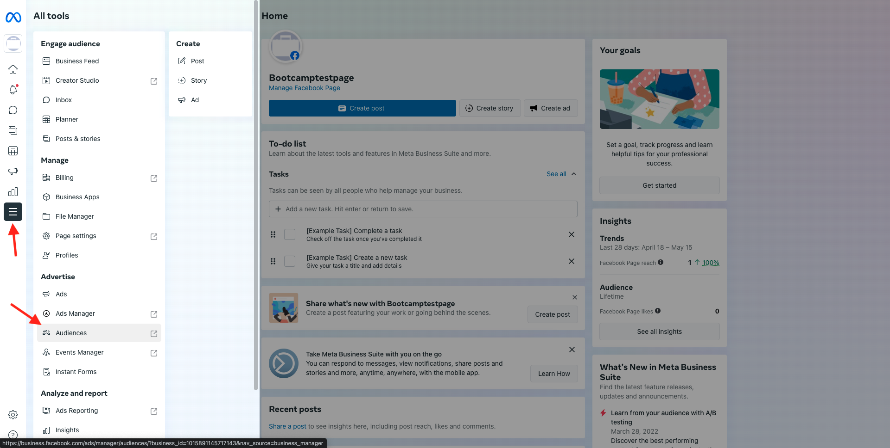

# 1.5操作：将受众发送到Facebook

转到[Adobe Experience Platform](https://experience.adobe.com/platform)。 登录后，您将登录到Adobe Experience Platform的主页。

在继续之前，您需要选择一个&#x200B;**沙盒**。 要选择的沙盒名为``Bootcamp``。 您可以通过单击屏幕顶部蓝线中的文本&#x200B;**[!UICONTROL Production Prod]**&#x200B;来执行此操作。 选择适当的[!UICONTROL 沙盒]后，您将看到屏幕更改，现在您已经进入专用的[!UICONTROL 沙盒]。

在左侧菜单中，转到&#x200B;**目标**，然后转到&#x200B;**目录**。 您随后将看到&#x200B;**目标目录**。 在&#x200B;**目标**&#x200B;中，单击&#x200B;**Facebook自定义受众**&#x200B;卡片上的&#x200B;**激活受众**。

选择目标&#x200B;**bootcamp-facebook**，然后单击&#x200B;**下一步**。

在可用受众列表中，选择您在上一个练习中创建的受众。 单击&#x200B;**下一步**。

在&#x200B;**映射**&#x200B;页面上，确保启用&#x200B;**应用转换**&#x200B;复选框。 单击&#x200B;**下一步**。

在&#x200B;**受众计划**&#x200B;页面上，选择受众的&#x200B;**来源**，并将其设置为&#x200B;**直接从客户**。 单击&#x200B;**下一步**。

最后，在&#x200B;**审核**&#x200B;页面上单击&#x200B;**完成**。

现在，您的受众已链接到Facebook自定义受众。 每次有客户符合此受众的资格条件时，都会向Facebook服务器端发送一个信号，将该客户包含在Facebook端的自定义受众中。

在Facebook中，您可以在自定义受众下找到来自Adobe Experience Platform的受众：

您现在可以看到您的自定义受众显示在Facebook中：

[返回用户流程1](./uc1.md)

[返回所有模块](../../overview.md)
