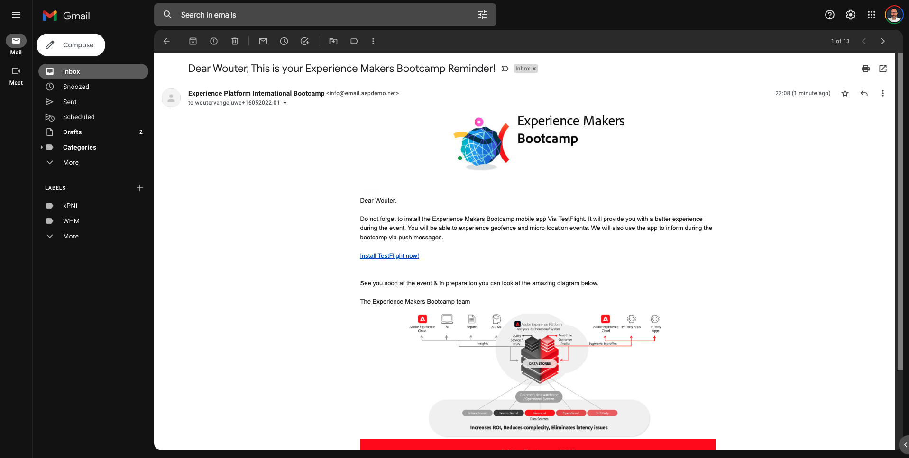

# 2.1访问网站并创建帐户

## 上下文

从未知到已知的过程，以及客户从收购到维系的过程，是当今品牌圈最重要的主题之一。

Adobe Experience Platform在此历程中发挥着巨大作用。 Platform是通讯的大脑，记录的&#x200B;**体验系统**。

Platform是一个环境，在该环境中，客户一词不仅限于已知客户。 从Platform的角度来看，网站上的未知访客也是客户，因此，作为未知访客的所有行为也会发送到Platform。 凭借这种方法，当该访客最终成为已知客户时，品牌也可以可视化此时之前发生的事情。 这在归因和体验优化方面很有用。

## 客户历程流程

转到[https://bootcamp.aepdemo.net](https://bootcamp.aepdemo.net)。 单击&#x200B;**全部允许**。 根据您在上一个用户流中的浏览行为，您将在网站的主页上看到个性化。

单击屏幕左上角的Adobe徽标图标以打开配置文件查看器。 请查看配置文件查看器面板和实时客户配置文件，将&#x200B;**Experience CloudID**&#x200B;作为此当前未知客户的主要标识符。

您还可以查看根据客户行为收集的所有体验事件。

单击屏幕右上角的&#x200B;**配置文件**&#x200B;图标。

单击&#x200B;**创建帐户**。

填写表单的所有字段。 为电子邮件地址和电话号码使用实际值，因为它将在以后的练习中用于投放电子邮件和短信。

向下滚动并单击&#x200B;**注册**。

你会看到这个。

您还将收到以下电子邮件：

几分钟后，您还将收到以下电子邮件：

让我们看看下一步如何配置此入门培训历程。

下一步： [2.2创建您的事件](./ex2.md)

[返回用户流程2](./uc2.md)

[返回所有模块](../../overview.md)
