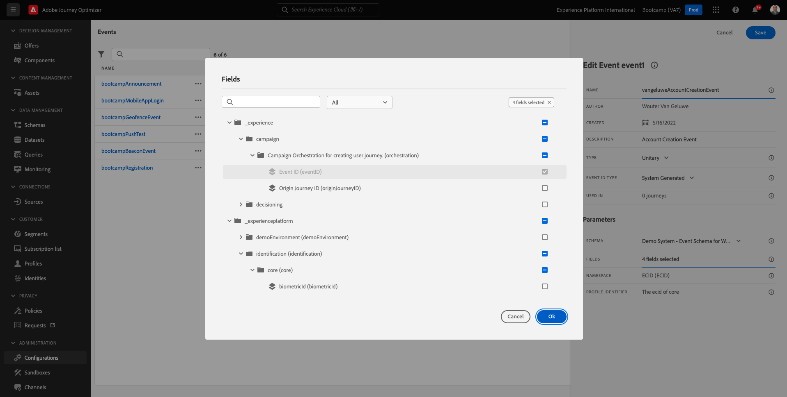
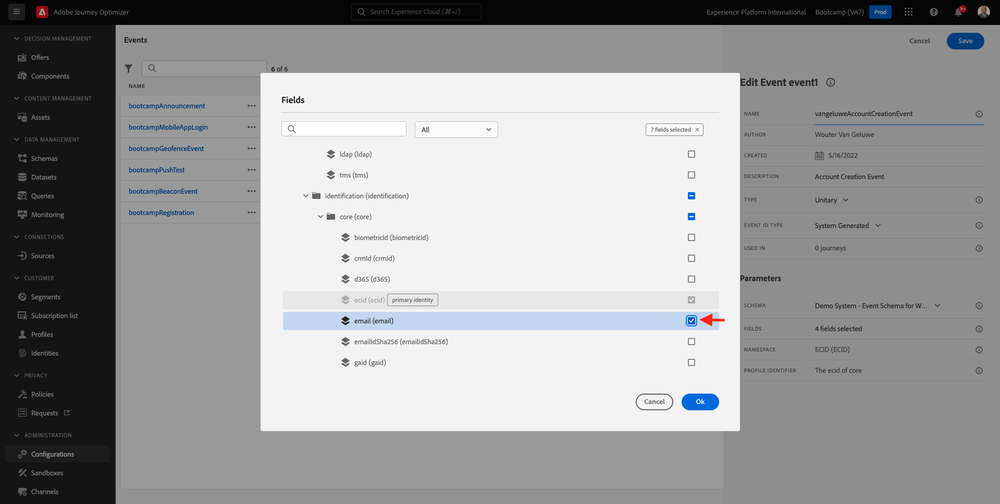
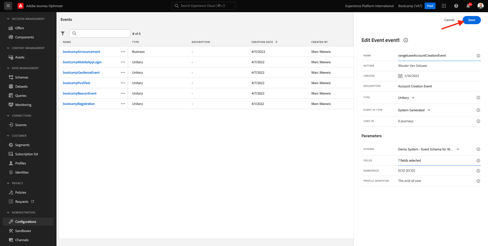

# 2.2创建您的事件

通过转到[Adobe Experience Cloud](https://experience.adobe.com)登录Adobe Journey Optimizer。 单击&#x200B;**Journey Optimizer**。

您将被重定向到Journey Optimizer中的&#x200B;**主页**&#x200B;视图。 首先，确保使用正确的沙盒。 要使用的沙盒名为`Bootcamp`。 若要从一个沙盒更改到另一个沙盒，请单击&#x200B;**Prod**&#x200B;并从列表中选择该沙盒。 在此示例中，沙盒名为&#x200B;**Bootcamp**。 然后，您将进入沙盒`Bootcamp`的&#x200B;**主页**&#x200B;视图。

在左侧菜单中，向下滚动并单击&#x200B;**配置**。 接下来，单击&#x200B;**事件**&#x200B;下的&#x200B;**管理**&#x200B;按钮。

然后，您将看到所有可用事件的概述。 单击&#x200B;**创建事件**&#x200B;开始创建您自己的事件。

随后将弹出一个新的空事件窗口。

首先，为您的事件提供如下名称： `yourLastNameAccountCreationEvent`并添加如下描述`Account Creation Event`。

接下来，确保&#x200B;**类型**&#x200B;设置为&#x200B;**单一**，对于&#x200B;**事件ID类型**&#x200B;选择，请选择&#x200B;**系统生成的**。

接下来是架构选择。 为本练习准备了一个方案。 请使用架构`Demo System - Event Schema for Website (Global v1.1) v.1`。

选择架构后，您将在&#x200B;**字段**&#x200B;部分看到许多字段正在被选择。 现在，您应该将鼠标悬停在&#x200B;**字段**&#x200B;部分上，此时您会看到3个图标弹出窗口。 单击&#x200B;**编辑**&#x200B;图标。

您会看到&#x200B;**字段**&#x200B;窗口弹出窗口，您需要在该窗口中选择个性化电子邮件所需的某些字段。  我们稍后将使用Adobe Experience Platform中已有的数据，选择其他配置文件属性。

在对象`_experienceplatform.demoEnvironment`中，请确保选择字段&#x200B;**brandLogo**&#x200B;和&#x200B;**brandName**。

在对象`_experienceplatform.identification.core`中，请确保选择字段&#x200B;**电子邮件**。

单击&#x200B;**确定**&#x200B;以保存更改。

您应该会看到此内容。 再次单击&#x200B;**保存**&#x200B;以保存更改。

您的事件现已配置并保存。

再次单击您的事件以再次打开&#x200B;**编辑事件**&#x200B;屏幕。 再次将鼠标悬停在&#x200B;**字段**&#x200B;上可再次查看这3个图标。 单击&#x200B;**查看有效负载**&#x200B;图标。

您现在将看到预期有效负载的示例。
您的事件具有独特的编排eventID，您可以通过在该有效负荷中向下滚动直至看到`_experience.campaign.orchestration.eventID`来查找该事件。

事件ID是需要发送到Adobe Experience Platform的，以触发您将在下一个练习中构建的历程。 记住此eventID，因为您以后可能需要它。
`"eventID": "19cab7852cdef99d25b6d5f1b6503da39d1f486b1d585743f97ed2d1e6b6c74f"`

单击&#x200B;**确定**，然后单击&#x200B;**取消**。

您现在已经完成了此练习。

下一步： [2.3创建电子邮件](./ex3.md)

[返回用户流程2](./uc2.md)

[返回所有模块](../../overview.md)
