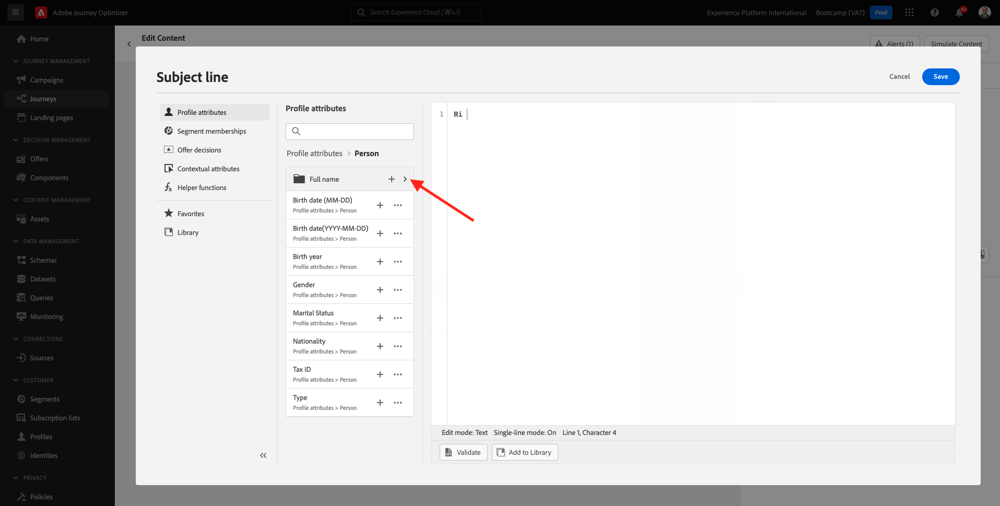
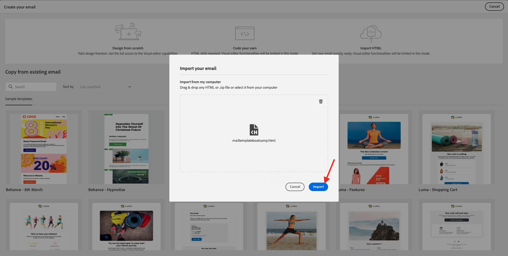

# 2.3创建历程和电子邮件

在本练习中，您将配置当有人在演示网站上创建帐户时需要触发的历程。

登录到Adobe Journey Optimizer，方法是： [Adobe Experience Cloud](https://experience.adobe.com). 单击 **Journey Optimizer**.

您将被重定向到 **主页**  在Journey Optimizer中查看。 首先，确保使用正确的沙盒。 调用要使用的沙盒 `Bootcamp`. 要从一个沙盒更改到另一个沙盒，请单击 **Prod** 并从列表中选择沙盒。 在此示例中，将沙盒命名为 **Bootcamp**. 然后，您将位于 **主页** 沙盒视图 `Bootcamp`.

## 2.3.1创建历程

在左侧菜单中，单击 **历程**. 接下来，单击 **创建历程** 以创建新旅程。

然后，您将看到一个空的历程屏幕。

在上一个练习中，您创建了一个 **事件**. 你给它起名是这样的 `yourLastNameAccountCreationEvent` 和已替换 `yourLastName` 加上你的姓氏。 这是事件创建的结果：

现在，您需要将此活动作为此历程的开头。 为此，您可以转到屏幕左侧，并在事件列表中搜索您的事件。

选择您的事件，将其拖放到历程画布上。 您的历程现在看起来像这样：

作为历程的第二步，您需要添加一个简短的 **等待** 步骤。 转到屏幕左侧的 **编排** 部分以查找此内容。 您将使用配置文件属性，并且需要确保将这些属性填充到Real-time Customer Profile中。

您的历程现在看起来像这样。 在屏幕的右侧，您需要配置等待时间。 设置为1分钟。 这将为配置文件属性在事件触发后提供足够的可用时间。

单击 **确定** 以保存更改。

作为历程的第三步，您需要添加 **电子邮件** 操作。 转到屏幕左侧，以访问 **操作**，选择 **电子邮件** 操作，然后将其拖放到历程的第二个节点上。 您现在可以看到此内容。

设置 **类别** 到 **营销** 并选择一个允许您发送电子邮件的电子邮件表面。 在这种情况下，要选择的电子邮件表面为 **电子邮件**. 确保选中复选框 **电子邮件的点击次数** 和 **电子邮件打开次数** 都处于启用状态。

下一步是创建消息。 为此，请单击 **编辑内容**.

## 2.3.2创建消息

要创建消息，请单击 **编辑内容**.

您现在可以看到此内容。

单击 **主题行** 文本字段。

在文本区域中，开始写入 **您好**

主题行尚未完成。 接下来，您需要为字段引入个性化令牌 **名字** ，存储在 `profile.person.name.firstName`. 在左侧菜单中，向下滚动以查找 **人员** 元素，然后单击箭头可更深入了解。

现在查找 **全名** 元素，然后单击箭头可更深入了解。

最后，查找 **名字** 字段，然后单击 **+** 在它旁边签名。 然后，您会看到个性化令牌显示在文本字段中。

接下来，添加文本 **，感谢您注册！**&#x200B;的问题。单击&#x200B;**保存**。

然后你就回来。 单击 **电子邮件设计工具** 以创建电子邮件的内容。

在下一个屏幕中，将提示您使用3种不同的方法来提供电子邮件的内容：

- **从头开始设计**：从空白画布开始，使用WYSIWYG编辑器拖放结构和内容组件以可视方式构建电子邮件内容。
- **自己编写代码**：使用HTML对电子邮件模板进行编码，以创建自己的电子邮件模板
- **导入HTML**：导入一个现有的HTML模板，您将能够对其进行编辑。

单击 **导入HTML**. 或者，您也可以单击 **保存的模板** 并选择模板 **Bootcamp — 电子邮件模板**.

如果您已选择 **导入HTML**，您现在可以拖放文件 **mailtemplatebootcamp.html**，您可以下载 [此处](../../assets/html/mailtemplatebootcamp.html.zip). 单击“导入”。

然后，您将看到此默认电子邮件模板：

让我们个性化电子邮件。 单击文本旁的 **您好** 然后单击 **添加个性化** 图标。

接下来，您需要将 **名字** 个性化令牌，存储在 `profile.person.name.firstName`. 在菜单中，找到 **人员** 元素，向下展开至 **全名** 元素，然后单击 **+** 图标以将“名字”字段添加到表达式编辑器中。

单击&#x200B;**保存**。

现在，您会注意到个性化字段已如何添加到您的文本中。

单击 **保存** 以保存您的消息。

通过单击 **箭头** 位于左上角的主题行文本旁边。

您现在已经完成了注册电子邮件的创建。 单击左上角的箭头可返回您的历程。

单击 **确定**.

## 2.3.3发布您的历程

您仍需要为历程命名。 要执行此操作，请单击 **属性** 图标。

然后，您可以在此处输入历程的名称。 请使用 `yourLastName - Account Creation Journey`. 单击 **确定** 以保存更改。

您现在可以通过单击 **Publish**.

单击 **Publish** 再来一次。

然后，您将看到一个绿色确认栏，其中显示您的历程现已发布。

您现在已经完成了此练习。

下一步： [2.4测试您的历程](./ex4.md)

[返回用户流程2](./uc2.md)

[返回所有模块](../../overview.md)