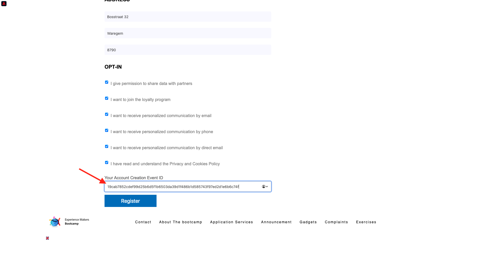

# 2.4测试您的历程

## 客户历程流程

打开一个干净无痕的新浏览器窗口，然后转到 [https://bootcamp.aepdemo.net](https://bootcamp.aepdemo.net). 单击 **全部允许**. 根据您在上一个用户流中的浏览行为，您将在网站的主页上看到个性化。

单击 **个人资料** 图标。

单击 **创建帐户**.

填写表单的所有字段。 为电子邮件地址和电话号码使用实际值，因为它将在以后的练习中用于投放电子邮件和短信。

向下滚动。 现在，您需要输入在练习2.2中创建的自定义事件的eventID。您可以在此处找到它：

事件ID是需要发送到Adobe Experience Platform的，以触发您构建的历程。 下面是此示例中的eventID： `19cab7852cdef99d25b6d5f1b6503da39d1f486b1d585743f97ed2d1e6b6c74f`

在字段中填写eventID **您的帐户创建事件ID** 并单击 **注册**.

你就能看到这个了。

您还将收到这封电子邮件，它是您在本练习中自行创建的电子邮件。

您现在已经完成了此练习。

下一步： [2.5安装和使用移动应用程序](./ex5.md)

[返回用户流程2](./uc2.md)

[返回所有模块](../../overview.md)
