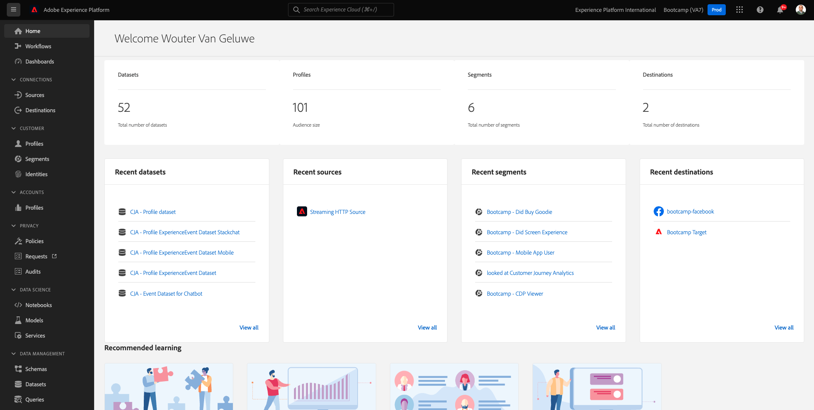

# 2.6 Personalization在呼叫中心

正如在引导营中已经多次讨论过的，以全渠道方式实现客户体验的个性化应当实现。 呼叫中心通常与客户历程的其余部分非常脱节，这通常会导致客户体验受损，但无需如此。 我们来举一个例子，说明如何轻松地实时将呼叫中心连接到Adobe Experience Platform。

## 客户历程流程

在上一个使用移动应用程序的练习中，您通过单击&#x200B;**购买**&#x200B;按钮购买了产品。

假设您对订单的状态有疑问，您会怎么做？ 通常您会致电呼叫中心。

在呼叫呼叫中心之前，您需要知道您的&#x200B;**忠诚度ID**。 您可以在网站的用户档案查看器中找到您的忠诚度ID。

在这种情况下，**忠诚度ID**&#x200B;为&#x200B;**5863105**。 作为我们演示环境中呼叫中心功能自定义实施的一部分，您需要为您的&#x200B;**忠诚度ID**&#x200B;添加前缀。 前缀为&#x200B;**11373**，因此在此示例中使用的忠诚度ID为&#x200B;**113735863105**。

现在我们开始吧。 使用您的电话并拨打&#x200B;**+1 (323) 745-1670**。

系统将要求您输入忠诚度ID，随后是&#x200B;**#**。 输入您的忠诚度ID。

您随后将听到&#x200B;**名字**&#x200B;您好。 该名字摘自Adobe Experience Platform中的Real-time Customer Profile。 然后您有3个选项。 按号码&#x200B;**1**，**订单状态**。

听到您的订单状态后，您可以选择按&#x200B;**1**&#x200B;返回主菜单，或者按2。 按&#x200B;**2**。

然后，您将需要选择一个介于1和5之间（1表示低，5表示高）的号码来评价您的呼叫中心体验。 做出您的选择。

您致电呼叫中心的工作将立即结束。

转到[Adobe Experience Platform](https://experience.adobe.com/platform)。 登录后，您将登录到Adobe Experience Platform的主页。

在继续之前，您需要选择一个&#x200B;**沙盒**。 要选择的沙盒名为``Bootcamp``。 您可以通过单击屏幕顶部蓝线中的文本&#x200B;**[!UICONTROL Production Prod]**&#x200B;来执行此操作。 选择适当的[!UICONTROL 沙盒]后，您将看到屏幕更改，现在您已经进入专用的[!UICONTROL 沙盒]。

在左侧菜单中，转到&#x200B;**配置文件**&#x200B;和&#x200B;**浏览**。

选择&#x200B;**身份命名空间** **电子邮件**，然后输入客户配置文件的电子邮件地址。 单击&#x200B;**查看**。 单击以打开您的配置文件。

您将再次看到您的客户资料。 转到&#x200B;**活动**。

在events下，您将看到2个eventType为&#x200B;**呼叫中心**&#x200B;的事件。 第一个活动是您对问题&#x200B;**的回答的结果，请对您的通话满意度评级**。

向下滚动一点，您会看到选择检查&#x200B;**订单状态**&#x200B;的选项时记录的事件。

转到&#x200B;**区段成员资格**。 现在，您将看到2个区段根据您通过呼叫中心的交互情况，实时在您的个人资料中符合条件。 这些区段成员资格可以也应该用于影响通过任何其他渠道进行的通信和个性化。

您现在已经完成了此练习。

[返回用户流程2](./uc2.md)

[返回所有模块](../../overview.md)
