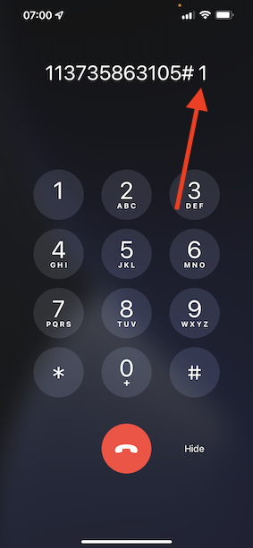

# 2.6呼叫中心中的个性化

正如已在引导营中多次讨论过的那样，应以全渠道方式实现客户体验个性化。 呼叫中心通常与客户历程的其余部分非常脱节，这通常会导致客户体验令人沮丧，但并不需要如此。 让我们向您展示一个示例，说明如何轻松地实时将呼叫中心连接到Adobe Experience Platform。

## 客户历程流程

在上一个使用移动应用程序的练习中，您通过单击 **购买** 按钮。

假设您对订单的状态有疑问，您会怎么做？ 通常您会致电呼叫中心。

在呼叫呼叫中心之前，您需要了解 **忠诚度ID**. 您可以在网站的用户档案查看器中找到您的忠诚度ID。

在本例中， **忠诚度ID** 是 **5863105**. 在演示环境中，作为呼叫中心功能自定义实施的一部分，您需要向添加前缀 **忠诚度ID**. 前缀为 **11373**，因此本示例中使用的忠诚度ID为 **11373 5863105**.

现在让我们做吧。 使用您的电话并拨打电话号码 **+1 (323) 745-1670**.

系统将要求您输入忠诚度ID，随后将要求 **#**. 输入您的忠诚度ID。

然后您会听到 **你好，名字**. 名字取自Adobe Experience Platform中的Real-Time Customer Profile。 然后您有3个选项。 按键号码 **1**， **订单状态**.

在听到您的订单状态后，您将可以选择按下 **1** 返回主菜单，或者按2。 按 **2**.

然后，您将需要选择一个介于1和5之间（1表示低，5表示高）的数字，对您的呼叫中心体验进行评分。 做出您的选择。

您致电呼叫中心的电话现在将结束。

转到 [Adobe Experience Platform](https://experience.adobe.com/platform). 登录后，您将登录到Adobe Experience Platform的主页。

在继续之前，您需要选择 **沙盒**. 要选择的沙盒已命名 ``Bootcamp``. 您可以通过单击文本来执行此操作 **[!UICONTROL 生产产品]** 在屏幕顶部的蓝线上。 选择适当的 [!UICONTROL 沙盒]，您会看到屏幕更改，现在您已专心致志地工作 [!UICONTROL 沙盒].

在左侧菜单中，转到 **配置文件** 和 **浏览**.

选择 **身份命名空间** **电子邮件** 并输入客户个人资料的电子邮件地址。 单击 **视图**. 单击以打开您的个人资料。

您将再次看到您的客户资料。 转到 **事件**.

在events下，您将看到2个事件，其eventType为 **呼叫中心**. 第一个事件是您对问题的回答所产生的结果 **评价您的通话满意度**.

向下滚动一点，您将看到选中选项时记录的事件。 **订单状态**.

转到 **区段成员资格**. 现在，您将看到根据通过呼叫中心进行的交互，有2个区段实时符合您的个人资料条件。 这些区段成员资格可以而且应该用于影响通过任何其他渠道进行的通信和个性化。

您现在已经完成了此练习。

[返回用户流程2](./uc2.md)

[返回所有模块](../../overview.md)
