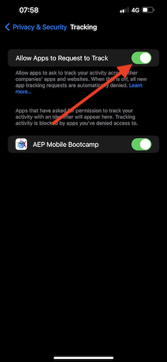
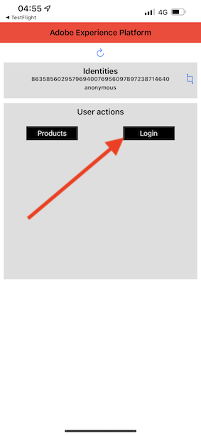
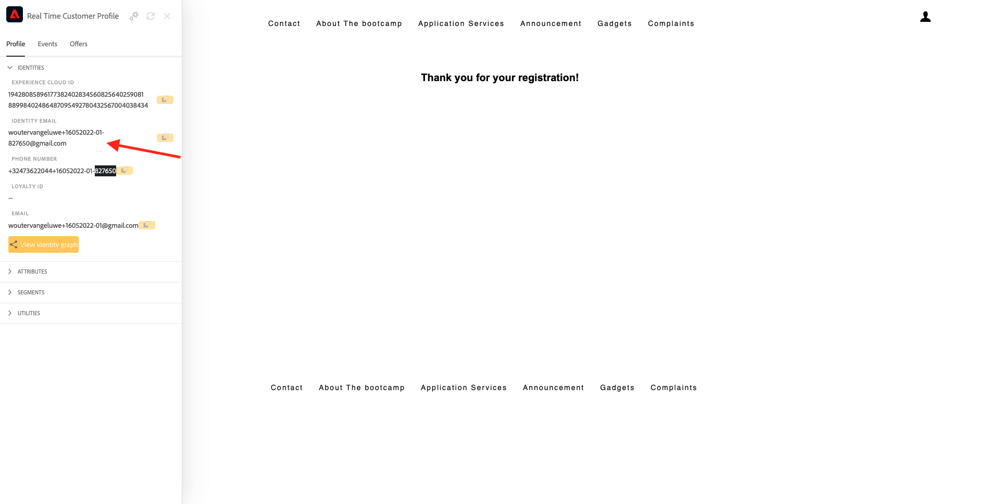

# 3.1使用移动设备应用程序并触发信标条目

## 安装移动设备应用程序

在安装应用程序之前，您需要启用 **跟踪** 在iOS设备上。 要执行此操作，请转到 **设置** > **隐私和安全** > **跟踪** 并确保 **允许应用程序请求跟踪**.

转到Apple App Store并搜索 `aepmobile-bootcamp`. 单击 **安装** 或 **下载**.

安装应用程序后，单击 **打开**.

单击&#x200B;**确定**。

单击 **允许**.

单击 **我同意**.

单击 **使用应用程序时允许**.

单击 **允许**.

您现在位于应用程序的主页上，可以随时完成客户历程。

## 客户历程流程

首先，您需要登录。 单击&#x200B;**登录**。

在之前的练习中创建帐户后，您会在网站上看到此内容。 现在，您需要重复使用在应用程序中创建的帐户的电子邮件地址才能登录。

在此处输入您在网站上使用的电子邮件地址，然后单击 **登录**.

然后，您将获得登录确认，并收到推送通知。

返回到应用程序中的主页，您将看到显示其他功能。

首先，转到 **产品**. 在本例中，单击任意产品 **咖啡去**.

您将看到 **咖啡去** 产品页面。

现在，您将在离线存储位置模拟信标条目事件。 模拟此过程的目标是在店内屏幕上个性化客户体验。 为了可视化店内体验，已创建一个页面，该页面将动态显示与刚刚进入商店的客户相关的信息。

在继续之前，请在您的计算机上打开此网页： [https://bootcamp.aepdemo.net/content/aep-bootcamp-experience/language-masters/en/screen.html](https://bootcamp.aepdemo.net/content/aep-bootcamp-experience/language-masters/en/screen.html)

然后您将看到：

接下来，返回主页。 单击 **信标** 图标。

然后你会看到这个。 首先，选择 **Bootcamp屏幕信标** ，然后单击 **条目** 按钮。 这将允许您模拟信标条目。

现在，看看店内屏幕。 您将在5秒内看到您查看的最后一个产品。

然后，返回 **产品**. 在本例中，单击任意产品 **滩毯滩**.

接下来，返回主页。 单击 **信标** 图标。

然后你会看到这个。 首先，选择 **Bootcamp屏幕信标** ，然后单击 **条目** 按钮。 这将允许您模拟信标条目。

现在，再次查看店内屏幕。 您将在5秒内看到您查看的最后一个产品。

现在，我们还可以在网站上查看您的用户档案查看器。 您将看到在此处添加的许多事件，只是为了显示与客户的任何交互都会收集并存储在Adobe Experience Platform中。

在接下来的练习中，您将配置并测试您自己的信标登入历程。

下一步： [3.2创建事件](./ex2.md)

[返回到用户流量3](./uc3.md)

[返回到所有模块](../../overview.md)
