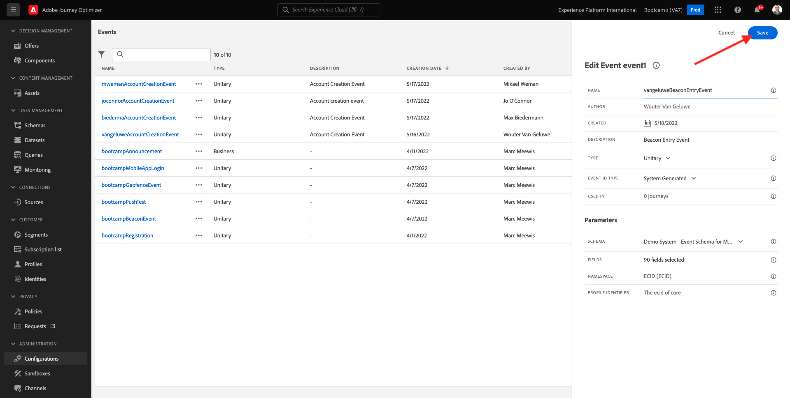

# 3.2创建事件

登录到Adobe Journey Optimizer，方法是： [Adobe Experience Cloud](https://experience.adobe.com). 单击 **Journey Optimizer**.

您将被重定向到 **主页**  在Journey Optimizer中查看。 首先，确保使用正确的沙盒。 调用要使用的沙盒 `Bootcamp`. 要从一个沙盒更改到另一个沙盒，请单击 **Prod** 并从列表中选择沙盒。 在此示例中，将沙盒命名为 **Bootcamp2**. 然后，您将位于 **主页** 沙盒视图 `Bootcamp`.

在左侧菜单中，向下滚动并单击 **配置**. 接下来，单击 **管理** 按钮位于 **事件**.

然后，您将看到所有可用事件的概述。 单击 **创建事件** 以开始创建您自己的事件。

随后将弹出一个新的空事件窗口。

首先，为您的事件提供一个名称，如下所示： `yourLastNameBeaconEntryEvent` 并添加如下描述 `Beacon Entry Event`.

接下来，确保 **类型** 设置为 **单一**&#x200B;的，和 **事件ID类型** 选择，选择 **系统生成**.

接下来是架构选择。 为此练习准备了一个模式。 请使用架构 `Demo System - Event Schema for Mobile App (Global v1.1) v.1`.

选择架构后，您将看到在 **字段** 部分。 现在，您应该将鼠标悬停在 **字段** 部分中，您将看到3个图标弹出窗口。 单击 **编辑** 图标。

您将看到 **字段** 窗口弹出窗口，您需要在其中选择我们对历程进行个性化所需的某些字段。  我们稍后将使用Adobe Experience Platform中已有的数据，选择其他配置文件属性。

向下滚动直到您看到对象为止 `Place context` 并选中复选框。 这样，客户所在位置的所有上下文都将可供历程使用。 单击 **确定** 以保存更改。

然后您应该会看到此内容。 单击 **保存** 再保存一次更改。

您的事件现已配置并保存。

再次单击您的事件以打开 **编辑事件** 再次屏幕。 将鼠标悬停在 **字段** 再次查看这3个图标。 单击 **视图** 图标。

您现在将看到预期有效负载的示例。
您的事件具有唯一的编排eventID，您可以通过向下滚动该有效负载中的直到看到 `_experience.campaign.orchestration.eventID`.

事件ID是需要发送到Adobe Experience Platform的，以触发您将在下一个练习中构建的历程。 记住此eventID，因为您以后可能需要它。
`"eventID": "e76c0bf0c77c3517e5b6f4c457a0754ebaf5f1f6b9357d74e0d8e13ae517c3d5"`

单击 **确定**，然后单击 **取消**.

您现在已经完成了此练习。

下一步： [3.3创建历程和推送通知](./ex3.md)

[返回用户流程3](./uc3.md)

[返回所有模块](../../overview.md)
