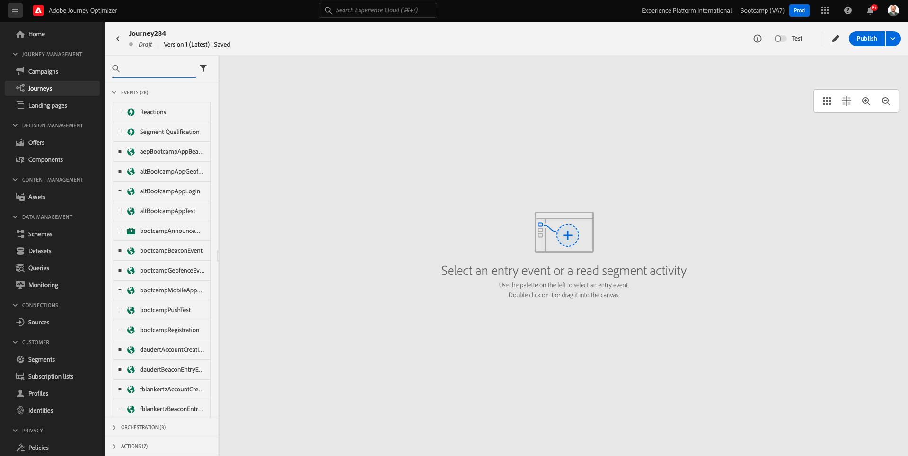
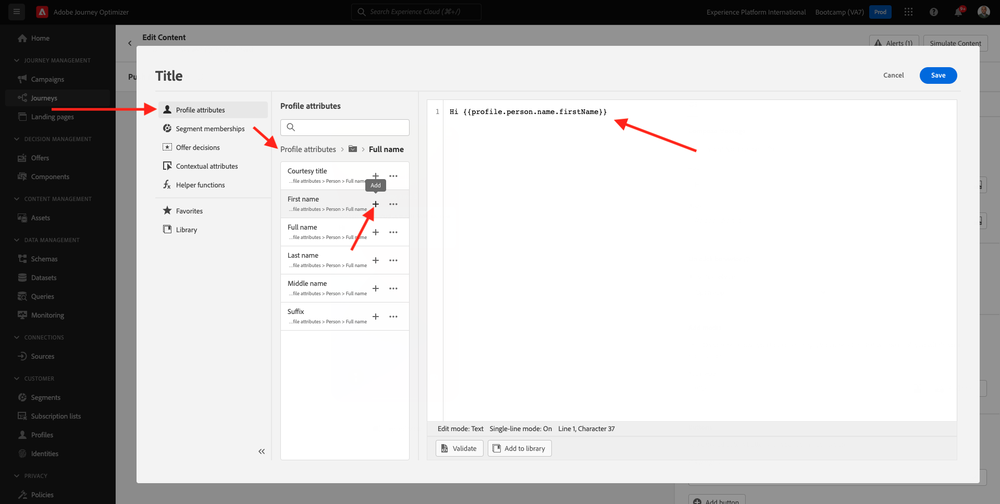
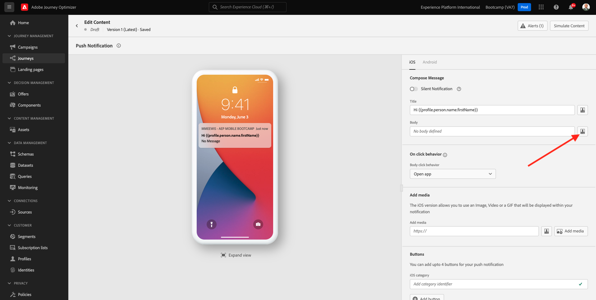
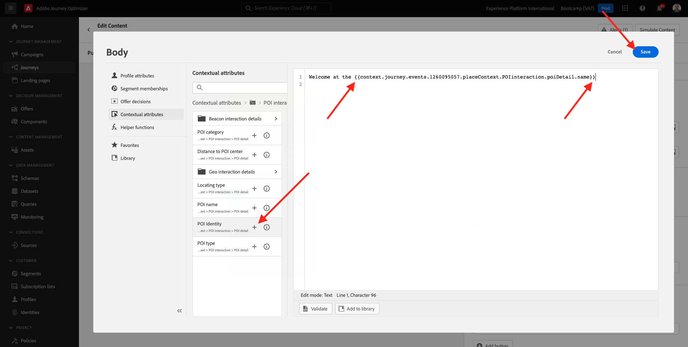
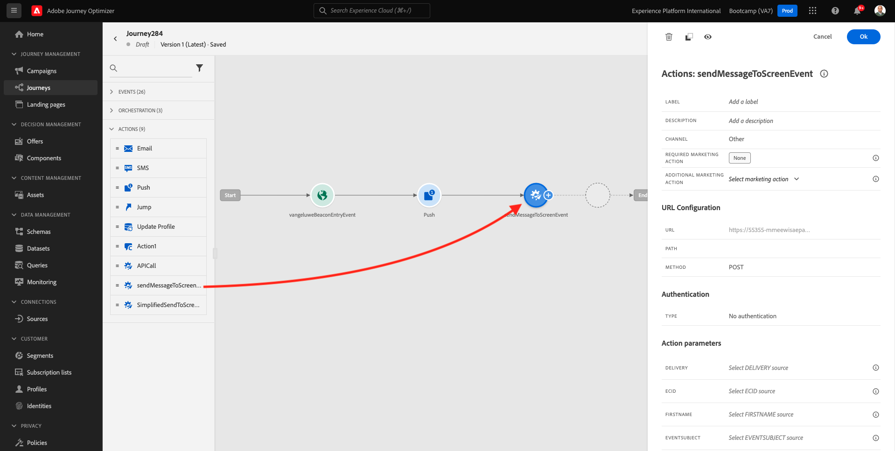

# 3.3创建历程和推送通知

在本练习中，您将配置当有人使用移动设备应用程序进入信标时需要触发的历程和消息。

登录到Adobe Journey Optimizer，方法是： [Adobe Experience Cloud](https://experience.adobe.com). 单击 **Journey Optimizer**.

您将被重定向到 **主页**  在Journey Optimizer中查看。 首先，确保使用正确的沙盒。 调用要使用的沙盒 `Bootcamp`. 要从一个沙盒更改到另一个沙盒，请单击 **Prod** 并从列表中选择沙盒。 在此示例中，将沙盒命名为 **Bootcamp**. 然后，您将位于 **主页** 沙盒视图 `Bootcamp`.

## 3.3.1创建历程

在左侧菜单中，单击 **历程**. 接下来，单击 **创建历程** 以创建新旅程。

然后，您将看到一个空的历程屏幕。

在上一个练习中，您创建了一个 **事件**. 你给它起名是这样的 `yourLastNameBeaconEntryEvent` 和已替换 `yourLastName` 加上你的姓氏。 这是事件创建的结果：

现在，您需要将此活动作为此历程的开头。 为此，您可以转到屏幕左侧，并在事件列表中搜索您的事件。

选择您的事件，并将其拖放到历程画布上。 您的历程现在看起来像这样。 单击 **确定** 以保存更改。

作为历程的第二步，您需要添加 **推送** 操作。 转到屏幕左侧，以访问 **操作**，选择 **推送** 操作，然后将其拖放到历程的第二个节点上。

在屏幕右侧，您现在需要创建推送通知。

设置 **类别** 到 **营销** 并选择一个允许您发送推送通知的推送表面。 在这种情况下，要选择的推送表面为 **mmeeewis-app-mobile-bootcamp**.

## 3.3.2创建消息

单击 **编辑内容**.

您随后将看到以下内容：

让我们定义推送通知的内容。

单击 **标题** 文本字段。

在文本区域中，开始写入 **您好**. 单击个性化图标。

您现在需要引入字段的个性化令牌 **名字** ，存储在 `profile.person.name.firstName`. 在左侧菜单中，选择 **配置文件属性**，向下滚动/导航以查找 **人员** 元素，然后单击箭头可更深入一层，直到到达字段 `profile.person.name.firstName`. 单击 **+** 图标以将字段添加到画布。 单击&#x200B;**保存**。

然后你就回来。 单击字段旁边的个性化图标 **正文**.

在文本区域中，写入 `Welcome at the `.

接下来，单击 **上下文属性** 然后 **Journey Orchestration**.

单击 **事件**.

单击事件的名称，其外观应如下所示： **yourLastNameBeaconEntryEvent**.

单击 **地标上下文**.

单击 **POI交互**.

单击 **POI详细信息**.

单击 **+** 图标 **POI名称**.
你就能看到这个了。 单击**保存**。

您的消息现已准备就绪。 单击左上角的箭头可返回您的历程。

单击 **确定**.

## 3.3.2向屏幕发送消息

作为历程的第三步，您需要添加 **sendMessageToScreen** 操作。 转到屏幕左侧，以访问 **操作**，选择 **sendMessageToScreen** 操作，然后将其拖放到历程中的第三个节点上。 你就能看到这个了。

此 **sendMessageToScreen** action是一个自定义操作，它将向存储内显示使用的端点发布消息。 此 **sendMessageToScreen** 操作需要定义多个变量。 您可以向下滚动直到看到，以查看这些变量 **操作参数**.

现在，您需要设置每个操作参数的值。 请参阅此表以了解在何处需要哪些值。

| 参数 | 值 |
|:-------------:| :---------------:|
| 投放 | `'image'` |
| ECID | `@{yourLastNameBeaconEntryEvent._experienceplatform.identification.core.ecid}` |
| 名字 | `#{ExperiencePlatform.ProfileFieldGroup.profile.person.name.firstName}` |
| 事件主题 | `#{ExperiencePlatform.ProductListItems.experienceevent.first(currentDataPackField.eventType == "commerce.productViews").productListItems.first().name}` |
| EVENTSUBJECTURL | `#{ExperiencePlatform.ProductListItems.experienceevent.first(currentDataPackField.eventType == "commerce.productViews").productListItems.first()._experienceplatform.core.imageURL}` |
| 沙盒 | `'bootcamp'` |
| CONTAINERID | `''` |
| ACTIVITYID | `''` |
| PLACEMENTID | `''` |

{style="table-layout:auto"}

要设置这些值，请单击 **编辑** 图标。

接下来，选择 **高级模式**.

然后，根据上表粘贴值。 单击 **确定**.

重复此过程以添加每个字段的值。

>[!IMPORTANT]
>
>对于字段ECID，有一个对事件的引用 `yourLastNameBeaconEntryEvent`. 请确保替换 `yourLastName` 用你的姓氏。

最终结果应如下所示：

向上滚动并单击 **确定**.

您仍需要为历程命名。 要执行此操作，请单击 **属性** 图标。

然后，您可以在此处输入历程的名称。 请使用 `yourLastName - Beacon Entry Journey`. 单击 **确定** 以保存更改。

您现在可以通过单击 **Publish**.

单击 **Publish** 再来一次。

然后，您将看到一个绿色确认栏，其中显示您的历程现已发布。

您的历程现在处于实时状态，可以触发。

您现在已经完成了此练习。

下一步： [3.4测试您的历程](./ex4.md)

[返回用户流程3](./uc3.md)

[返回所有模块](../../overview.md)
