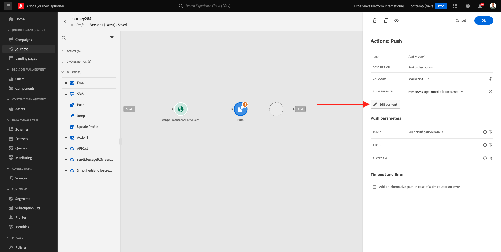
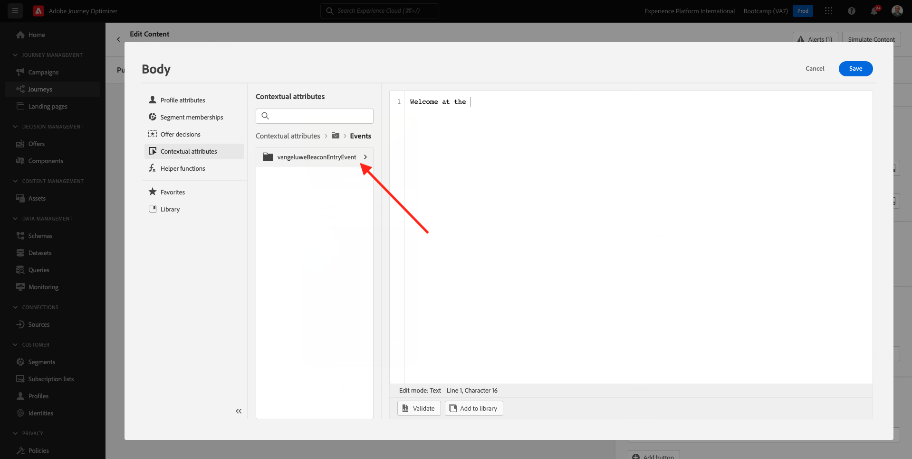

# 3.3创建历程和推送通知

在本练习中，您将配置当用户使用移动设备应用程序进入信标时需要触发的历程和消息。

通过转到Adobe Journey Optimizer [Adobe Experience Cloud](https://experience.adobe.com). 单击 **Journey Optimizer**.

您将被重定向到 **主页**  查看Journey Optimizer。 首先，确保您使用的是正确的沙盒。 要使用的沙盒称为 `Bootcamp`. 要从一个沙盒更改为另一个沙盒，请单击 **生产** 并从列表中选择沙盒。 在此示例中，沙盒名为 **Bootcamp**. 然后你会在 **主页** 沙盒视图 `Bootcamp`.

## 3.3.1创建历程

在左侧菜单中，单击 **历程**. 接下来，单击 **创建历程** 以创建新历程。

然后，您将看到一个空历程屏幕。

在上一个练习中，您创建了一个 **事件**. 你这样命名的 `yourLastNameBeaconEntryEvent` 替换 `yourLastName` 姓氏。 这是事件创建的结果：

现在，您需要将此事件作为此历程的开始。 为此，您可以转到屏幕左侧，并在事件列表中搜索您的事件。

选择您的事件，将其拖放到历程画布上。 你的旅程现在是这样。 单击 **确定** 以保存更改。

作为历程的第二步，您需要添加 **推送** 操作。 转到屏幕左侧的 **操作**，选择 **推送** 操作，然后将其拖放到历程中的第二个节点。

现在，您需要在屏幕右侧创建推送通知。

设置 **类别** to **营销** ，然后选择可用于发送推送通知的推送表面。 在这种情况下，要选取的推曲面是 **mmeewis-app-mobile-bootcamp**.

## 3.3.2创建消息

单击 **编辑内容**.

然后您将看到：

让我们定义推送通知的内容。

单击 **标题** 文本。

在文本区域中开始写入 **你好**. 单击个性化图标。

现在，您需要为字段引入个性化令牌 **名字** 存储在 `profile.person.name.firstName`. 在左侧菜单中，选择 **配置文件属性**，向下滚动/导航以查找 **人员** 元素并单击箭头可更深入地查看，直到您到达该字段 `profile.person.name.firstName`. 单击 **+** 图标将字段添加到画布。 单击&#x200B;**保存**。

然后你会回来。 单击字段旁边的个性化图标 **正文**.

在文本区域中，写 `Welcome at the `.

接下来，单击 **上下文属性** 然后 **Journey Orchestration**.

单击 **事件**.

单击事件的名称，该名称应如下所示： **yourLastNameBeaconEntryEvent**.

单击 **放置上下文**.

单击 **POI互动**.

单击 **POI详细信息**.

单击 **+** 图标 **POI名称**.
然后你会看到这个。 单击**保存**。

您的消息现已准备就绪。 单击左上角的箭头以返回您的历程。

单击 **确定**.

## 3.3.2向屏幕发送消息

作为历程的第三步，您需要添加 **sendMessageToScreen** 操作。 转到屏幕左侧的 **操作**，选择 **sendMessageToScreen** 操作，然后将其拖放到历程的第三个节点。 然后你会看到这个。

的 **sendMessageToScreen** 操作是一个自定义操作，它将消息发布到存储内显示所使用的端点。 的 **sendMessageToScreen** 操作需要定义多个变量。 您可以通过向下滚动直至看到 **操作参数**.

现在，您需要为每个操作参数设置值。 请参阅下表，了解在哪些情况下需要哪些值。

| 参数 | 值 |
|:-------------:| :---------------:|
| 投放 | `'image'` |
| ECID | `@{yourLastNameBeaconEntryEvent._experienceplatform.identification.core.ecid}` |
| 名字 | `#{ExperiencePlatform.ProfileFieldGroup.profile.person.name.firstName}` |
| EVENTSUBJECT | `#{ExperiencePlatform.ProductListItems.experienceevent.first(currentDataPackField.eventType == "commerce.productViews").productListItems.first().name}` |
| EVENTSUBJECTURL | `#{ExperiencePlatform.ProductListItems.experienceevent.first(currentDataPackField.eventType == "commerce.productViews").productListItems.first()._experienceplatform.core.imageURL}` |
| 沙盒 | `'bootcamp'` |
| 容器ID | `''` |
| ACTIVITYID | `''` |
| PLACEMENTID | `''` |

{style=&quot;table-layout:auto&quot;}

要设置这些值，请单击 **编辑** 图标。

接下来，选择 **高级模式**.

然后，根据上表粘贴值。 单击 **确定**.

重复此过程为每个字段添加值。

>[!IMPORTANT]
>
>对于字段ECID，有对事件的引用 `yourLastNameBeaconEntryEvent`. 请确保更换 `yourLastName` 姓氏。

最终结果应如下所示：

向上滚动并单击 **确定**.

您仍需要为历程提供一个名称。 为此，您可以单击 **属性** 图标。

然后，您可以在此处输入历程的名称。 请使用 `yourLastName - Beacon Entry Journey`. 单击 **确定** 以保存更改。

您现在可以通过单击 **发布**.

单击 **发布** 再次。

然后，您将看到一个绿色确认栏，表示您的历程现已发布。

您的历程现已上线，可以触发。

你现在已经完成了这个练习。

下一步： [3.4测试您的历程](./ex4.md)

[返回到用户流量3](./uc3.md)

[返回到所有模块](../../overview.md)
