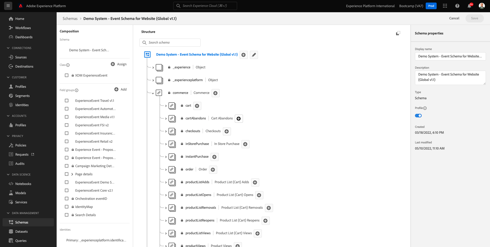

# 4.1Customer Journey Analytics101

## 目标

- 了解CJA应用程序
- 了解如何定位CJA
- 了解CJA工作流程：从数据连接到见解

## 4.1.1什么是Customer Journey Analytics？

Customer Journey Analytics(CJA)为商业智能和数据科学团队提供了一个工具包，用于拼合和分析跨渠道数据（在线和离线）。 CJA中的功能为复杂的多渠道客户历程提供了上下文和更清晰的描述。 所提供的上下文有助于从客户转化过程中消除棘手问题，并为最重要的时刻设计和提供卓越体验，从而实现切实可行的洞察。

CJA将Analysis Workspace提升到Adobe Experience Platform之上。 Adobe Experience Platform是沟通和编排的大脑，借助CJA，品牌现在可以将所有这些数据关联和可视化，以便商业和洞察团队可以通过分析完整的在线和离线客户历程从中学习。

商业和洞察团队可以使用Analysis Workspace的拖放、点击和用户友好UI与CJA交谈、提出问题并快速获得答案。

## 4.1.2主要优势

客户获得的三个主要优势包括：

- 为所有人提供洞察信息的能力（即实现数据访问民主化）
- 能够在情境式历程中查看客户(即，可以跨多个渠道（在线和离线）按顺序显示数据)
- 能够在不需要（即，让普通人能够使用数据解锁深入的洞察信息和分析，进而激活营销）的情况下利用数据的强大功能

## 4.1.3为何选择Customer Journey Analytics？

CJA无意替代当前的BI应用程序，例如Power BI、微策略、Locker或Tableau。 这些BI应用程序旨在将数据可视化，以创建公司功能板，以便组织中的每个人都可以快速查看重要指标。\
CJA的目标是向营销和业务团队提供分析能力，使其成为这些角色的“必备”分析工具。

传统上，BI应用程序无法实现真正的客户智能：

- 他们无法进行归因，也无法进行客户历程分析。
- BI应用程序需要提前知道问题
- 交互式查询受数据库结构的限制
- 需要SQL技能。
- BI应用程序不能让您询问为什么发生了一些事情。
- BI应用程序无法直接连接到客户接触点。

由于上述原因，商业用户和分析师几乎立即陷入死胡同，导致分析成本高昂、速度慢、缺乏灵活性，并且与操作系统脱节。

借助CJA，您可以使用离线和在线数据全面了解客户历程，并使用正确的工具减少获得洞察的时间，从而使商业用户独立了解问题发生的原因以及如何做出响应。

## 4.1.4了解Customer Journey Analytics工作流程

在开始下一个练习之前，关键是要了解需要执行哪些步骤才能将数据从Adobe Experience Platform引入CJA，从而实现数据可视化并获得一些深入见解。 我们称之为CJA工作流程。 我们来看一下：

在开始执行上述步骤之前，请不要忘记第0步，即了解Adobe Experience Platform中可用的数据。

**垃圾输入，垃圾输出。**&#x200B;还记得吗？ 您必须清楚地了解哪些数据可用，以及如何配置Adobe Experience Platform中的架构。 了解Adobe Experience Platform中的数据将使事情变得更轻松，不仅在数据连接部分，而且在构建可视化图表和分析时也是如此。

## 4.1.5步骤0：了解Adobe Experience Platform架构和数据集

通过转到以下URL登录Adobe Experience Platform： [https://experience.adobe.com/platform](https://experience.adobe.com/platform)。

登录后，您将登录到Adobe Experience Platform的主页。

在继续之前，您需要选择一个&#x200B;**沙盒**。 要选择的沙盒名为``Bootcamp``。 您可以通过单击屏幕右上角的文本&#x200B;**[!UICONTROL Prod]**&#x200B;来执行此操作。 选择相应的沙盒后，您将看到屏幕变化，现在您位于专用沙盒中。

请在Adobe Experience Platform中查看这些架构和数据集。

| 数据集 | 架构 |
| ----------------- |-------------| 
| 演示系统 — 网站的事件数据集(Global v1.1) | 演示系统 — 网站的事件架构(Global v1.1) |
| 演示系统 — 呼叫中心的事件数据集(Global v1.1) | 演示系统 — 呼叫中心的事件架构(Global v1.1) |
| 演示系统 — 语音助手的事件数据集(Global v1.1) | 演示系统 — 语音助手的事件架构（全局v1.1） |

确保至少检查了以下内容：

- 身份：CRMID、电话号码、ECID、电子邮件。 哪些标识是主标识符，哪些标识是辅助标识符？
您可以通过打开架构并查看对象`_experienceplatform.identification.core`来查找标识符。 请查看[Demo System - Website (Global v1.1)](https://experience.adobe.com/platform/schema)的架构。

- 在架构[演示系统 — 网站的事件架构（全局v1.1）](https://experience.adobe.com/platform/schema)中探索商务对象。

- 预览所有[数据集](https://experience.adobe.com/platform/dataset/browse?limit=50&amp;page=1&amp;sortDescending=1&amp;sortField=created)并查看数据

您现在可以开始使用Customer Journey AnalyticsUI了。

下一步： [4.2连接Customer Journey Analytics](./ex2.md)中的Adobe Experience Platform数据集

[返回用户流程4](./uc4.md)

[返回所有模块](../../overview.md)
