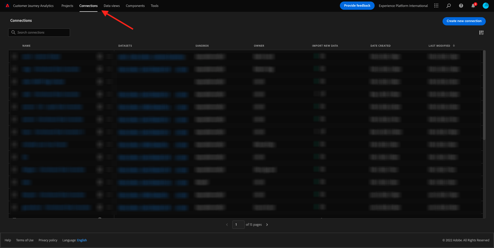

# 4.2在Customer Journey Analytics中连接Adobe Experience Platform数据集

## 目标

- 了解Data Connection UI
- 将Adobe Experience Platform数据引入CJA
- 了解人员ID和数据拼接
- 了解Customer Journey Analytics中数据流的概念

## 4.2.1连接

转到[analytics.adobe.com](https://analytics.adobe.com)以访问Customer Journey Analytics。

在Customer Journey Analytics主页上，转到&#x200B;**连接**。

在这里，您可以看到CJA和Platform之间建立的各种连接。 这些连接与Adobe Analytics中的报表包具有相同的目标。 然而，数据的收集是完全不同的。 所有数据都来自Adobe Experience Platform数据集。

让我们来创建您的第一个连接。 单击&#x200B;**新建连接**。

您随后将看到&#x200B;**创建连接**&#x200B;用户界面。

您现在可以为您的连接提供一个名称。

请使用此命名约定： `yourLastName – Omnichannel Data Connection`。

示例：`vangeluw - Omnichannel Data Connection`

您还需要选择要使用的正确沙盒。 在沙盒菜单中，选择您的沙盒，应为`Bootcamp`。 在此示例中，要使用的沙盒是&#x200B;**Bootcamp**。 您还需要将&#x200B;**平均每日事件数**&#x200B;设置为&#x200B;**小于100万**。

选择沙盒后，您可以开始向此连接添加数据集。 单击&#x200B;**添加数据集**。

## 4.2.2选择Adobe Experience Platform数据集

搜索数据集`Demo System - Event Dataset for Website (Global v1.1)`。 单击&#x200B;**+**&#x200B;将数据集添加到此连接。

现在搜索并选中`Demo System - Profile Dataset for Loyalty (Global v1.1)`和`Demo System - Event Dataset for Call Center (Global v1.1)`的复选框。

你就能拥有这个了。 单击&#x200B;**下一步**。

## 4.2.3人员ID和数据拼接

### 人员 ID

现在的目标是连接这些数据集。 对于您选择的每个数据集，您将看到一个名为&#x200B;**人员ID**&#x200B;的字段。 每个数据集都有其自己的人员ID字段。

如您所见，其中大多数都会自动选择人员ID。 这是因为在Adobe Experience Platform的每个架构中都选择了主标识符。 例如，这是`Demo System - Event Schema for Call Center (Global v1.1)`的架构，您可以看到主标识符设置为`phoneNumber`。

但是，您仍然可以影响将用于为连接拼合数据集的标识符。 您可以使用在链接到数据集的架构中配置的任何标识符。 单击下拉菜单以浏览每个数据集上的可用ID。

如前所述，您可以为每个数据集设置不同的人员ID。 这允许您在CJA中将来自多个源的不同数据集整合在一起。 想象一下，如果能引入NPS或调查数据，那将非常有趣，并且有助于了解背景以及某些事情为什么会发生。

人员ID字段的名称并不重要，只要人员ID字段中的值相对应。 例如，如果人员ID在一个数据集中为`email`，在另一个数据集中为`emailAddress`，且在两个数据集中人员ID字段的`dnb-bootcamp@adobe.com`值相同，则CJA将能够拼合数据。

目前，还存在其他一些限制，例如将匿名行为与已知行为拼合。 请在此处查看常见问题解答：[常见问题解答](https://experienceleague.adobe.com/docs/analytics-platform/using/cja-overview/cja-faq.html)。

### 使用人员ID拼合数据

现在您已经了解了使用人员ID拼合数据集的概念，让我们选择`email`作为每个数据集的人员ID。

转到每个数据集以更新人员ID。

现在，在下拉列表中选择`email`以填写人员ID字段。

在拼合三个数据集后，我们便可继续操作。

| 数据集 | 人员 ID |
| ----------------- |-------------| 
| 演示系统 — 网站的事件数据集(Global v1.1) | 电子邮件 |
| 演示系统 — 忠诚度用户档案数据集(Global v1.1) | 电子邮件 |
| 演示系统 — 呼叫中心的事件数据集(Global v1.1) | 电子邮件 |

您还需要确保为每个数据集启用以下选项：

- 导入所有新数据
- 回填所有现有数据

单击&#x200B;**添加数据集**。

单击&#x200B;**保存**，然后转到下一个练习。
创建&#x200B;**Connection**&#x200B;后，可能需要几个小时才能在CJA中使用您的数据。

下一步： [4.3创建数据视图](./ex3.md)

[返回用户流程4](./uc4.md)

[返回所有模块](./../../overview.md)
