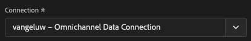
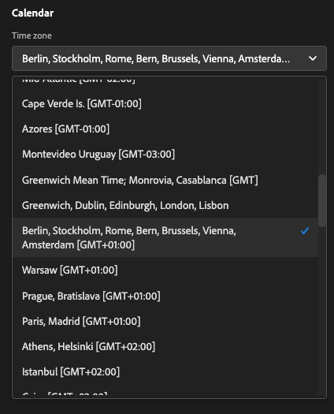
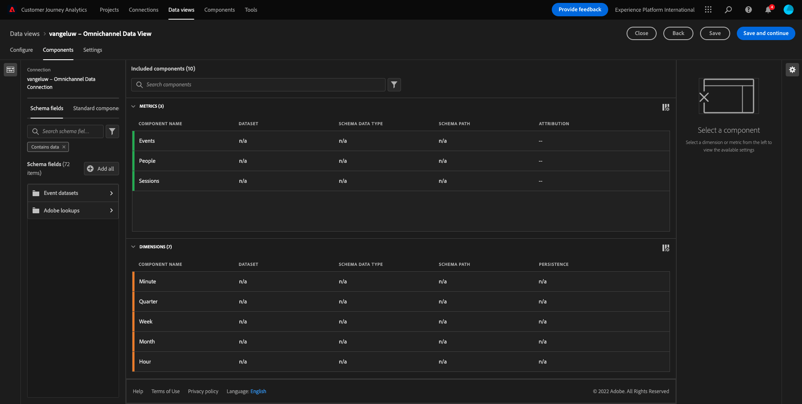
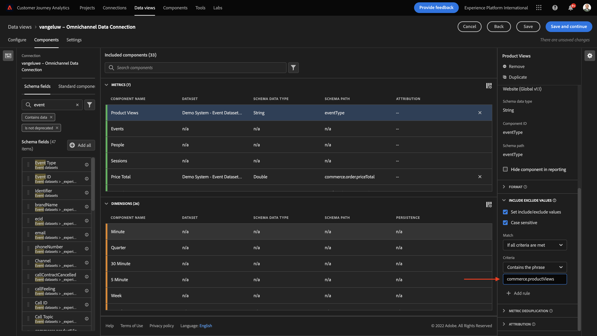

# 4.3创建数据视图

## 目标

- 了解数据视图UI
- 了解访问定义的基本设置
- 了解数据视图中的归因和持久性

## 4.3.1数据视图

连接完成后，您现在可以继续影响可视化。 Adobe Analytics和CJA之间的区别在于，CJA需要数据视图，以便在可视化之前清理和准备数据。

数据视图与Adobe Analytics中虚拟报表包的概念类似，您可以在其中定义上下文感知访问定义、筛选以及组件的调用方式。

每个连接至少需要一个数据视图。 但是，对于某些用例，最好是针对同一连接有多个数据视图，目标是为不同的团队提供不同的见解。
如果您希望您的公司成为数据驱动型公司，您应该调整每个团队中查看数据的方式。 一些示例：

- 仅适用于UX设计团队的UX量度
- 对Google Analytics的KPI和量度使用与Customer Journey Analytics相同的名称，以便数字分析团队只能说1种语言。
- 数据视图经过筛选，仅针对一个市场、一个品牌或仅针对移动设备显示实例数据。

在 **连接** 屏幕，选中您刚刚创建的连接前面的复选框。 单击 **创建数据视图**.

您将被重定向到 **创建数据视图** 工作流。

## 4.3.2数据视图定义

您现在可以为数据视图配置基本定义。

此 **连接** 已选中在上一个练习中创建的。 您的连接已命名 `yourLastName – Omnichannel Data Connection`.

接下来，按照以下命名约定为数据视图命名： `yourLastName – Omnichannel Data View`.

为说明输入相同的值： `yourLastName – Omnichannel Data View`.

| 名称 | 描述 |
| ----------------- |-------------| 
| `yourLastName – Omnichannel Data View` | `yourLastName – Omnichannel Data View` |

对于 **时区**，选择时区 **柏林、斯德哥尔摩、罗马、伯尔尼、布鲁塞尔、维也纳、阿姆斯特丹GMT+01:00**. 这是一个非常有趣的设置，因为一些公司在不同的国家和地区运营。 为每个国家分配合适的时区将避免典型的数据错误，例如，相信秘鲁的大多数人在凌晨4点购买T恤。

您还可以修改主要量度命名（“人员”、“会话”和“事件”）。 虽然这不是必需的，但一些客户希望使用人员、访问和点击量而不是人员、会话和事件(来自Customer Journey Analytics的默认命名惯例)。

您现在应该已配置以下设置：

单击 **保存并继续**.

## 4.3.3数据视图组件

在本练习中，您将配置使用Analysis Workspace分析和可视化数据所需的组件。 在此UI中，有三个主要方面：

- 左侧：所选数据集中的可用组件
- 中间：已将组件添加到数据视图
- 右侧：组件设置

>[!IMPORTANT]
>
>如果找不到特定量度或维度，请检查字段是否 `Contains data` 从数据视图中删除。 如果不能，请删除该字段。
>
>

现在，您必须将分析所需的组件拖放到 **添加的组件**. 要实现此目的，您需要在左侧菜单中选择组件，并将它们拖放到中间的画布上。

让我们从第一个组件开始： **名称(web.webPageDetails.name)**. 搜索此组件，然后将其拖放到画布上。

此组件是页面名称，因为您可以从读取架构字段派生 `(web.webPageDetails.name)`.

但是，使用 **名称** 由于名称不是业务用户快速了解此维度的最佳命名约定。

让我们将名称更改为 **页面名称**. 单击该组件，然后在 **组件设置** 区域。

真正重要的事情是 **持久性设置**. evar和prop的概念在CJA中不存在，但持久性设置使类似行为成为可能。

如果不更改这些设置，CJA会将维度解释为 **属性** （点击级别）。 此外，我们可以更改持久性以使维度成为 **eVar** （在历程中保留值）。

如果您不熟悉eVar和Prop，则可以 [有关它们的更多信息，请参阅文档](https://experienceleague.adobe.com/docs/analytics/landing/an-key-concepts.html).

让我们将页面名称保留为Prop。 因此，您无需更改任何 **持久性设置**.

| 要搜索的组件名称 | 新名称 | 持久性设置 |
| ----------------- |-------------| --------------------| 
| 名称(web.webPageDetails.name) | 页面名称 |          |

接下来，选取维度 **phonenumber** 然后放到画布上。 新名称应为 **电话号码**.

最后，让我们更改“持久性”设置，因为手机号码应在用户级别持续存在。

要更改持久性，请在右侧菜单中向下滚动，然后打开 **持久性** 选项卡：

选中此复选框可修改持久性设置。 选择 **最近** 和 **人员（“报表”窗口）** 范围，因为我们只关心该用户的最后一个手机号码。 如果客户在未来的访问中未填写移动设备，您仍会看到填充了此值。

| 要搜索的组件名称 | 新名称 | 持久性设置 |
| ----------------- |-------------| --------------------| 
| phonenumber | 电话号码 | 最近，人员（报告窗口） |

下一个组件是 `web.webPageDetails.pageViews.value`.

在左侧菜单中，搜索 `web.webPageDetails.pageViews.value`. 将此量度拖放到画布上。

将名称更改为 **页面查看次数** 在 **组件设置**.

| 要搜索的组件名称 | 新名称 | 归因设置 |
| ----------------- |-------------| --------------------| 
| web.webPageDetails.pageViews.value | Page Views |         |

对于归因设置，我们将保留为空。

注意：量度上的持久性设置也可以在Analysis Workspace中更改。 在某些情况下，您可能会选择在此处设置它，以避免业务用户必须考虑哪个是最佳持久性模型。

接下来，您必须配置许多Dimension和量度，如下表所示。

### Dimension

| 要搜索的组件名称 | 新名称 | 持久性设置 |
| ----------------- |-------------| --------------------| 
| brandName | 品牌名称 | 最近，会话 |
| callfeely | 通话感觉 |          |
| 调用ID | 呼叫交互类型 |          |
| callTopic | 调用主题 | 最近，会话 |
| ecid | ECID | 最近，人员（报告窗口） |
| 电子邮件 | 电子邮件ID | 最近，人员（报告窗口） |
| 付款类型 | 付款类型 |          |
| 产品添加方法 | 产品添加方法 | 最近，会话 |
| 事件类型 | 事件类型 |         |
| 名称(productListItems.name) | 产品名称 |         |
| SKU | SKU（会话） | 最近，会话 |
| Transaction ID | Transaction ID |         |
| URL (web.webPageDetails.URL) | URL |         |
| 用户代理 | 用户代理 | 最近，会话 |
| level | 忠诚度级别 |          |
| 点数 | 客户存留期值 |          |

### 量度

| 要搜索的组件名称 | 新名称 | 归因设置 |
| ----------------- |-------------| --------------------| 
| 数量 | 数量 |          |
| commerce.order.priceTotal | 收入 |         |

然后，您的配置应如下所示：

别忘了 **保存** 您的数据视图。 因此，单击 **保存** 现在。

## 4.3.4计算指标

虽然我们已在数据视图中组织了所有组件，但您仍需要调整其中一些组件，以便业务用户可以开始他们的分析。

如果您还记得，我们并没有具体将添加到购物车、产品视图或购买量等指标引入数据视图。
但是，我们有一个称为的维度： **事件类型**. 因此，让我们通过创建3个计算量度来派生这些交互类型。

让我们从第一个量度开始： **产品查看次数**.

请在左侧搜索 **事件类型** 并选择尺寸。 然后将其拖放到 **包含的组件** 画布。

单击以选择新量度 **事件类型**.

现在，将组件名称和描述更改为以下值：

| 组件名称 | 组件描述 |
| ----------------- |-------------| 
| 产品查看次数 | 产品查看次数 |

现在仅允许计数 **产品查看次数** 事件。 为此，请向下滚动至 **组件设置** 直到你看到 **包括/排除值**. 确保启用该选项 **设置包括/排除值**.

因为我们只想计算 **产品查看次数**，请说明 **commerce.productViews** 在标准下。

您的计算量度现已准备就绪！

接下来，对以下对象重复相同的过程 **添加到购物车** 和 **购买** 事件。

### 添加到购物车

首先拖放相同的维度 **事件类型**.

由于我们使用相同的变量，您会看到一个重复字段的弹出警报。 请单击 **仍要添加**：

现在，请遵循与我们对量度“产品查看次数”相同的过程：
- 首先更改名称和描述。
- 最后添加 **commerce.productListAdds** 作为仅计入添加到购物车的条件

| 名称 | 描述 | 标准 |
| ----------------- |-------------| -------------|
| 添加到购物车 | 添加到购物车 | commerce.productListAdds |

### 购买

首先拖放相同的维度 **事件类型** 与我们对前两个指标所做的一样。

由于我们使用相同的变量，您会看到一个重复字段的弹出警报。 请单击 **仍要添加**：

现在，请遵循与我们对量度“产品查看次数”和“添加到购物车”相同的过程：
- 首先更改名称和描述。
- 最后添加 **commerce.purchases** 作为仅计入购买次数的标准

| 名称 | 描述 | 标准 |
| ----------------- |-------------| -------------|
| 购买 | 购买 | commerce.purchases |

您的最终配置应类似于此。 单击 **保存并继续**.

## 4.3.5数据视图设置

您应会被重定向到此屏幕：

在此选项卡中，您可以修改一些重要设置以更改数据的处理方式。 我们先来设置 **会话超时** 30分钟。 借助每个体验事件的时间戳，您可以将会话的概念扩展到所有渠道。 例如，如果客户在访问网站后致电呼叫中心，会发生什么情况？ 使用自定义会话超时，您可以在决定会话是什么以及该会话如何将数据合并到一起时具有很大的灵活性。

在此选项卡中，您可以修改其他内容，例如使用区段/过滤器过滤数据。 在本练习中，您不需要执行此操作。

完成后，请单击 **保存并完成**.

>[!NOTE]
>
>您可以稍后返回此数据视图，并随时更改设置和组件。 更改将影响历史数据的显示方式。

您现在可以继续可视化和分析部分！

下一步： [4.4Customer Journey Analytics中的数据准备](./ex4.md)

[返回用户流程4](./uc4.md)

[返回所有模块](./../../overview.md)
