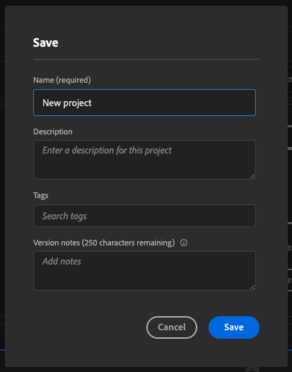

# 4.4在Analysis Workspace中准备数据

## 目标

- 了解CJA中的Analysis Workspace UI
- 了解Analysis Workspace中的数据准备概念
- 了解如何进行数据计算

## 4.4.1 CJA中的Analysis Workspace UI

Analysis Workspace消除了单个Analytics报表的所有典型限制。 它为构建自定义分析项目提供了一个功能强大、灵活的画布。 可将任意数量的数据表、可视化图表和组件（维度、量度、区段和时间粒度）拖放到项目中。 即时创建划分和区段、创建用于分析的同类群组、创建警报、比较区段、进行流量和流失分析，以及组织和计划报表以与业务中的任何人共享。

Customer Journey Analytics将此解决方案引入到平台数据之上。 我们强烈建议您观看此四分钟的概述视频：

>[!VIDEO](https://video.tv.adobe.com/v/35109?quality=12&learn=on)

如果您以前未使用过Analysis Workspace，我们强烈建议您观看此视频：

>[!VIDEO](https://video.tv.adobe.com/v/26266?quality=12&learn=on)

### 创建项目

现在，该创建您的第一个CJA项目。 转到CJA中的项目选项卡。
单击**新建**。

然后你会看到这个。 选择 **空白项目** 然后单击 **创建**.

然后，您将看到一个空项目。

首先，确保在屏幕的右上角选择正确的数据视图。 在此示例中，要选择的数据视图是 `vangeluwe - Omnichannel Data View`.

接下来，您将保存项目并为其命名。 您可以使用以下命令进行保存：

| 操作系统 | 短切 |
| ----------------- |-------------| 
| Windows | Control + S |
| Mac | Command + S |

您将看到此弹出窗口：

请使用此命名约定：

| 名称 | 描述 |
| ----------------- |-------------| 
| `yourLastName - Omnichannel Analysis` | `yourLastName - Omnichannel Analysis` |

接下来，单击 **保存**.

## 4.4.2计算量度

尽管我们在数据视图中组织了所有组件，但您仍需要调整其中一些组件，以便业务用户能够开始分析。 此外，在任何分析期间，您都可以创建计算量度以更深入地了解分析发现结果。

例如，我们将创建一个 **转化率** 使用 **购买** 量度/事件。

### 转化率

让我们开始打开计算量度生成器。 单击 **+** 以在Analysis Workspace中创建您的第一个计算量度。

的 **计算量度生成器** 将显示：

查找 **购买** 在左侧菜单的量度列表中。 在 **量度** 单击 **显示全部**

现在，将 **购买** 量度。

通常，转化率表示 **转化/会话**. 因此，我们在计算量度定义画布中执行相同的计算。 查找 **会话** 量度并将其拖放到定义生成器中的 **购买** 事件。

请注意，已自动选择除法运算符。

转化率通常以百分比表示。 因此，让我们将格式更改为百分比，并选择2位小数。

最后，更改计算量度的名称和描述：

| 标题 | 描述 |
| ----------------- |-------------| 
| 转化率 | 转化率 |

您的屏幕上将显示如下内容：

别忘了 **保存** 计算量度。

## 4.4.3计算Dimension:过滤器（分段）和日期范围

### 过滤器：计算Dimension

计算不仅适用于量度。 在开始分析之前，创建一些 **计算Dimension**. 这基本上就是说 **区段** 回到Adobe Analytics。 在Customer Journey Analytics中，这些区段称为 **过滤器**.

创建过滤器将帮助企业用户使用一些有价值的计算维度开始分析。 这将自动执行一些任务，并帮助采用部分。 下面给出了一些示例：

1. 自有媒体、付费媒体、
2. 新增与回访
3. 放弃购物车的客户

这些过滤器可以在分析部分之前或期间创建（您将在下一个练习中执行此操作）。

### 日期范围：计算时间Dimension

时间Dimension是另一种类型的计算维度。 有些时间Dimension已经创建，但您也能够在数据准备阶段创建自己的自定义时间维度。

这些计算时间Dimension将帮助分析人员和业务用户记住重要日期，并使用它们过滤和更改报表时间。 进行分析时，我们想到的典型问题和疑问是：

- 去年黑色星期五是什么时候？ 21-29街？
- 我们12月的电视宣传活动是什么时候进行的？
- 2018年夏季的销售活动是何时进行的？ 我想把它和2019年做比较。 顺便问一句，你知道2019年的确切日子吗？

您现在已使用CJA Analysis Workspace完成数据准备练习。

下一步： [4.5使用Customer Journey Analytics的可视化](./ex5.md)

[返回到用户流量4](./uc4.md)

[返回到所有模块](./../../overview.md)
