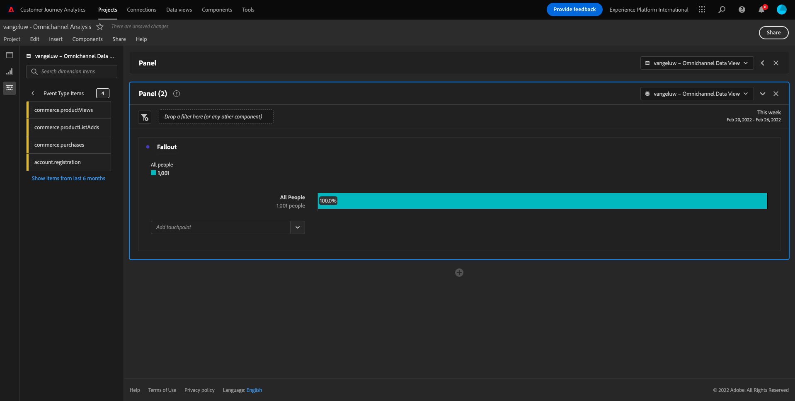
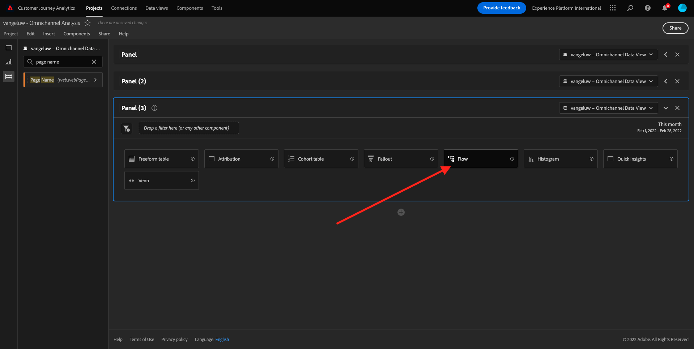

# 4.5使用Customer Journey Analytics实现可视化

## 目标

- 了解Analysis Workspace UI
- 了解一些使Analysis Workspace与众不同的功能。
- 了解如何使用Analysis Workspace在CJA中分析

## 上下文

在本练习中，您将使用CJA中的Analysis Workspace来分析产品查看、产品漏斗、流失率等。

让我们使用您在中创建的项目 [4.4 Analysis Workspace中的数据准备](./ex4.md)，请转到 [https://analytics.adobe.com](https://analytics.adobe.com).

打开您的项目 `yourLastName - Omnichannel Analysis`.

打开您的项目并显示“数据视图” `CJA Bootcamp - Omnichannel Data View` 已选中，您可以开始构建您的第一个可视化图表。

## 我们每天查看多少个产品

首先，我们需要选择正确的日期来分析数据。 转到画布右侧的日历下拉菜单。 单击该日期范围并选择适用的日期范围。

>[!IMPORTANT]
>
>最新的可用数据摄取日期为2022年9月19日，请选择包含此日期的日期范围。

在左侧菜单（组件区域）中，找到计算指标 **产品查看次数**. 选择它并将其拖放到画布中，即自由格式表的右上角。

自动设置维度 **日** 将添加以创建您的第一个表。 现在你可以看到你的问题被迅速回答了。

接下来，右键单击量度摘要。

单击 **可视化** 然后选择 **折线图** 作为可视化图表。

您将按天查看产品查看次数。

您可以通过单击 **设置** 在可视化中。

单击旁边的圆点 **折线图** 到 **管理数据源**.

接下来，单击 **锁定选择** 并选择 **选定的项目** 以锁定此可视化图表，使其始终显示产品查看的时间线。

## 查看的前4个产品

查看的前4项产品是什么？

请记得偶尔保存项目。

| 操作系统 | 快捷键 |
| ----------------- |-------------| 
| Windows | Control + S |
| Mac | Command + S |

让我们开始查找查看的前4个产品。 在左侧菜单中，找到 **产品名称** -Dimension。

现在拖放 **产品名称** 以替换 **日** 维度：

这将成为结果

接下来，尝试按品牌名称划分产品之一。 搜索 **brandName** 并将其拖动到第一个产品名称下。

接下来，使用忠诚度级别进行划分。 搜索 **忠诚度级别** 然后将其拖到品牌名称下。

您随后将看到以下内容：

最后，您可以添加更多可视化图表。 在左侧的可视化图表下，搜索 `Donut`. Take `Donut`，将其拖放到画布上的 **折线图** 可视化图表。

接下来，在表中，选择3 **忠诚度级别**  划分的行 **Google Pixel XL 32GB黑色智能手机** > **花旗信号**. 在选择3行时，按住 **CTRL** 按钮（在Windows上）或 **命令** 按钮(在Mac上)。

您会看到圆环图已更改：

您甚至可以通过使两者都使用，使设计更易于理解 **折线图** 图表和 **圆环图** 图表更小一些，以便它们可以彼此邻接：

单击旁边的圆点 **圆环图** 到 **管理数据源**.
接下来，单击 **锁定选择** 以锁定此可视化图表，使其始终显示产品查看的时间线。

有关使用Analysis Workspace的可视化图表的更多信息，请访问：

- [https://experienceleague.adobe.com/docs/analytics/analyze/analysis-workspace/visualizations/freeform-analysis-visualizations.html](https://experienceleague.adobe.com/docs/analytics/analyze/analysis-workspace/visualizations/freeform-analysis-visualizations.html)
- [https://experienceleague.adobe.com/docs/analytics/analyze/analysis-workspace/visualizations/t-sync-visualization.html](https://experienceleague.adobe.com/docs/analytics/analyze/analysis-workspace/visualizations/t-sync-visualization.html)

## 产品互动漏斗，从查看到购买

有很多方法可以解决这个问题。 其中之一是使用“产品交互类型”，并将其用于自由格式表。 另一种方法是使用 **流失可视化**. 让我们使用最后一个变量，因为我们希望同时进行可视化和分析。

单击此处关闭我们当前拥有的面板：

现在，通过单击 **+添加空白面板**.

单击可视化图表 **流失**.

选择与上一个练习相同的日期范围。

你就能看到这个了。

查找维度 **事件类型** 在左侧的组件下：

单击箭头以打开尺寸：

您将看到所有可用的事件类型。

选择项目 **commerce.productViews** 然后将其拖放到 **添加接触点** 中的字段 **流失可视化**.

对执行相同操作 **commerce.productListAdds** 和 **commerce.purchases** 然后把它们放到 **添加接触点** 中的字段 **流失可视化**. 您的可视化图表现在将如下所示：

你可以在这里做很多事。 一些示例：随时间比较、按设备比较每个步骤或按忠诚度比较。 但是，如果我们想要分析一些有趣的事情，例如为什么客户在将商品添加到购物车后不购买，我们可以使用CJA中的最佳工具：右键单击。

右键单击接触点 **commerce.productListAdds**. 然后单击 **此接触点的划分流失**.

将创建一个新的自由格式表，以分析用户如果未购买则执行了哪些操作。

更改 **事件类型** 作者： **页面名称**，以了解他们前往的页面而不是购买确认页面。

## 用户在访问“取消服务”页面之前会在网站上执行什么操作？

同样，有许多方法可执行此分析。 让我们使用流量分析来启动发现部分。

单击此处关闭当前面板：

现在，通过单击 **+添加空白面板**.

单击可视化图表 **流量**.

您随后将看到以下内容：

选择与上一个练习相同的日期范围。

查找维度 **页面名称** 在左侧的组件下：

单击箭头以打开尺寸：

您将找到查看的所有页面。 查找页面名称： **取消服务**.
拖放 **取消服务** 到中间字段上的流量可视化中：

您随后将看到以下内容：

现在，让我们分析访问过网站的客户是 **取消服务** 网站上的页面也被称为呼叫中心，结果是什么。

在维度下，返回并查找 **呼叫交互类型**.
拖放 **呼叫交互类型** 以替换右侧的第一次交互 **流量可视化**.

您现在可以看到致电呼叫中心的客户在访问 **取消服务** 页面。

接下来，在维度下搜索 **通话感觉**.  将其拖放以替换右侧的第一次交互 **流量可视化**.

您随后将看到以下内容：

如您所见，我们已使用流量可视化图表运行了全渠道分析。 多亏了这一点，我们发现似乎有些客户在考虑取消其服务后，在致电呼叫中心后有了积极的感觉。 我们是否通过提拔改变了他们的想法？

## 具有肯定呼叫中心联系人的客户在主KPI方面的表现如何？

让我们先对数据进行分段，以便仅获取具有以下特征的用户： **正面** 呼叫。 在CJA中，区段称为过滤器。 转到组件区域（左侧）中的过滤器，然后单击 **+**.

在过滤器生成器中，为过滤器提供一个名称

| 名称 | 描述 |
| ----------------- |-------------| 
| 通话感觉 — 正面 | 通话感觉 — 正面 |

在组件下（在过滤器生成器中），查找 **通话感觉** 并将其拖放到过滤器生成器定义中。

现在选择 **正面** 作为筛选器的值。

将范围更改为 **人员** 级别。

要完成，只需单击 **保存**.

然后你就回来。 如果尚未执行此操作，请关闭上一个面板。

现在，通过单击 **+添加空白面板**.

选择与上一个练习相同的日期范围。

单击 **自由格式表**.

现在，拖放您刚刚创建的过滤器。

添加一些量度所花的时间。 开始于 **产品查看次数**. 拖放到自由格式表中。 您也可以删除 **事件** 量度。

对执行相同操作 **人员**，  **添加到购物车** 和 **购买**. 你最后会得到一张这样的桌子。

由于第一个流量分析，出现了一个新问题。 因此，我们决定创建此表并根据区段检查一些KPI以回答该问题。 如您所见，洞察时间比使用SQL或其他BI解决方案快得多。

## Customer Journey Analytics和Analysis Workspace回顾

正如您在本实验中了解到的那样，Analysis Workspace将所有渠道中的数据拼合在一起，以分析整个客户历程。 此外，请记住，您可以将数据引入未拼合到历程的同一工作区。
将断开连接的数据纳入分析以提供历程上下文会非常有用。 例如，NPS数据、调查、Facebook Ads事件或离线交互（未识别）。

下一步： [4.6从洞察到行动](./ex6.md)

[返回用户流程4](./uc4.md)

[返回所有模块](./../../overview.md)
