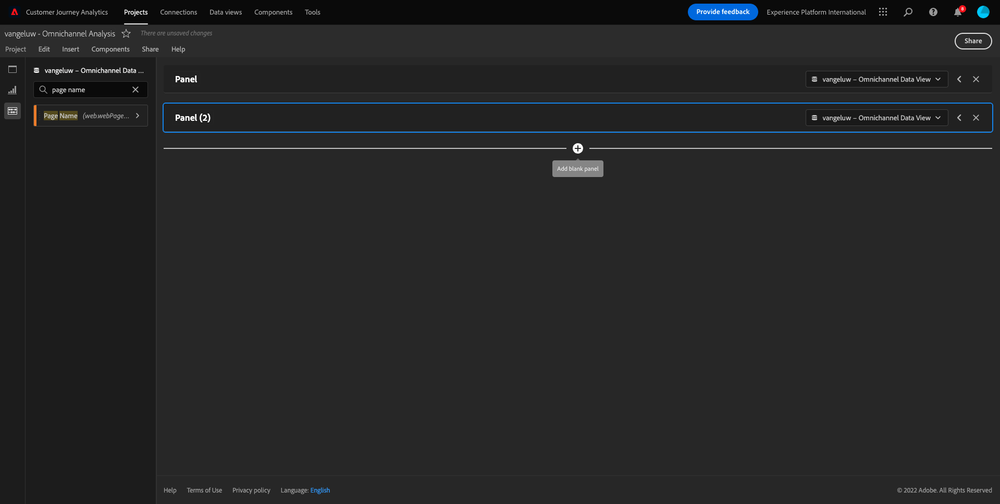
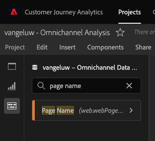
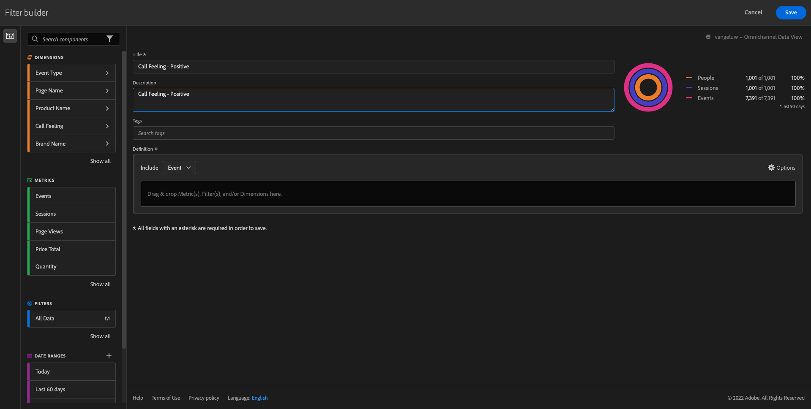
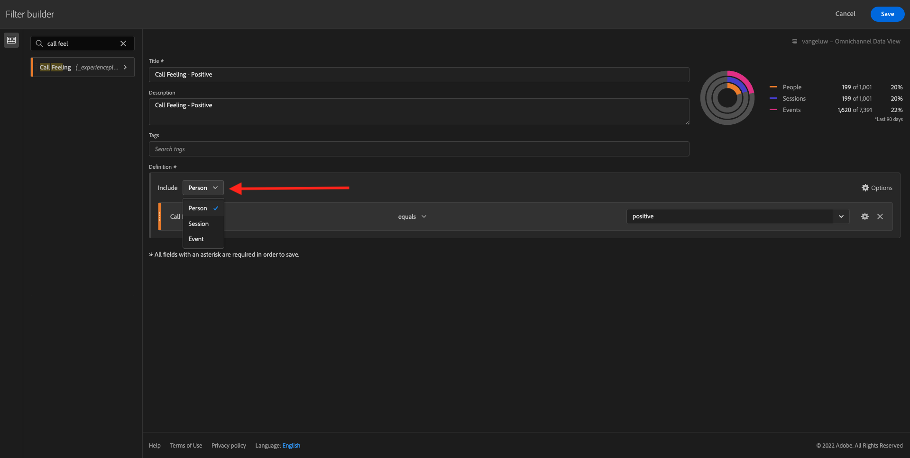
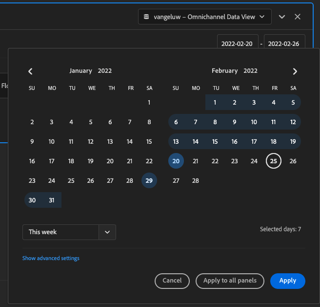

# 4.5使用Customer Journey Analytics的可视化

## 目标

- 了解Analysis Workspace UI
- 了解一些使Analysis Workspace如此不同的功能。
- 了解如何在CJA中使用Analysis Workspace进行分析

## 上下文

在本练习中，您将在CJA中使用Analysis Workspace来分析产品查看次数、产品漏斗数、流失率等。

让我们使用您在中创建的项目 [4.4Analysis Workspace中的数据准备](./ex4.md)，因此请转到 [https://analytics.adobe.com](https://analytics.adobe.com).

打开您的项目 `yourLastName - Omnichannel Analysis`.

打开项目并查看数据 `yourLastName - Omnichannel Analysis` 选定后，您便可以开始构建第一个可视化图表。

## 我们每天有多少次产品查看

首先，我们需要选择正确的日期来分析数据。 转到画布右侧的日历下拉菜单。 单击并选择适用的日期范围。

>[!IMPORTANT]
>
>请选择日期范围，如 **本周** 或 **本月**. 2022年9月19日摄取了最新可用数据。

在左侧菜单（组件区域）中，找到计算量度 **产品查看**. 选择它并将其拖放到自由格式表右上角的画布上。

自动维度 **日** 将被添加以创建您的第一个表。 现在，您可以即时看到您的问题。

接下来，右键单击量度摘要。

单击 **可视化图表** 然后选择 **折线图** 作为可视化图表。

您将按天查看产品查看次数。

您可以通过单击 **设置** 中。

单击旁边的圆点 **折线图** to **管理数据源**.

接下来，单击 **锁定选择** 选择 **选定项目** 以锁定此可视化，以便始终显示产品查看时间轴。

## 查看的5大产品

查看的5大产品中有哪些？

请记住，每时每刻都要保存项目。

| 操作系统 | 短切 |
| ----------------- |-------------| 
| Windows | Control + S |
| Mac | Command + S |

让我们开始查找查看的5大产品。 在左侧菜单中，找到 **产品名称** -Dimension。

现在，拖放 **产品名称** 替换 **日** 维度：

结果是

接下来，尝试按品牌名称划分其中一个产品。 搜索 **brandName** 并将其拖动到第一个产品名称下。

接下来，使用用户代理进行划分。 搜索 **用户代理** 并将其拖动到品牌名称下。

然后您将看到：

最后，您可以添加更多可视化图表。 在左侧的可视化下，搜索 `Donut`. Take `Donut`，将其拖放到画布下 **折线图** 可视化图表。

接下来，在表中，选择前5个 **用户代理**  在 **Google Pixel XL 32GB黑色智能手机** > **花旗信号**. 选择5行时，按住 **CTRL** 按钮（在Windows上）或 **命令** 按钮(在Mac上)。

您将看到圆环图已更改：

您甚至可以通过使 **折线图** 图形和 **圆环** 图形要小一些，以便它们可以彼此相邻：

单击旁边的圆点 **圆环** to **管理数据源**.
接下来，单击 **锁定选择** 以锁定此可视化，以便始终显示产品查看时间轴。

有关使用Analysis Workspace进行可视化的更多信息，请参阅此处：

- [https://experienceleague.adobe.com/docs/analytics/analyze/analysis-workspace/visualizations/freeform-analysis-visualizations.html](https://experienceleague.adobe.com/docs/analytics/analyze/analysis-workspace/visualizations/freeform-analysis-visualizations.html)
- [https://experienceleague.adobe.com/docs/analytics/analyze/analysis-workspace/visualizations/t-sync-visualization.html](https://experienceleague.adobe.com/docs/analytics/analyze/analysis-workspace/visualizations/t-sync-visualization.html)

## 产品互动漏斗，从查看到购买

有很多方法可以解决这个问题。 其中一种方法是使用产品交互类型，并将其用在自由格式表中。 另一种方法是使用 **流失可视化图表**. 让我们使用最后一个要同时进行可视化和分析的内容。

通过单击此处关闭当前面板：

现在，通过单击 **+添加空白面板**.

单击可视化 **流失**.

选择与上一个练习相同的日期范围。

然后你会看到这个。

查找维度 **事件类型** 在左侧的组件下：

单击箭头以打开维度：

您将看到所有可用的事件类型。

选择项目 **commerce.productViews** 然后拖放到 **添加接触点** 字段 **流失可视化图表**.

使用 **commerce.productListAdds** 和 **commerce.purches** 然后把它们放到 **添加接触点** 字段 **流失可视化图表**. 您的可视化图表现在将如下所示：

你可以做很多事。 一些示例：随着时间的推移进行比较、按设备比较每个步骤或按忠诚度进行比较。 但是，如果我们想要分析一些有趣的事情，例如客户在将项目添加到购物车后为何不进行购买，则可以使用CJA中的最佳工具：右键单击。

右键单击接触点 **commerce.productListAdds**. 然后，单击 **此接触点的划分流失**.

将创建一个新的自由格式表，以分析购买者未购买时所执行的操作。

更改 **事件类型** by **页面名称**，以查看要访问的页面，而不是购买确认页面。

## 访问“取消服务”页面之前，用户在网站上会执行哪些操作？

同样，有多种方法可以执行此分析。 让我们使用流量分析开始发现部分。

单击此处关闭当前面板：

现在，通过单击 **+添加空白面板**.

单击可视化 **流量**.

然后您将看到：

选择与上一个练习相同的日期范围。

查找维度 **页面名称** 在左侧的组件下：

单击箭头以打开维度：

您会找到查看的所有页面。 查找页面名称： **取消服务**.
拖放 **取消服务** 中间字段上的流量可视化：

然后您将看到：

现在，让我们分析一下访问 **取消服务** 网站上的页面也叫呼叫中心，结果如何。

在维度下，返回并查找 **调用交互类型**.
拖放 **调用交互类型** 在 **流量可视化图表**.

现在，您会看到在访问 **取消服务** 页面。

接下来，在维度下，搜索 **通话感觉**.  拖放该元素以替换 **流量可视化图表**.

然后您将看到：

如您所见，我们使用流量可视化图表运行了全渠道分析。 多亏我们发现，一些想要取消服务的客户在致电呼叫中心后，似乎有了积极的感觉。 我们是否可以通过升职来改变他们的想法？

## 具有积极呼叫中心联系人的客户如何针对主KPI执行？

我们先对数据进行分段，以便仅让用户使用 **积极** 调用。 在CJA中，区段称为过滤器。 转到组件区域（左侧）中的过滤器，然后单击 **+**.

在过滤器生成器中，为过滤器指定一个名称

| 名称 | 描述 |
| ----------------- |-------------| 
| 通话感觉 — 积极 | 通话感觉 — 积极 |

在组件（在过滤器生成器内）下，找到 **通话感觉** 并将其拖放到过滤器生成器定义中。

现在，选择 **积极** 作为过滤器的值。

将范围更改为 **人员** 级别。

要完成，只需单击 **保存**.

然后你会回来。 如果尚未完成，请关闭上一个面板。

现在，通过单击 **+添加空白面板**.

选择与上一个练习相同的日期范围。

单击 **自由格式表**.

现在，拖放您刚刚创建的过滤器。

是时候添加一些量度了。 开始于 **产品查看**. 拖放到自由格式表中。 您还可以删除 **事件** 量度。

使用 **人员**,  **添加到购物车** 和 **购买**. 你最终会得到这样一张桌子。

由于进行了第一次流量分析，我想到了一个新问题。 因此，我们决定创建此表，并针对某个区段检查一些KPI，以回答该问题。 如您所见，洞察时间比使用SQL或使用其他BI解决方案快得多。

## Customer Journey Analytics和Analysis Workspace回顾

正如您在本实验中所了解的，Analysis Workspace会将所有渠道的数据拼合在一起，以分析整个客户历程。 此外，请记住，您可以将数据导入未拼合到历程的相同工作区。
将断开连接的数据引入分析中以提供历程的上下文非常有用。 一些示例包括NPS数据、调查、Facebook广告事件或离线交互（未识别）。

下一步： [4.6从洞察到行动](./ex6.md)

[返回到用户流量4](./uc4.md)

[返回到所有模块](./../../overview.md)
