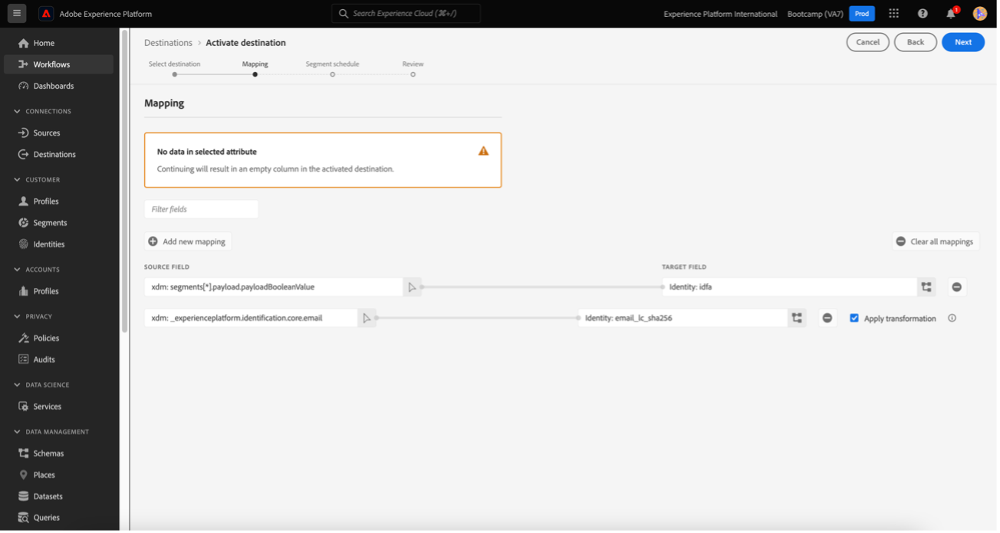

# 4.6从洞察到行动

## 目标

- 了解如何基于Customer Journey Analytics中收集的视图构建受众
- 在Real-Time CDP和Adobe Journey Optimizer中使用此受众

## 4.6.1创建受众并将其发布

在您的项目中，您创建了一个名为的过滤器 **呼叫感情** 并且能够查看将其致电的呼叫中心分类为 **正面**. 您现在将能够与这些用户一起创建区段，并在历程或通信渠道中激活这些用户。

第一步是：在上一个练习创建的面板中，选择行 **1. 通话感觉 — 正面**，右键单击并选择 **从所选内容创建受众** 选项：

接下来，按照模型为受众提供一个名称 **yourLastName - CJA受众呼叫感觉良好**：

请注意，可以预览正在创建的受众：

最后，单击 **Publish**.

## 4.6.2将受众用作区段的一部分

返回Adobe Experience Platform，转到 **区段>浏览** 并且您将能够看到在CJA中创建的区段已准备就绪，并且可用于您的激活和历程！

现在，让我们在Facebook激活和客户历程中使用此区段！

## 4.6.3实时使用您在Real-Time CDP中的区段

在Adobe Experience Platform中，转到 **区段>浏览** 并查找您在CJA中创建的受众：

单击您的区段，然后单击 **激活到目标**：

选择名为的目标 **bootcamp-facebook**，然后单击 **下一个**.

单击 **下一个** 再来一次。

选择 **受众的来源** 选项并将其设置为 **直接来自客户**，单击 **下一个**.

单击&#x200B;**完成**。

您的区段现在已连接到Facebook的自定义受众。 现在，让我们在Adobe Journey Optimizer中使用相同的区段。

## 4.6.4在Adobe Journey Optimizer中使用您的区段

在Adobe Experience Platform中，单击 **Journey Optimizer**，然后在左侧菜单中，单击 **历程** 并开始创建旅程，方法是单击 **创建历程**.

然后，在左侧菜单的下方 **事件**，选择 **区段鉴别** 并将其拖动到旅程：

在“区段”下，单击 **编辑** 要选择区段，请执行以下操作：

选择您之前在CJA中创建的受众并单击  **保存**.

准备就绪！ 从此处，您可以为符合此区段条件的客户创建历程。

[返回用户流程4](./uc4.md)

[Voltar para todos os módulos](./../../overview.md)
