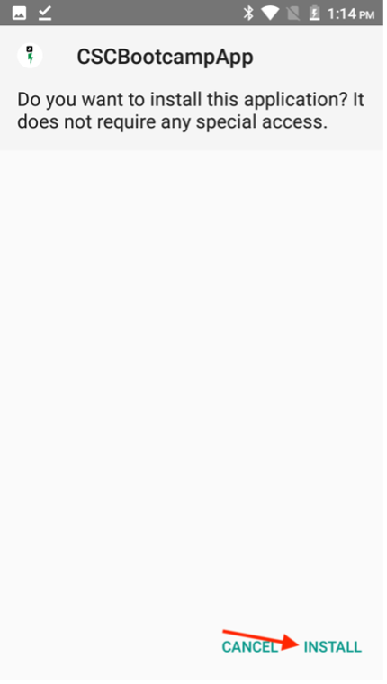
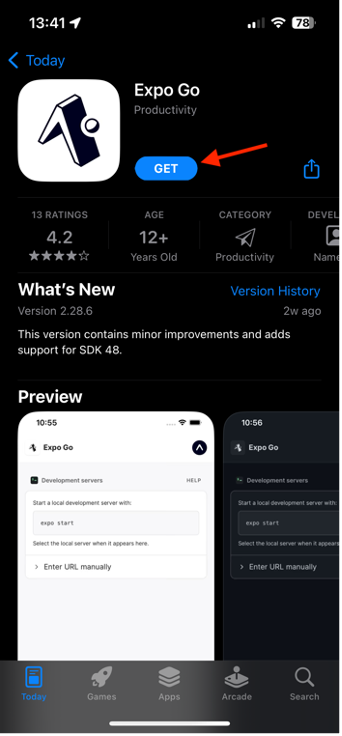
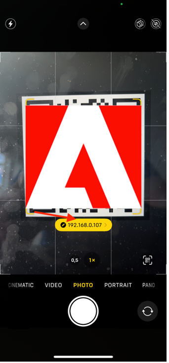

# 验证移动应用程序

## Android

- 从Android设备上的[此处](https://tinyurl.com/CSCBootcampApp)下载移动应用。 您可以在[Android模拟器](https://developer.android.com/studio/run/emulator)或物理Android设备上下载它。

- 通过点按打开下载的文件。

- 在弹出窗口中，单击安装按钮，然后单击“Install Anyway”进行确认。

- 成功安装应用程序后，单击“打开”按钮以将其打开。

## iOS

>[!WARNING]
>
> 确保您已连接到Bootcamp Wifi网络。 这一点至关重要，因为只有在您使用同一Wifi网络的情况下，该应用程序才能正常工作。

由于这不是正式分发的应用程序，因此iOS的设置与您习惯使用的设置有所不同。

- 从[App Store](https://itunes.apple.com/app/apple-store/id982107779)下载Expo Go应用程序。

- 在iPhone Camera应用程序中，扫描Adobe团队将在训练营中投影的二维码。 出现提示时，单击显示的按钮。

- 此操作将加载允许您在iPhone上打开应用程序的网页。 单击“Expo Go”按钮，在刚刚下载的应用程序中将其打开。

- 在弹出的对话框中，选择“打开”，以便能够在Expo Go应用程序中加载正确信息。

- Expo Go应用程序打开后，将提示您查找本地网络上的设备。 如前所述，这是必需的，这样我们才能将应用程序从Adobe设备下载到您的手机。 单击“允许”以加载此项。

- 您最初可能会收到错误页面。 只需单击“重试”按钮，即可最终在设备上加载应用程序。 请注意，关闭Expo Go应用程序或断开设备与Wifi网络的连接将导致应用程序不再响应。

## 导航应用程序

在应用程序中，您可以从下拉菜单中选择您的团队。 这会动态加载您在AEM中创作的内容。 如果您对内容不满意，可以随时在我们之前创作的内容片段中更新内容，然后重新发布内容。 然后，您会看到更改已反映在应用程序中。

选择团队前
选择团队后

下一步：[阶段3 — 投放：在AEM中创建页面](./page-in-aem.md)

[返回第2阶段 — 生产：创建移动应用程序内容](../production/app.md)

[返回所有模块](../../overview.md)
