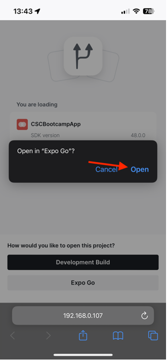

# 验证移动设备应用程序

## Android

- 从下载移动设备应用程序 [此处](https://tinyurl.com/CSCBootcampApp) 在Android设备上。 您可以在 [Android模拟器](https://developer.android.com/studio/run/emulator) 或您的物理Android设备。

- 点按以打开下载的文件。

- 在弹出窗口中，单击安装按钮，然后单击“仍然安装”进行确认。

- 成功安装应用程序后，单击“打开”按钮以将其打开。

## iOS

>[!WARNING]
>
> 确保您已连接到Bootcamp Wifi网络。 这非常重要，因为只有在您使用同一个Wifi网络时，应用程序才会工作。

由于这不是正式分发的应用程序，因此iOS的设置与您以前的设置有些不同。

- 从下载Expo Go应用程序 [App Store](https://itunes.apple.com/app/apple-store/id982107779).

- 在iPhone Camera应用程序中，扫描Adobe团队将在Bootcamp中投影的二维码。 出现提示时，单击显示的按钮。

- 这将加载一个网页，允许您在iPhone上打开应用程序。 单击“Expo Go”按钮以在您刚刚下载的应用程序中打开它。

- 在弹出的对话框中，选择“打开”，以便Expo Go应用程序可以加载正确的信息。

- Expo Go应用程序打开后，它将提示您在本地网络上查找设备。 如前所述，这是必需的，以便我们能够将应用程序从Adobe设备下载到您的手机。 单击“允许”以加载此代码。

- 您可能会首先遇到错误页面。 只需单击“重试”按钮，即可在设备上最终加载应用程序。 请注意，关闭Expo Go应用程序或断开设备与Wifi网络的连接将导致应用程序不再响应。

## 导航应用程序

在应用程序中，您可以从下拉菜单中选择您的团队。 这将动态加载您在AEM中创作的内容。 如果您对内容不满意，您可以随时在我们之前创作的内容片段中更新内容，然后重新发布内容。 然后，您将看到应用程序中反映的更改。

下一步： [阶段3 — 交付：在AEM中创建页面](./page-in-aem.md)

[返回到阶段2 — 生产：创建移动设备应用程序内容](../production/app.md)

[返回到所有模块](../../overview.md)
