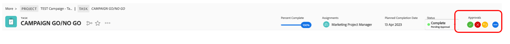

# Campaign开始/停止

## 在Adobe Workfront中批准营销活动

由于我们现在已完成所有任务，并因此将所有任务设为100%，因此我们只需要“Campaign go/no go”（活动执行/否，是一项审核和批准任务）才能发布活动。

我们当然会批准我们的营销活动，因此将任务20“营销活动开始/不开始”设置为100%完成。 这将自动触发审阅和批准流程：

我们来看一下我们现有的流程。 单击任务20的名称“CAMPAIGN GO/NO GO”：

现在，让我们看一下审批部分：

我们可以看到，这是一个两步流程，通过它，我自己、Petra或你们任何人都需要审核和/或批准该执行/不执行，作为第一步，然后Olivia(我们的营销运营Director)可以执行她的最终操作。

因此，在右上角，出现了我的审批按钮，我现在可以审批这个“开始/停止”的第一步。 单击绿色勾号以批准：

我们所有的项目现在都在等待奥利维亚的批准。 一旦她批准（她当然会批准），我们的Campaign就会发布。

## 启动社交媒体营销活动

现在我们已经证实我们的营销活动已经准备就绪，并且我们已准备好开始销售我们的自行车，是时候引起轰动了。 还有什么更好的办法可以做到这一点，然后是社交媒体上的帖子？

由于我们已经创建并批准了一个社交媒体帖子，因此现在可以将其发布到我们的演示Instagram帐户。

>[!WARNING]
> 一些内务管理规则
> 
> 这个描述只是为了完成我们训练营的故事。 **不打算共享、关注或公开**。 请保持您的帖子&#x200B;**相互尊重和专业**。 **请勿与引导营以外的任何人共享凭据**，请注意，本练习结束后，**所有设备都将注销**。

- 您将获得名为“csc_bootcamp_emea”的Instagram帐户的密码。
- 创建一个新帖子，在其中添加要加入的位置作为标题的最后一部分，以及日期和团队编号。
- 您可以随意滚动到所有不同的帖子，看看其他团队是如何用同样的材料获得一些艺术自由的。

## 恭喜，您的营销活动已发布！

下一步：[阶段4 — 分析：概述](../insights/overview.md)

[返回第3阶段 — 交付：在AEM中创建页面](./app.md)

[返回所有模块](../../overview.md)
