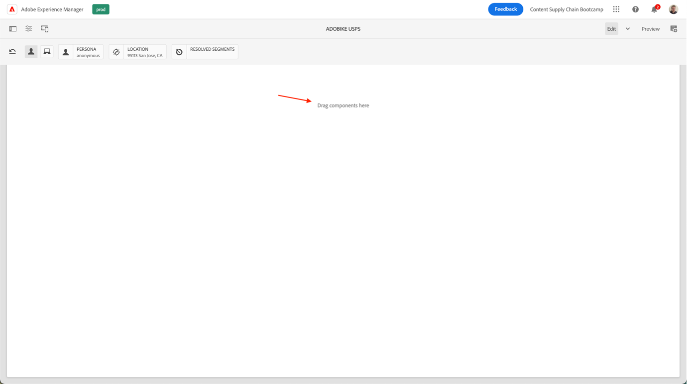
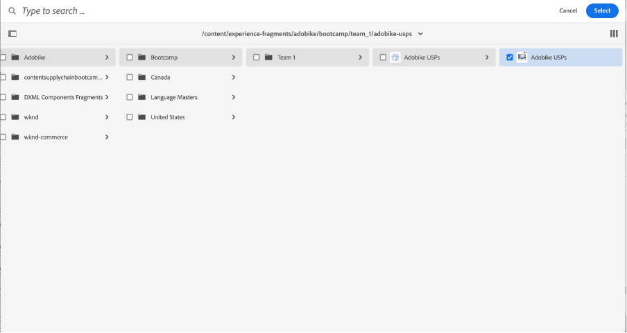

# 在AEM中创建页面

AEM提供了两个环境：创作环境和发布环境。 通过这些交互，您可以在网站上提供内容，以便访客能够体验到该内容。

创作环境提供了在实际发布内容之前创建、更新和审核此内容的机制：

- 作者创建并审阅内容(这可以是几种类型；例如，页面、资产、发布等)
- 将在某个时候发布到您的网站。

作为作者，您需要在AEM中组织您的网站。 这包括创建和命名内容页面，以便：

- 您可以轻松地在创作环境中找到这些页面
- 您站点的访客可以方便地在发布环境中浏览这些页面

网站的结构可以视为包含内容页面的树结构。 这些内容页面的名称用于构成URL，而标题则会在查看页面内容时显示。 在以下示例中，页面的可访问URL将为/content/adobike/language-masters/en.html

让我们看一看如何向现有网站添加新页面，以及如何重复使用某些内容。

## 创建主页

如上节所述，AEM页面层次结构可用作树结构。 这意味着我们将从最高级别的页面开始：主页。

- 转到AEM作者(位于 [https://author-p71057-e991028.adobeaemcloud.com/](https://author-p71057-e991028.adobeaemcloud.com/) 然后使用我们提供的凭据登录。

- 从AEM的开始菜单中，选择导航\>站点

- 首先，让我们将现有树结构导航到要创建主页的位置。 在树结构中导航，方法是在第一列中选择“Adobike”，然后在第二列中选择“Bootcamp”。 然后，要在此页面下创建页面，请单击“创建”按钮，然后在弹出的菜单中选择“页面”。

- 这将打开配置新页面的新屏幕。 首先，我们需要选择一个页面模板。 利用AEM中的页面模板，可定义页面的结构，以及可在此页面上使用的内容。 由于我们要创建主页（即登陆页面），因此将选择登陆页面模板，然后单击“下一步”按钮以继续。

- 在下一个屏幕中，您将能够用一些初始信息填充您的页面。 最重要的信息是标题（一个必填属性，带有\*），它允许您为页面提供一个有意义的名称。 如果您未填写“名称”，则AEM将按照SEO最佳实践自动生成可用页面的URL。 在这种情况下，您可以将此字段留空。 其他一些属性也可以填充，您可能会浏览其他选项卡，但为了实现此引导营，目前尚未填写任何其他属性。 准备好创建页面后，只需单击“创建”按钮。

- AEM现在将创建您的页面。 完成后，您将看到一个弹出窗口，通过该弹出窗口，您可以单击“打开”按钮以打开新创建的页面。

- 您现在将进入AEM编辑器。 这是一个“所见即所得”（或WYSIWYG）编辑器，您可以在其中将组件拖放到页面中以构建页面。 让我们看一下导航：
   
   - 左侧是侧面板，其中包含您可以在页面上使用的资产、可在此页面上使用的组件（或构建基块），以及便于使用的树视图，该视图可向您显示页面的结构方式。 单击其中的任意图标以打开其视图。
   - 在右侧，您将看到“布局容器”。 在这个区域中，您可以放置所需的组件。
   - 让我们在页面中填充一些内容。 随时填充主页。 在以下示例中，我们使用了链接到产品页面的图像组件以及两个Teaser组件。

## 通过利用体验片段来重复使用体验

我们现在创作了主页，该主页已完全准备好启动Adobike。 但是，其中的某些内容（例如我们的自行车的独特销售点）可以在多个页面上重复使用。

理想情况下，我们只想创建一次此独特的销售点体验，以便我们可以对其进行集中管理并确保提供个性化且一致的体验。 在AEM中，我们可以使用“体验片段”执行此操作。 体验片段是由一个或多个组件组成的组，这些组件包括可在页面中引用的内容和布局。 它们可以包含任何组件。

让我们立即使用它：

- 转到AEM作者(位于 [https://author-p71057-e991028.adobeaemcloud.com/](https://author-p71057-e991028.adobeaemcloud.com/) 然后使用我们提供的凭据登录。

- 从AEM开始菜单中，选择导航\>体验片段

- 在以下屏幕中，让我们创建一个文件夹，以供您的团队用于存储可重复使用的体验。 在列视图中，导航到Adobike \> Bootcamp ，然后单击创建\>文件夹按钮。

- 在弹出的模式窗口中，为您的文件夹指定团队的名称。 您可以将名称字段留空，AEM会自动为您生成该字段。 为文件夹指定了名称后，单击创建按钮以创建文件夹。

- 此时您应会看到文件夹弹出窗口。 单击该页面，然后单击创建\>体验片段按钮。

- 首先，让我们选择一个体验片段模板。 与页面一样，体验片段也可以基于多个模板，每个模板都预先预定义了一个体验。 在本例中，由于我们希望在网站中重复使用我们的内容，因此让我们选中左上方的复选框，然后单击“下一步”按钮以选择“体验片段Web变体模板”。

- 为您的体验片段提供一个有意义的标题，例如“Adobe USP”，然后单击创建按钮。

- 创建体验片段后，单击模式窗口中的“打开”按钮，以便我们可以在体验片段中添加一些内容。

- 就像编辑页面时一样，您可以看到一个布局容器，您可以在其中添加一些内容。

- 我们将从主页复制组件。 在新选项卡中，按照上一章所述导航到主页，选择要复制的组件，然后单击复制图标。

- 然后，返回到体验片段中，单击布局容器，然后单击粘贴按钮。

>[!NOTE]
>
> 提示：AEM允许您在任何页面或体验片段中使用“布局模式”。 这允许您调整组件大小并优化任何设备的体验。

- 从顶部菜单中，打开下拉菜单并选择“布局”以进入布局模式。

- 然后，您可以选择任何组件，并只需拖动组件两侧的手柄即可调整其大小，以便与屏幕上可见的列对齐。

- 默认情况下，您正在编辑所有断点。 但是，如果要为特定断点进行编辑，则可以从页面顶部的工具栏中选择一个匹配的设备。 然后，您随后创作的断点将突出显示。

- 如您所见，移动设备上的两列布局看起来不太好。 让我们在移动设备上创建一个列布局。 正如您在桌面上所看到的，我们的体验保持不变，但在移动设备上，我们现在只有一列内容可以获得更好的体验。

- 最后，我们现在可以在主页上重复使用此体验。 将“体验片段”组件拖放到页面上要显示内容的位置。 您可以删除我们复制的内容，因为我们将从体验片段中使用它。

- 打开体验片段组件的配置对话框，然后使用路径选取器选择创建体验片段的位置。

- 最后，我们在页面上有了可重复使用的体验。

## 创建产品页面

使用与AEM集成的Adobe Commerce时，您可以拥有一个通用的产品详细信息页面，当您从生成的概述中导航网站时，该页面会使用。 但是，有时我们还希望看到一个鼓舞人心的页面，该页面将产品特定内容与激励性内容结合在一起。 让我们按照我们的预制在商店上复制，然后创建一个鼓舞人心的产品页面。

- 转到AEM作者(位于 [https://author-p71057-e991028.adobeaemcloud.com/](https://author-p71057-e991028.adobeaemcloud.com/) 然后使用我们提供的凭据登录。

- 从AEM的开始菜单中，选择导航\>站点

- 在列概述中，将预制网站导航到商店：Adobike \>语言母版\> Adobike \>商店。 然后，选中带有复选框的“商店”页面，然后单击创建\> Live Copy。 这样，您就无需过多地介绍具体细节，而是可以创建可在网站中使用的页面副本，以便您能够使用AEM多站点管理器重复使用现有页面和内容。

- 在弹出的屏幕中，选中团队网站名称旁边的复选框，以选择网站作为目标。 然后，单击“Next（下一步）”按钮。

- 由于我们不打算深入了解多站点管理器，因此您只需接管此配置即可。\
   标题：商店\
   名称：商店\
   转出配置：标准转出配置\
   配置Live Copy后，单击创建按钮。

>[!NOTE]
>
> 想了解有关Live Copy的更多信息吗？ 查看 [“创建和同步Live Copy”。](https://experienceleague.adobe.com/docs/experience-manager-cloud-service/content/sites/administering/reusing-content/msm/creating-live-copies.html?lang=en)

- 完成后，您现在应会看到网站中可用的商店。 选择它，然后单击创建\>页面以创建我们的创意产品页面。

- 由于我们想要在页面上显示产品信息，现在让我们使用产品页面模板创建页面。 选择它，然后单击“下一步”按钮。

- 填写页面元数据，然后单击创建按钮，就像主页一样。 创建页面后，可以单击打开按钮以打开页面。 如您所见，该组件已填充了产品详细信息组件。

- 首先，我们将添加之前创建的体验片段。 然后，我们可以在页面上添加任何仍然需要的其他内容。 最后，我们将配置产品详细信息组件以显示Adobike产品，方法是在配置对话框中选择产品查找器，然后选择Adobike类别，并选中产品旁边的复选框。 然后，单击“添加”按钮。

- 现在，我们有完整的鼓舞人心的页面，包括集中管理的内容和产品信息，这些信息来自Adobe Commerce。

下一步： [阶段3 — 交付：营销活动开始/不开始](./go-nogo.md)

[返回到阶段3 — 交付：验证移动设备应用程序](./app.md)

[返回到所有模块](../../overview.md)
