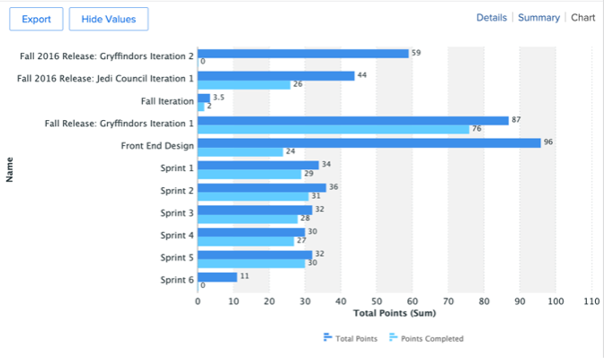

# 营销经理的分析

## 项目负责人的每周观点

在左列，单击“项目负责人的每周视图”：

这包含丰富的报表数组，通常可单击/可操作，以了解更多详细信息：

- 的 **本周到期的任务（按项目）**

- 的 **项目管理即将实现的里程碑** :

- 的 **按优先级列出的未解决问题**

- 的 **按部门列出的延迟任务**

- 的 **按个人列出的延迟任务**

## 与SCRUM相关的分析

在左列，单击“小版本状态”

如果您的团队使用SCRUM方法，这是一组有趣的管理报表：

- **迭代速度**

- **按团队划分的平均速度**

- **当前迭代完成的小时总数（按被分派人）**

- **按团队迭代**

## 效率报告

在左栏，单击“效率”

- **计划/未计划比率** （完成的工作）

- **按周完成的请求**

## 投放中的项目分析

仍在左栏中，单击“营销 — 正在投放的项目”

- **飞行中项目现状**

- **按月分类的项目**

- 清单、进度及财务详情 **飞行中项目**

## 可视化（跨项目）依赖项

返回“PIN”行，单击“Portfolio视图”：

这里有 **一组项目的Gant图视图** 项目之间可能存在的依赖关系（前置任务）

## 第三方集成分析

>[!NOTE]
>
> 这是与第三方软件集成的示例。 以下是与Adobe Campaign的集成示例。 它可导入Adobe Campaigns中已完成促销活动的结果。

在“PIN”行上，单击“营销活动摘要”：

- **Adobe Campaign摘要**

- **Adobe Campaign发送到打开**

- **Adobe Campaign打开点击量**

下一步： [结论](../../conclusion.md)

[返回到阶段4 — 分析项目经理的信息](./project-manager.md)

[返回到所有模块](../../overview.md)
