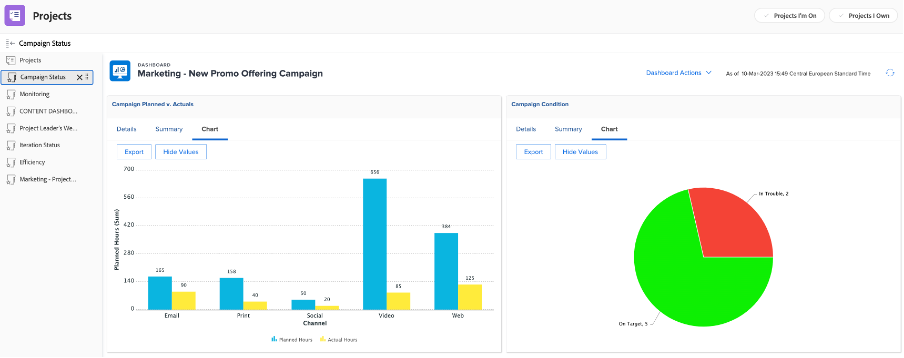

# 项目经理的分析

## 交互式项目进度报表

在“PIN”行上，单击“移动设备应用程序感知”，然后单击“量度”：

在此，您可以以图形方式查看单个项目/营销策划的状态。

>[!NOTE]
>
> 每个区域都可单击以获取更多详细信息，对于Workfront中的大多数分析，也是如此。 试试看！

## 特定于促销活动的报表

在“PIN”行上，单击“项目：

在左侧列中，单击“营销活动状态”：

顶部将为您提供关于1个营销活动的1个营销活动的洞察信息 **计划与实际** 逗留时间和2/ **促销活动条件** 对于每个渠道：

下半部分将深入分析 **营销活动交付件** 状态：

## 基于多个项目的分析

仍在左栏中，单击“监视”

顶部将为您提供一组项目的状态分析，这两组项目均来自 **任务状态** 从视点和角度 **项目条件** 视点：

底部显示所有 **风险审批** 而且需要追踪：

## 内容功能板

仍在左列，单击“内容功能板”：

顶部会对您的 **文档的校样批准** 状态（是否已批准，我们需要多少个版本等）

底部是 **校样批准审核** 这为验证批准状态提供了另一个视角：

下一步： [阶段4 — 对营销经理的分析](./marketing-manager.md)

[返回到阶段4 — 分析：概述](./overview.md)

[返回到所有模块](../../overview.md)
