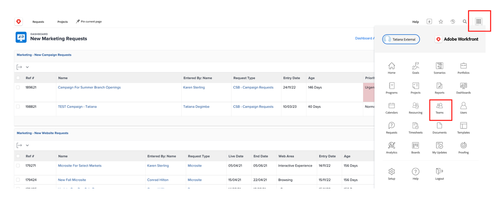

# 规划

>[!NOTE]
>
> 在Bootcamp期间，您将佩戴多个帽子：请求者、项目经理、Designer和高级管理层。 这将为您提供每个用户档案的用户体验概览。

现在我们来看一下工作管理平台Adobe Workfront。 Workfront使您的目标在整个组织中可见，以便每个人都可以从战略角度确定工作的优先级、跟踪进度和衡量结果。 随着您的目标的发展，Workfront会将信息级联到在实地执行工作的团队。 结果如何？ 更加一致、更加专注、更快取得成功。

通过浏览到[adobebootcampemea-02032301.testdrive.workfront.com](https://adobebootcampemea-02032301.testdrive.workfront.com)并使用Adobe团队提供给您的凭据登录您的Workfront配置文件。

您将面临此登录页面。  以您订阅的引导营地专业电子邮件地址作为用户名登录：

成功登录后，您将看到以下主页：

## 准备Workfront以供使用

我们现在将像定期使用Workfront一样准备主页。  这意味着我们将转到相关页面，以便稍后在工作流程中将这些页面“PIN”到我们的主页上。

首先，让我们转到团队的工作负载页面。  单击右上方的华夫饼并选择“团队”

当我们的团队（营销 — 数字）出现在屏幕上时，只需将其固定到您的顶部功能区即可：

您的顶部功能区现在应如下所示：

现在，我们固定一个项目，稍后我们将对其进行更深入的分析。  单击已固定项目页面，然后单击搜索按钮。  键入“移动应用程序感知活动”，然后单击项目名称：

项目在屏幕上显示后，像我们以前一样将其固定到顶部功能区：

再次钉选

您的顶部功能区现在应如下所示：

最后，再次单击右上角的华夫饼并选择“PORTFOLIO”。

单击搜索按钮并键入“TRANSFORM”。  单击“转变客户体验”Portfolio以将其打开：

打开Portfolio后，将其固定到顶部功能区：

您的顶部功能区现在应如下所示：

我们现在已准备好通过一个界面开始我们的工作流程，该界面会定期向我们准确显示我们所需的内容。

## 请求者

现在我们从请求者的帽子开始实际的工作录入。 我们想要为我们的新Adobike Campaign正式提出请求，并提供营销简报的信息，例如产品经理。

- 单击左上方的请求：

- 然后，单击“新请求”：

- 对于请求类型，请依次选择“营销请求”、“CSB — 营销活动请求”：

- 输入主题：“Adobike Campaign - \*team\*”（填写您的团队编号）。 您可以随意添加描述和优先级。

- “CSB — 营销活动摘要”标题下的所有内容均可完全自定义。 在这种情况下，所有这些都是自定义字段，您可以根据自己的营销简要需求对其进行调整。 下面是我们为这个Bootcamp创建的简短字段：

Workfront中的

- 让我们开始填写以下摘要：

   - 将开始日期设置为01/06/2023 — 将结束日期设置为30/06/2023：

  

   - 选择AEM Assets，因为我们将有一些资源可用于该营销活动：

  AEM Assets中的

   - 在“新内容”上，请注意，如果单击“是”，将显示一个附有时间线警告的额外（条件）字段：

  

   - 由于期限很紧，因此我们将选择更改为“否”：

  

   - 在渠道上，我们默认进行了预选择一些选项。 这些是我们下一步需要的，因此这里不需要任何改变：

  

   - Adobe Commerce，选择“是”：

  

- 最后，在文档部分中，您可以为请求添加任何相关文档。  在这里，我们将使用AEM连接器向您展示如何从我们的AEM Assets实例获取现有内容。

   - 单击“添加或链接文件”并从“experience-manager”中选择链接。

  

   - 现在，您面临着使用AEM Assets文件夹，并且可以浏览这些文件夹（和/或使用搜索引擎）以获取您的请求所需的文档/资源：

  

   - 您可以随时附加AEM Assets中可能与本项目相关的任何项目（如果有）。 完成后，单击“链接”可链接到资产，如果未链接任何文件夹，则单击“关闭”。

  

- 我们已经完成了请求，可以随时提交它：

## 项目管理器

现在我们已经以“请求者”（例如，产品经理）的身份提交了请求，我们将更换产品经理的头衔，并配戴项目经理的头衔。

- 单击“Adobe”徽标，您将登录到“新营销请求”页面（这是典型的“项目经理”主页）：

- 在“营销 — 新营销活动请求”部分下，您可以找到新创建的请求：

- 单击请求名称：

- 单击“请求详细信息”：

- 向下滚动到“CSB — 营销活动摘要”部分并展开：

- 您可以查看申请人简介的所有详细信息，使用此信息可以基于模板启动项目计划。
   - 在顶部请求名称旁边，单击三个圆点：

  

   - 单击“从模板转换为项目”：

  

   - 选择“CSB — 营销活动”，然后单击“使用模板”：

  

   - 单击页面底部的“转换为项目”：

  

- 我们现在拥有了基于模板的Campaign项目工作流。 让我们稍后固定项目。 单击“固定当前页面”：

- 一些需要注意的方面：

1. 持续时间概念 — 它是完成任务的机会窗口。\
   计划小时数的概念 — 它是完成任务所需的实际时间。

1. 前置任务概念（又称依赖项） — 这些是任务之间可以具有的约束条件（通常，在完成另一个任务之前无法启动该任务）。 这使我们能够有一个清晰的甘特图，其中包含每个项目的关键路径。 单击以下图标以查看甘特图：
   

1. 作业的概念 — 在项目创建时，作业仍然具有一般性，因为它们来自模板。 它们对应两个职位角色：由锤子图标（即具备完成此特定任务所需技能的一组人员）表示的工作角色，或由人员图标（即由您的公司人员组定义的人员组）表示的团队。 现在到了将这些任务分配给个人的时候。

- 今天，我们将重点介绍团队预分配以及如何将这些任务分配给个人。

- 如您所见，任务11“制作社交媒体广告”已分配给“营销 — 数字”团队：
  

- 通过打开该团队的资源管理页面，让我们看看这如何反映该团队的规划。 单击页面顶部的“Marketing - Digital”PIN：
  

- 您现在拥有此“团队计划”视图：

1. 顶部覆盖该特定团队的未分配工作。 它列出了团队分配到的项目，通过单击此处的箭头，您可以看到项目需要涵盖的确切任务：
   

1. 底部涵盖团队中个人的已分配工作，但不仅如此：它确实显示了团队每个成员的实际工作量，还显示了他们的时间表（例如，周一至周五或周一至周六）、他们的假期等。
   

- 要将任务分配给个人，只需将任务从顶部拖到底部单人行即可 — 请参阅Bea的工作量调整方式及其任务分配的详细信息已添加：
  

下一步：[阶段1 — 计划：其他准备工作](./prework.md)

[返回到“创意摘要”](../../creative-brief.md)

[返回所有模块](../../overview.md)
