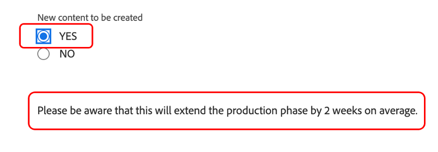

# 规划

>[!NOTE]
>
> 在Bootcamp期间，你会戴几顶帽子：请求者、项目经理、设计师和高级管理人员。 这样您就可以一目了然地了解每个用户档案的用户体验。

现在，让我们看一下工作管理平台，Adobe Workfront。 Workfront可让整个组织看到您的目标，以便每个人都可以战略性地优先处理工作、跟踪进度和衡量结果。 随着目标的发展，Workfront将信息传递给实地工作团队。 结果呢？ 更加协调一致、专注和快速地取得成功。

通过浏览到 [adobebootcampemea-02032301.testdrive.workfront.com](https://adobebootcampemea-02032301.testdrive.workfront.com) 并使用Adobe团队为您提供的凭据登录。

此登录页面将面对您。  使用您订阅到bootcamp的专业电子邮件地址作为用户名登录：

成功登录后，您将面临以下主页：

## 准备Workfront以供使用

现在，我们将准备主页，就像我们定期使用Workfront一样。  这意味着我们将转到并获取与我们以后的工作流程相关的页面，并在主页的顶部“固定”这些页面。

首先，让我们进入我们团队的工作量页面。  单击右上方的华夫饼，然后选择“团队”

我们的团队（营销 — 数字）在屏幕上显示后，只需将其“PIN”到您的顶部功能区：

现在，您顶部的功能区应如下所示：

现在，我们将确定一个项目，稍后我们将对其进行更为深入的分析。  单击项目已固定页面，然后单击搜索按钮。  键入“移动设备应用程序感知营销活动”并单击项目名称：

项目显示到屏幕上后，将其固定到顶部功能区，操作方式与之前相同：

现在，您顶部的功能区应如下所示：

最后，再次单击右上方的华夫饼图，然后选择PORTFOLIO。

单击搜索按钮，然后键入“TRANSFORM”。  单击“转换客户体验”Portfolio以将其打开：

Portfolio打开后，将其固定到顶部功能区：

现在，您顶部的功能区应如下所示：

现在，我们准备好通过一个界面来启动工作流，该界面可定期准确显示我们需要的内容。

## 请求者

现在，我们将用请求者的帽子开始实际的工作。 例如，作为请求者（例如产品经理），我们希望正式确定对新Adobe Campaign的请求，并提供营销简报的信息。

- 单击左上角的请求：

- 然后，单击“New request”：

- 对于请求类型，选择“营销请求”，然后选择“CSB — 促销活动请求”：

- 输入主题：“Adobike Campaign - \*team\*”（填写您的团队编号）。 您可以自由添加描述和优先级。

- “CSB — 营销活动摘要”标题下的所有内容都完全可自定义。 在这种情况下，这些都是自定义字段，您可以根据自己的营销摘要需求进行调整。 以下是我们为此Bootcamp创建的Brief字段：

- 让我们开始填写Brief:

   - 将开始日期设置为01/06/2023 — 将结束日期设置为30/06/2023:

   

   - 选择AEM Assets，因为我们将在此处拥有一些可用于此营销活动的资产：

   

   - 在“新内容”中，请注意，如果单击“是”，将显示一个额外（视情况而定）的字段，并带有时间线警告：

   

   - 既然我们的期限很紧，我们就改为“不”：

   

   - 在渠道上，我们默认选择预先选择一些渠道。 我们下一步就需要这些，因此这里不需要任何改变：

   

   - Adobe Commerce，选择是：

   

- 最后，在文档部分中，您可以为请求添加任何相关文档。  在本例中，我们将利用AEM连接器向您展示如何从我们的AEM Assets实例获取现有内容。

   - 单击“添加或链接文件”，然后从“experience-manager”中选择“链接”。

   

   - 现在，您面对的是AEM Assets文件夹，您可以浏览这些文件夹（和/或使用搜索引擎）以获取请求所需的文档/资产：

   

   - 请随时附加您认为可能与此项目相关的任何AEM Assets项目（如果有）。 完成后，单击“链接”以链接到资产，或者单击“关闭”以关联任何文件夹。

   

- 我们现已完成请求并准备提交：

## 项目管理器

现在，我们以“请求者”（例如产品经理）的身份提交了我们的请求，接下来我们将更换帽子，并戴上其中一位项目经理。

- 单击“Adobe”徽标，您将登陆“新营销请求”页面（这是典型的“项目经理”主页）：

- 在“营销 — 新营销活动请求”部分下，您可以找到新创建的请求：

- 单击请求名称：

- 单击“请求详细信息”：

- 向下滚动到“CSB — 营销活动摘要”部分并展开该部分：

- 您可以查看请求者摘要的所有详细信息，并且利用此信息，您可以基于模板启动项目计划。
   - 在顶部的“请求名称”旁边，单击三个圆点：

   

   - 单击“从模板转换为项目”：

   

   - 选择“CSB — 营销活动”，然后单击“使用模板”：

   

   - 单击页面底部的“转换为项目”：

   

- 现在，我们提供了基于模板的Campaign项目工作流。 让我们将项目固定到以后。 单击“固定当前页面”：

- 一些关注领域：

1. 持续时间概念 — 完成任务的机会之窗。\
   计划时数的概念 — 完成任务所需的实际时间。

1. 前置任务的概念（即依赖项） — 这些是相互之间可能存在的约束任务（通常，此任务在完成前无法启动）。 这样，我们就可以获得清晰的Gant图，其中包含每个项目的关键路径。 单击以下图标以查看变量图：
   

1. 分配概念 — 在创建项目时，分配虽然来自模板，但仍是泛泛的。 这些任务可用于“工作角色”(由锤子图标（即一组具有完成此特定任务的技能的人员）或“团队”(由人员图标（即由公司人员组定义）)。 现在是时候把这些任务分配给个人了。

- 今天，我们将重点介绍团队预分配以及如何将这些预分配给个人。

- 如您所见，任务11“制作社交媒体广告”已分配给“营销 — 数字”团队：
   

- 请打开此团队的“资源管理”页，以了解这反映了该团队的规划。 单击页面顶部的“营销 — 数字”PIN:
   

- 您现在具有以下“团队”计划视图：

1. 顶部包含该特定团队的“未分配”工作。 其中列出了团队在中分配的项目，通过单击此处的箭头，您可以看到项目需要涵盖的确切任务：
   

1. 底部部分涵盖团队中个人的已分配工作，但不仅包括：它的确显示了小组每个成员的实际工作量，还显示了他们的日程安排（如周一至周五或周一至周六）、他们的节假日等。
   

- 要将任务分配给个人，只需将任务从顶部拖到底部的个人行中即可 — 查看如何调整Bea的工作量并添加其任务分配的详细信息：
   

下一步： [阶段1 — 规划：其他工作前](./prework.md)

[返回至Creative Brief](../../creative-brief.md)

[返回到所有模块](../../overview.md)
