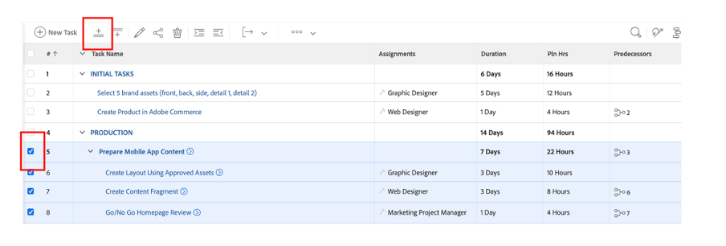

# 其他前期工作

## 选择Brand Assets

如创意简报中所述，需要一些资源才能有效地启动我们的营销活动。 这些品牌资产将添加到Workfront中的营销活动，以便我们能够在集中位置访问它们。

- 展开任务1“初始任务”，然后单击任务以打开任务“选择5个品牌资产（前、后、...）”。

- 单击“文档”，然后单击“新增：

- 选择“从Experience-manager”；这将允许我们选择AEM Assets上已可用的品牌资产：

来自experience-manager

- 显示AEM文件夹层次结构后，导航到以下路径： experience-manager > Adobike Assets >自行车拍摄选择5个资源，然后单击“链接”。

- 现在，我们的任务中包含品牌资产。 这意味着我们可以将任务2设置为100%完成：

## Adobe Commerce演示

Adobe Commerce是Adobe Experience Cloud中的众多产品之一，可以帮助您为客户提供最佳数字体验。 然而，在训练营里时间太少，无法一起做任何事。

本视频让您熟悉Adobe Commerce，并展示我们创建用于引导营的产品。 在现实场景中，您将向Adobe Commerce上传先前选择的品牌资产到产品配置。

>[!VIDEO](https://video.tv.adobe.com/v/3418945?quality=12&learn=on&enablevpops)

此任务完成后，您可以在Workfront中将任务3标记为100%完成。

## 灵活的营销活动是先决条件

在查看工作计划时，我们注意到了一个小问题：我们的产品经理（请求者）提交了一个更新，忘记请求“产品主页横幅”。  我们将此添加到我们的项目计划中。

- 转到任务列表，并在任务4“生产”下方添加我们的“创建产品主页横幅”任务。 为此，请选择“准备移动设备应用程序内容”任务，然后单击“在上方添加任务图标”：

- 为添加的任务提供一个有意义的名称，例如“创建产品主页横幅”。

- 现在我们已经创建了任务，接下来让我们向其添加一些内容。 单击项目标题右侧的三个圆点，然后选择“附加模板”：

- 选择“创建产品主页横幅”并单击“自定义并附加”：

- 在自定义屏幕中，确保提及“创建产品主页横幅”任务作为父级：

- 最后，请确保使用任务3的前置任务标记父任务“创建产品主页”，因为只有在Adobe Commerce中创建产品后才能开始生产：

我们现在有了一个已完成并计划好的营销活动，这意味着我们现在可以从生产和交付营销活动开始！

下一步：[阶段2 — 生产：创建产品主页横幅](../production/banner.md)

[返回第1阶段 — 计划：计划](./planning.md)

[返回所有模块](../../overview.md)
