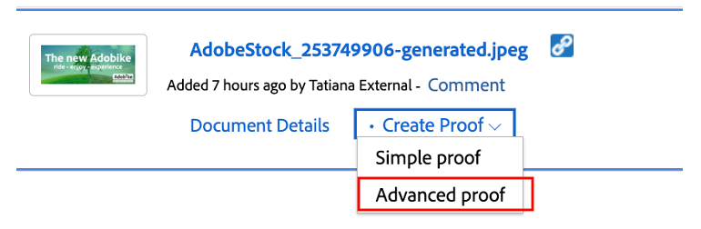

# 创建产品主页横幅

## 横幅的制作

内容自动化为Experience Manager Assets引入了Adobe Creative Cloud的强大功能，使营销人员能够大规模自动化资产生产，从而大幅加快变体的创建。 让我们使用这些功能生成要在主页上使用的横幅！

- 转到[https://author-p105462-e991028.adobeaemcloud.com/](https://author-p105462-e991028.adobeaemcloud.com/)上的AEM作者，然后使用我们提供的凭据登录。

- 从主页，导航到工具\> Assets \>处理配置文件。

- 在界面中，您将看到所有现有的处理配置文件。 这些选项最多可用于启用某些自动化。

- 以下是您感兴趣的内容：
   - Adobike横幅深色：根据选定的资产，创建带有深色叠加的Adobike横幅

     
   - Adobike横幅图示：根据选定的资产，创建带有浅色叠加的Adobike横幅

     
   - Adobike横幅绿色：根据选定的资产，创建带有绿色叠加的Adobike横幅

     

- 选择要创建的横幅类型后，选择该处理配置文件，然后选择“将配置文件应用到文件夹”。

- 在下一个屏幕上，浏览到AEM Assets中团队的文件夹。 然后，从左上角选择“创建”按钮以创建新文件夹并为其指定有意义的名称，例如“创建深色横幅”。

- 创建文件夹后，选中其名称旁边的框，然后单击右上方的“应用”按钮。

现在，我们已经完成了必要的配置，接下来让我们生成横幅。

- 单击左上角的AEM徽标打开导航，然后导航到导航\> Assets \>文件。

- 找到“生成的Adobike Assets”文件夹，然后单击卡片将其打开。 生成的横幅将显示在此处。

- 打开新选项卡，然后再次导航到AEM Assets。 然后，导航到将处理配置文件应用到其中的文件夹。

- 在文件夹中，上传要为其创建横幅的图像，方法是将其拖放到浏览器中，或者单击界面右上角的“创建\>文件” 。

使用创建文件

- 等待一分钟以处理您的资产，然后重新加载屏幕。 如果您看到资产处于“新”状态，则表示它已完成处理。

- 导航回上一个选项卡，并在此处重新加载屏幕。 您应该注意到一个新资产处于“新”状态。 这是我们从DAM生成的横幅！ 还没看到吗？ 再等待一分钟，然后重新加载屏幕。

>[!NOTE]
>
> 对结果不满意？ 您可以随意将另一个处理配置文件应用到您的文件夹，并重新上传资产以生成不同的横幅（当然，也可以上传另一个资产）。 在重新上传期间，系统将询问您要对现有资产执行什么操作，请选择“替换”。
> 

现在，我们已经生成了横幅，我们以后可以在投放营销活动期间使用这些横幅。 请确保通过选择横幅，然后单击功能区上的“快速Publish”按钮来发布横幅。

## Workfront中的跟进

如果您需要对Assets进行正式且可审核的审核和批准流程，则可以选择Workfront。

>[!NOTE]
>
> 虽然我们在这里明确提及，但其目的是在Workfront中完成任务后对其进行更新。 您应该始终努力创建>审核>批准流。

- 让我们返回项目并展开“开始/不开始”横幅审核”折叠面板，通过单击以下内容以打开所述任务：

- 单击任务的文档部分（左列），然后单击AEM Assets链接文件夹“Final”。 通过单击资源所在区域并单击“创建验证”来选择资源。 校对是以结构化和协作方式校对内容（例如图片、文本、视频、网站等）的能力，在这种方式中，收集相关利益相关者的评论、更正和修改，可以比较版本和结果，并通过一次单击生成最终批准。

- 由于我们需要详细的审批流程，请选择“高级验证”。

>[!NOTE]
>
> 我们将手动决定谁将审核和/或批准我们在此引导营中的证明。 在大多数实际用例中，我们将使用已为每种验证类型定义的预置审批流程模板。

- 默认情况下，我们处于工作流类型“basic”，我们将选择您的Workfront Bootcamp专员作为审阅者和审批者。 键入您的Bootcamp Workfront专员姓名，并在其中显示“键入联系人姓名或电子邮件地址以添加收件人：

- 将它们设置为“审阅者和批准者”：

- 单击“创建验证”。 Workfront将需要一些时间来生成验证：

- 您的Workfront专家现在将收到新通知，告知他们他们有要审阅和/或批准的证明：

- 单击通知后，他们将面对您的校对，并能够发表意见和/或审批此校对。

   - 如果他们具有注释，则可以在屏幕顶部单击“添加注释”：

  

   - 然后，他们不仅能够添加注释，还能使用小指针 — 工具栏清楚地定义哪些区域需要更改。

  

   - 添加注释后，他们可以告知您，您需要在新版本的验证上做一些额外工作。 刷新您的Workfront选项卡，此时您会看到一条新通知，让您确切了解这一点。 了解了必须执行的更改后，请在AEM中进行更改，然后在此处上传新版本：

  

   - 选择更新后的资产（如果引导营方案不需要任何更改，只需重新上传相同的资产即可）并单击“链接”：

  

   - 然后，单击右侧的“创建验证”。

  

   - 生成校样后（这可能需要一些时间），您的Workfront专家将收到通知，并能够查看并有望批准此新版本。  例如，通过使用“校对比较”按钮，他们可以看到V1和V2与所有注释的并排比较。

  

  

  

现在，我们已正式批准使用我们的横幅。 可以轻松跟踪我们在流程中的位置，您执行的更新会自动触发通知，因此您可以尽可能高效地工作。

下一步：[第2阶段 — 生产：创建社交媒体广告](./social.md)

[返回第1阶段 — 计划：其他准备工作](../planning/prework.md)

[返回所有模块](../../overview.md)
