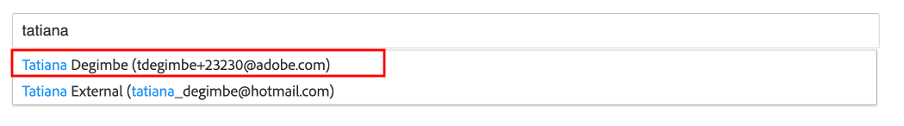

# 创建产品主页横幅

## 横幅的制作

内容自动化为Experience Manager Assets带来了Adobe Creative Cloud的强大功能，使营销人员能够大规模自动化资产生产，从而大大加快了变体的创建速度。 让我们使用这些功能生成要在主页上使用的横幅！

- 转到AEM作者(位于 [https://author-p105462-e991028.adobeaemcloud.com/](https://author-p105462-e991028.adobeaemcloud.com/) 然后使用我们提供的凭据登录。

- 从主页中，导航到工具\>资产\>处理配置文件。

- 在界面中，您将看到所有现有的处理用户档案。 这些功能可用于启用某些自动化。

- 您感兴趣的以下内容：
   - Adobike横幅深色：根据选定的资产创建带有深色叠加的Adobike横幅
      
   - Adobike横幅灯：根据选定的资产创建带有浅色叠加的Adobe横幅
      
   - Adobike横幅绿色：根据选定的资产创建带有绿色叠加的Adobike横幅
      

- 选择要创建的横幅类型后，选择该处理配置文件，然后选择“将配置文件应用到文件夹”。

- 在下一个屏幕上，浏览到您团队在AEM Assets中的文件夹。 然后，从左上方选择“创建”按钮以创建新文件夹并为其指定有意义的名称，例如“创建深色横幅”。

- 创建文件夹后，选中其名称旁边的框，然后单击右上方的“应用”按钮。

现在，我们已经完成了必要的配置，接下来让我们生成我们的横幅。

- 单击左上角的AEM徽标以打开导航，然后导航到导航\>资产\>文件。

- 找到“生成的Adobike Assets”文件夹，然后单击卡片以将其打开。 此时将显示生成的横幅。

- 打开新选项卡，然后再次导航到AEM Assets。 然后，导航到我们应用了处理配置文件的文件夹。

- 在文件夹中，通过将您要为其创建横幅的图像拖放到浏览器，或通过单击界面右上角的创建\>文件，上传该图像。

- 等待一分钟以处理资产，然后重新加载屏幕。 如果您在状态为“New”时看到资产，则知道该资产已完成处理。

- 导航回上一个选项卡，然后在此处重新加载屏幕。 您应会注意到状态为“新建”的新资产。 这是我们生成的横幅，全部来自DAM! 还没看到吗？ 等待一分钟，然后重新加载屏幕。

>[!NOTE]
>
> 对结果不满意？ 请随时将其他处理配置文件应用到您的文件夹并重新上传资产，以生成其他横幅（当然也可以上传其他资产）。 在重新上传期间，系统会询问您要对现有资产执行哪些操作，然后选择“替换”。
> 

现在，我们生成的横幅可供稍后在投放营销活动时使用。 确保通过选择横幅，然后单击功能区上的“快速发布”按钮来发布该横幅。

## Workfront的后续行动

如果您需要对资产进行正式且可审核的审核和批准流程，则可以选择Workfront。

>[!NOTE]
>
> 虽然我们在此明确提到，但是完成Workfront中的任务后，您就要更新这些任务。 您应该始终努力创建>审阅>批准流程。

- 让我们返回到我们的项目并展开“开始/禁止开始横幅审阅”折叠面板，通过单击以打开上述任务：

- 单击任务的文档部分（左列），然后单击AEM Assets链接的文件夹“Final”。 单击资产的区域，然后单击“创建校样”以选择资产。 证明是能够以结构化和协作的方式校对内容（如图片、文本、视频、网站等），其中收集相关利益相关方的评论、更正、修改，比较版本和结果，并通过一次单击生成最终批准。

- 由于我们希望获得详尽的批准流程，请选择“高级校样”。

>[!NOTE]
>
> 我们将手动决定谁将审核和/或批准我们在这个私营公司的证明。 在大多数实际用例中，我们会使用已为每个类型的校样定义的预设批准流程模板。

- 默认情况下，我们处于工作流类型“基本”中，我们将选择您的Workfront Bootcamp专家作为审核者和审批者。 键入您的Bootcamp Workfront Spesisital的名称，其中显示“键入联系人姓名或电子邮件地址以添加收件人：

- 将它们设置为“审核者和审批者”：

- 单击“创建校样”。 Workfront将花些时间生成验证：

- 您的Workfront专家现在将收到一则新通知，通知他们有审核和/或批准的证据：

- 单击通知后，他们将面对您的校样，并能够发表一些评论和/或批准此校样。

   - 如果用户有备注，则他们可以单击屏幕顶部的“添加备注”：

   

   - 然后，他们不仅可以添加评论，还可以使用小指针工具栏来明确定义需要更改的区域。

   

   - 通过添加注释，用户档案可以告知您需要对新版本的校样执行一些额外工作。 刷新Workfront选项卡，您将收到新通知，告知您具体情况。 了解了必须做哪些更改后，请在AEM中进行更改，然后在此处查看并上传新版本：

   

   - 选择您的更新资产（如果在引导营方案中不需要更改，只需再次上传同一资产），然后单击“链接”：

   

   - 然后，单击右侧的“创建校样”。

   

   - 生成验证（这可能需要一些时间）后，您的Workfront专家将收到通知，并将能够审核并希望批准此新版本。  例如，使用校样比较按钮，他们可以看到V1和V2与已发表的所有注释并排比较。

   

   

   

我们现在已正式批准使用我们的横幅。 在流程中，您可以轻松跟踪我们的位置，并且您所做的更新会自动触发通知，因此您可以尽可能高效地工作。

下一步： [阶段2 — 生产：创建社交媒体广告](./social.md)

[返回到阶段1 — 计划：其他工作前](../planning/prework.md)

[返回到所有模块](../../overview.md)
