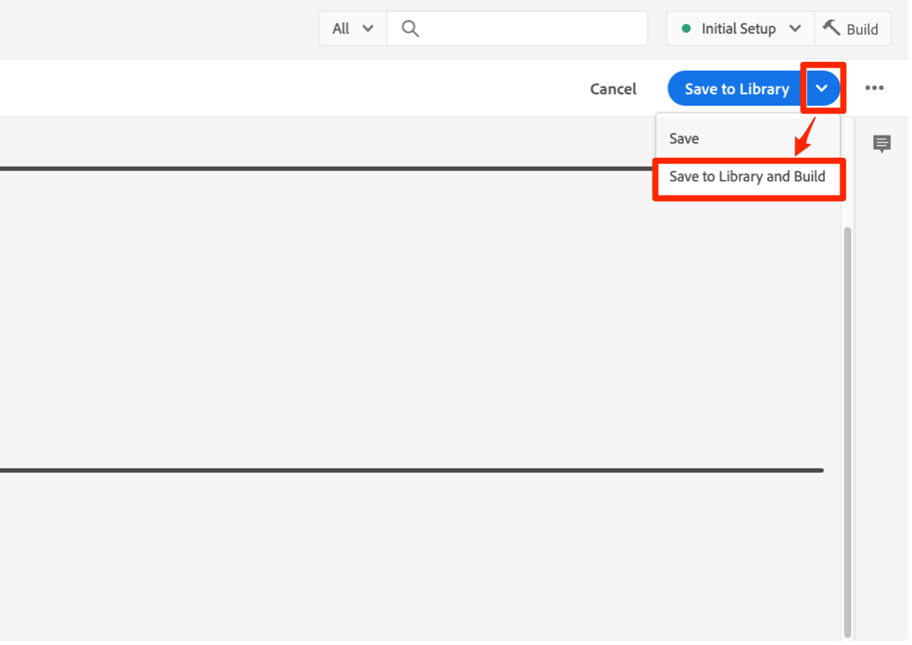
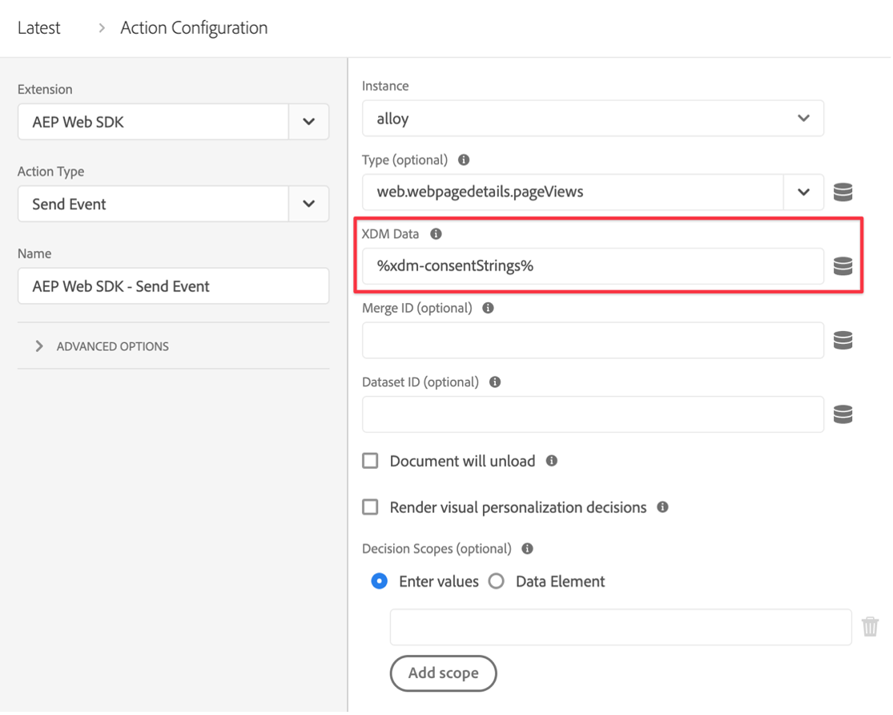

# 使用Platform Web SDK扩展通过同意管理平台(CMP)实施同意

许多隐私法规在数据收集、个性化和其他营销用例方面引入了对主动和特定同意的要求。 为了满足这些要求，Adobe Experience Platform允许您捕获个别客户配置文件中的同意信息，并在下游平台工作流中如何使用每个客户的数据时，将这些偏好设置用作决定性因素。

>[!NOTE]
>
>Adobe Experience Platform Launch正在作为一套数据收集技术集成到Adobe Experience Platform中。 在使用此内容时，您应该了解的界面中推出了几项术语更改：
>
> * platform launch（客户端）现在为 **[[!DNL tags]](https://experienceleague.adobe.com/docs/experience-platform/tags/home.html)**
> * platform launch服务器端现在为 **[[!DNL event forwarding]](https://experienceleague.adobe.com/docs/experience-platform/tags/event-forwarding/overview.html)**
> * Edge配置现在为 **[[!DNL datastreams]](https://experienceleague.adobe.com/docs/experience-platform/edge/fundamentals/datastreams.html)**

本教程演示了如何使用数据收集中的Platform Web SDK扩展实施和激活从同意管理平台(CMP)获取的同意数据。 我们将使用Adobe标准和IAB TCF 2.0同意标准来执行此操作，以OneTrust或Sourcepoint作为CMP示例。

本教程使用Platform Web SDK扩展将同意数据发送到Platform。 有关Web SDK的概述，请参阅 [此页面](https://experienceleague.adobe.com/docs/experience-platform/edge/home.html?lang=zh-Hans).

## 先决条件

列出了使用Web SDK的先决条件 [此处](https://experienceleague.adobe.com/docs/experience-platform/edge/fundamentals/prerequisite.html#fundamentals).

在该页面上，需要一个“事件数据集”，正如所听到的那样，这是一个用于保存体验事件数据的数据集。 要通过事件发送同意信息，请 [IAB TCF 2.0同意详细信息](https://experienceleague.adobe.com/docs/experience-platform/landing/governance-privacy-security/consent/iab/dataset.html) 字段组需要添加到您的体验事件架构：


对于Platform consent standard v2.0，我们还需要访问Adobe Experience Platform以创建XDM个人资料架构和数据集。 有关架构创建的教程，请参阅 [使用架构编辑器创建架构](https://experienceleague.adobe.com/docs/experience-platform/xdm/tutorials/create-schema-ui.html#tutorials) 有关所需的同意和偏好设置详细信息字段组，请参阅 [配置数据集以捕获同意和偏好设置数据](https://experienceleague.adobe.com/docs/experience-platform/landing/governance-privacy-security/consent/adobe/dataset.html).

本教程假定您有权访问数据收集，并且已经创建了客户端标记属性，其中安装了Web SDK扩展，并且创建并构建了用于开发的工作库。 以下文档详细说明了这些主题：

* [创建或配置资产](https://experienceleague.adobe.com/docs/experience-platform/tags/admin/companies-and-properties.html?lang=en#create-or-configure-a-property)
* [库概述](https://experienceleague.adobe.com/docs/experience-platform/tags/publish/libraries.html)
* [发布概述](https://experienceleague.adobe.com/docs/experience-platform/tags/publish/overview.html)

我们还将使用 [Platform Debugger](https://chrome.google.com/webstore/detail/adobe-experience-platform/bfnnokhpnncpkdmbokanobigaccjkpob) Chrome扩展可检查并验证我们的实施。

要在您自己的网站上使用CMP实施IAB TCF示例，您需要访问OneTrust或Sourcepoint等CMP以生成它们提供的数据，或者您只需遵循此处并查看以下结果。

## 将Web SDK与AdobeConsent Standard （v1.0或v2.0）结合使用

>[!NOTE]
>
>1.0标准正在逐步淘汰，取而代之的是v2.0。2.0标准允许您添加其他可用于手动强制实施同意首选项的同意数据。 Platform Web SDK扩展下方的屏幕截图来自版本 [2.4.0](https://experienceleague.adobe.com/docs/experience-platform/edge/release-notes.html#version-2.4.0) 与Adobe同意标准v1.0或v2.0兼容的扩展的扩展。

有关这些标准的更多信息，请参阅 [支持客户同意首选项](https://experienceleague.adobe.com/docs/experience-platform/edge/consent/supporting-consent.html).

### 步骤1：在Web SDK扩展中配置同意

在Tags资产中安装Platform Web SDK扩展后，我们可以在扩展配置屏幕上配置用于寻址同意数据的选项：


如果用户以前未提供同意首选项，“隐私”部分将设置SDK的同意级别。 这会为SDK中的同意和事件数据收集设置默认状态。 所选设置回答了“如果用户尚未提供明确的同意首选项，SDK应该怎么做？”问题。

* 在 — 收集用户提供同意首选项之前发生的事件。
* Out — 删除用户提供同意首选项之前发生的事件。
* 待处理 — 在用户提供同意首选项之前发生的队列事件。
* 由数据元素提供

如果默认的同意设置为“In”，这会告知SDK不应等待明确的同意，它应收集在用户提供同意首选项之前发生的事件。 这些首选项通常在CMP中进行处理和存储。

如果默认同意设置为“Out”，这会告知SDK不应收集在设置用户选择加入首选项之前发生的任何事件。 在设置同意首选项之前发生的访客活动将不会包含在设置同意后SDK发送的任何数据中。 例如，如果在选择同意横幅之前滚动并查看网页，并且使用了此“退出”设置，则在用户稍后明确同意数据收集时，将不会发送该滚动活动和查看时间。

如果默认同意设置为“Pending”，则SDK将在用户提供同意首选项之前发生的任何事件进行排队，以便在设置同意首选项之后以及在访问期间最初配置SDK之后发送事件。

使用此“挂起”设置时，如果尝试执行任何需要用户选择加入首选项的命令（例如event命令），则会导致该命令在SDK中排队。 在将用户的选择加入首选项告知SDK之前，不会处理这些命令。

一旦CMP收集了用户的首选项，我们就可以将这些首选项传递给SDK。 在下面稍后的部分中，我们将了解如何获取该选择加入数据并将其用于Web SDK扩展。

“由数据元素提供”允许我们访问包含由自定义代码或CMP在您的网站上或数据层中捕获的任何同意偏好设置数据的数据元素。 用于此目的的数据元素应解析为“in”、“out”或“pending”。

请注意：此SDK配置设置不会保留到用户的配置文件中，它专门用于在访客提供明确同意首选项之前设置SDK的行为。

要了解有关配置Web SDK扩展的更多信息，请参阅 [Platform Web SDK扩展概述](https://experienceleague.adobe.com/docs/experience-platform/edge/extension/web-sdk-extension-configuration.html?lang=en#configure-the-extension) 和 [支持客户同意首选项](https://experienceleague.adobe.com/docs/experience-platform/edge/consent/supporting-consent.html).

在本例中，我们选择“待处理”选项，然后选择 **保存** 以保存我们的配置设置。

### 步骤2：传达同意首选项

现在，我们已设置SDK的默认行为，接下来可以使用标记将访客的明确同意首选项发送到Platform。 通过使用，可以轻松实现使用Adobe1.0或2.0标准发送同意数据 `setConsent` 标记规则中Web SDK的操作。

#### 使用Platform Consent Standard 1.0设置Consent

让我们创建一个规则来演示这一点。 在Platform标记属性中，选择规则，然后单击蓝色的“添加规则”按钮。 让我们将规则命名为“setAdobeConsent”，然后选择以添加事件。 对于“事件类型”，请选择“已加载窗口”，这样当页面加载到我们的网站时，将触发此规则。 接下来，在“操作”下选择“添加”以打开操作配置屏幕。 我们将在此处设置同意数据。 选择“Extension”下拉列表，再选择“Platform Web SDK”，然后选择“Action Type”并选择“Set Consent”。

在“同意信息”下，选择“填写表单”。 在此规则操作中，我们将使用Web SDK通过填写显示的表单来为Adobe1.0同意标准设置同意：


通过这个“设置同意”操作，我们可以选择“传入”、“传出”或“由数据元素提供”。 此处的数据元素应解析为“in”或“out”。

在本例中，我们将选择“加入”以指示访客已同意允许Web SDK将数据发送到Platform。 选择蓝色的“Keep Changes”按钮以保存此操作，然后选择“Save”以保存此规则。

注意：一旦网站访客选择退出，SDK将不允许您将用户同意设置为使用。

您的标记规则可以由多种内置或自定义方式触发 [事件](https://experienceleague.adobe.com/docs/experience-platform/tags/extensions/adobe/core/overview.html) ，可用于在访客会话期间的适当时间传递此同意数据。 在上例中，我们使用window loaded事件来触发规则。 在后面的部分中，我们将使用CMP中的同意偏好设置事件来触发“设置同意”操作。 在由您喜欢的任何指示选择加入首选项设置的事件触发的规则中，您可以使用设置同意操作。

#### 使用Platform Consent Standard 2.0设置Consent

版本2.0的Platform同意标准适用于 [XDM](https://experienceleague.adobe.com/docs/platform-learn/tutorials/schemas/schemas-and-experience-data-model.html?lang=zh-Hans) 数据。 它还要求将同意和偏好设置详细信息字段组添加到您在Platform中的配置文件架构。 请参阅 [Platform中的同意处理](https://experienceleague.adobe.com/docs/experience-platform/landing/governance-privacy-security/consent/adobe/overview.html) 有关Adobe标准版本2.0以及此字段组的详细信息。

我们将创建一个自定义代码数据元素，以将数据传递到下面架构中显示的同意对象的收集属性和元数据属性：


此同意和偏好设置详细信息字段组包含 [同意和偏好设置XDM数据类型](https://experienceleague.adobe.com/docs/experience-platform/xdm/data-types/consents.html#prerequisites) 其中将包含我们在规则操作中通过Platform Web SDK扩展发送到Platform的同意偏好设置数据。 目前，实施Platform Consent Standard 2.0所需的唯一属性是收集值(val)和元数据时间值（上面以红色突出显示）。

让我们为此数据创建一个数据元素。 选择数据元素和蓝色的Add Data Element按钮。 我们将其称为“xdm-consent 2.0”，并使用核心扩展，我们将选择“自定义代码”类型。 您可以在自定义代码编辑器窗口中输入或复制并粘贴以下数据：

```js
var dateString = new Date().toISOString();

return {
  collect: {
    val: "y"
  },
  metadata: {
    time: dateString
  }
}
```

时间字段应指定用户上次更新其同意首选项的时间。 我们在这里使用标准方法在JavaScript Date对象上创建时间戳作为示例。 选择“保存”以保存自定义代码，然后再次选择“保存”以保存数据元素。

接下来，让我们选择Rules ，然后选择蓝色的Add Rule按钮，并输入名称“setConsent onLoad - Consent 2.0”。 让我们选择Window Loaded事件作为规则触发器，然后选择Actions下的Add 。 选择Platform Web SDK扩展，对于“操作类型”，请选择“设置同意”。 标准应为Adobe，版本应为2.0。对于Value，我们将使用刚刚创建的数据元素，其中包含我们需要发送到Platform的收集和时间值：


要查看此示例操作，我们从Platform Web SDK扩展中调用“设置同意”，并从表单中传递标准和版本，同时从我们之前创建的数据元素中传递集合和时间的值。

选择蓝色的Save按钮，然后再次选择以保存规则。

现在，我们有两个规则，每个Platform同意标准各一个。 实际上，您可能会跨站点选择一个标准。 接下来，我们将使用IAB TCF 2.0同意标准创建一个示例。

## 将Web SDK与IAB TCF 2.0同意标准结合使用

要了解有关IAB透明度和同意框架版本2.0的更多信息，请访问 [IAB欧洲网站](https://iabeurope.eu/transparency-consent-framework/).

要使用此标准设置同意偏好设置数据，我们需要将IAB TCF 2.0同意详细信息架构字段组添加到Platform中的Experience Event架构：


此字段组包含IAB TCF 2.0标准所需的同意首选项字段。 有关架构和字段组的更多信息，请参见 [XDM系统概述](https://experienceleague.adobe.com/docs/experience-platform/xdm/home.html).

### 步骤1：创建同意数据元素

为了使用IAB TCF 2.0同意标准从标记发送同意事件数据，我们首先设置一个具有所需同意字段的xdm数据元素：


在标记客户端资产中，选择数据元素和蓝色的“添加数据元素”按钮。 在本例中，我们将此数据元素命名为“xdm-consentStrings”。 这些xdm字段将包含IAB TCF 2.0标准所需的用户同意数据。

在“扩展”下拉菜单中，选择“Platform Web SDK”，对于“数据元素类型”，选择“XDM对象”。 xdm映射器将会出现，允许您选择和展开“consentStrings”项，如上面的屏幕快照中所示。

我们将按如下方式设置每个consentStrings：

* **`consentStandard`**：  `IAB TCF`
* **`consentStandardVersion`**:  `2.0`
* **`consentStringValue`**:  `%IAB TCF Consent String%`
* **`containsPersonalData`**：  `False` （从“选择值”按钮中选择）
* **`gdprApplies`**:  `%IAB TCF Consent GDPR%`

此 `consentStandard` 和 `consentStandardVersion` 字段都是我们使用的标准（IAB TCF版本2.0）的文本字符串。此 `consentStringValue` 引用名为“IAB TCF同意字符串”的数据元素。 文本周围的百分比符号表示数据元素的名称，我们稍后会讨论它。 此 `containsPersonalData` 字段指示IAB TCF 2.0同意字符串是否包含具有“True”或“False”的任何个人数据。 此 `gdprApplies` 字段指示“true”（适用于GDPR）、“false”（适用于GDPR不适用）或“undefined”（未知）是否适用GDPR。 目前，Web SDK将“undefined”视为“true”，因此使用“gdprApplices： undefined”发送的同意数据将被视为访客位于GDPR确实适用的区域。

请参阅 [同意文档](https://experienceleague.adobe.com/docs/experience-platform/edge/consent/iab-tcf/with-launch.html#getting-started) 有关这些属性以及标记中IAB TCF 2.0的更多信息。

### 步骤2：创建规则以使用IAB TCF 2.0标准设置同意

接下来，我们创建一个规则，以在网站访客设置或更改此标准的同意数据时通过Web SDK设置同意。 在此规则中，我们还将了解如何从CMP中捕获同意更改信号，例如 [OneTrust](https://www.onetrust.com/products/cookie-consent/) 或 [Sourcepoint](https://www.sourcepoint.com/cmp/).

#### 添加规则事件

选择Platform标记属性中的Rules部分，然后单击蓝色的Add Rule按钮。 让我们将规则命名为setConsent - IAB ，然后选择Events下的Add 。 让我们命名此事件tcfapi addEventListener ，然后选择Open Editor以打开自定义代码编辑器。

将以下代码复制并粘贴到编辑器窗口中：

```js
// Wait for window.__tcfapi to be defined, then trigger when the customer has completed their consent and preferences.
function addEventListener() {
  if (window.__tcfapi) {
    window.__tcfapi("addEventListener", 2, function (tcData, success) {
      if (success && (tcData.eventStatus === "useractioncomplete" || tcData.eventStatus === "tcloaded")) {
        // save the tcData.tcString properties in data elements
        _satellite.setVar("IAB TCF Consent String", tcData.tcString);
        _satellite.setVar("IAB TCF Consent GDPR", tcData.gdprApplies);
        trigger();
      }
    });
  } else {
    // window.__tcfapi wasn't defined. Check again in 100 milliseconds
    setTimeout(addEventListener, 100);
  }
}
addEventListener();
```

此代码只会创建和执行一个函数，名为 `addEventListener`. 此函数检查 `window.__tcfapi` 对象存在，如果存在，则根据API的规范添加事件侦听器。 有关这些规格的更多信息，请参阅 [IAB存储库](https://github.com/InteractiveAdvertisingBureau/GDPR-Transparency-and-Consent-Framework) 在GitHub上。 如果成功添加了此事件侦听器，并且网站访客已完成其同意和偏好设置选择，则代码会为设置标记自定义变量 `tcData.tcString`和GDPR区域的指示器。 要再次了解有关IAB TCF的更多信息，请参阅IAB [网站](https://iabeurope.eu/transparency-consent-framework/) 和 [GitHub存储库](https://github.com/InteractiveAdvertisingBureau/GDPR-Transparency-and-Consent-Framework) 了解技术详细信息。 设置这些值后，代码将执行触发器函数，触发运行此规则。

如果 `window.__tcfapi` 首次执行此函数时对象不存在，此函数将每100毫秒再次检查一次，以便添加事件侦听器。 最后一行代码只执行 `addEventListener` 在上面的代码行中定义的函数。

总之，我们创建了一个函数来检查网站访客使用CMP（或自定义）同意横幅设置的同意状态。 设置同意首选项后，此代码将创建两个自定义变量（自定义代码数据元素），我们可在规则操作中使用它们。 将以上代码粘贴到事件的自定义代码编辑器窗口后，选择蓝色的Save按钮以保存规则事件。

现在，让我们设置“设置同意”规则操作，以使用这些值并将它们发送到Platform。

#### 添加规则操作

在“操作”部分中选择“添加” 。 在扩展下，从下拉列表中选择Platform Web SDK 。 在Action Type下，选择Set Consent。 让我们将此操作命名为setConsent。

在同意信息下的操作配置中，选择填写表单。 对于“标准”，请选择“IAB TCF”；对于“版本”，请输入2.0。对于值，我们将使用事件中的自定义变量并输入 `%IAB TCF Consent String%` 来自 [tcData](https://github.com/InteractiveAdvertisingBureau/GDPR-Transparency-and-Consent-Framework/blob/master/TCFv2/IAB%20Tech%20Lab%20-%20CMP%20API%20v2.md#tcdata) 我们在上面的规则事件自定义函数中捕获。

在GDPR应用下，我们将使用事件中的其他自定义变量并输入 `%IAB TCF Consent GDPR%` 也来自 `tcData` 我们在上面的规则事件自定义函数中捕获。 如果您知道GDPR肯定会或不会应用于此网站的访客，则可以选择“是”或“否”（如果适用），而不使用自定义变量（数据元素）选项。 您还可以在数据元素中使用条件逻辑来检查GDPR是否适用并返回相应的值。

在GDPR包含个人数据下，选择选项以指示此用户的数据是否包含个人数据。 此处的数据元素应解析为true或false。


选择蓝色的Save按钮以保存操作，选择蓝色的Save（或Save to Library）按钮以保存规则。 此时，您已成功地在标记中实施数据元素和规则以使用带有IAB TCF 2.0同意标准的Web SDK扩展设置同意。

### 步骤3：保存到库并生成

如果您使用 [工作库](https://experienceleague.adobe.com/docs/platform-learn/implement-in-websites/configure-tags/add-data-elements-rules.html#use-the-working-library-feature) 前提条件，您已保存这些更改并构建开发库：



### 步骤4：Inspect并验证数据收集

在我们的网站上，我们刷新页面并在中确认库内部版本 [调试程序](https://chromewebstore.google.com/detail/adobe-experience-platform/bfnnokhpnncpkdmbokanobigaccjkpob) Chrome扩展，在标记菜单部分：


我们还可以通过在Debugger Platform Web SDK部分中Adobe的“正文”行上选择（您会看到），检查POST1.0或2.0标准的setConsent调用 `{"consent":[{"value":{"general":"in"},"version…`：


为了验证setConsent调用和我们针对IAB TCF 2.0标准的规则，我们将使用测试网站上的OneTrust同意横幅来设置我们的同意首选项并创建前面描述的tcData：


选择“我接受”后，通过在Debugger Platform Web SDK部分中您看到的网络请求的POST正文行上选择，我们可以检查IAB TCF 2.0标准的setConsent调用 `{"consent":[{"value":"someAlphaNumericCharacters…`.


在这里，我们可以在数据元素和标记规则中看到之前设置的数据。 value属性包含我们之前看到的编码tcString数据。

OneTrust、Sourcepoint和其他实施IAB TCF 2.0标准的CMP将在我们的页面中生成类似的数据。 我们可以使用上面创建的规则中的自定义代码事件捕获该数据，并将其与Tags中的Web SDK扩展一起使用。 无论使用哪个CMP生成IAB TCF 2.0数据，自定义代码都将相同。 自定义代码也可以与平台同意标准（1.0或2.0）一起使用。

## 通过体验事件发送同意数据

您可能已经注意到，我们之前在任何一个规则的数据元素字段中创建的“xdm-consentStrings”数据元素均未引用。 当您需要通过Experience Event发送同意数据时，可使用此数据元素。


由于此数据元素包含IAB TCF 2.0标准所需的所有字段，因此，在随体验事件发送此xdm数据时，您只需引用数据元素即可：



## 结论

现在，我们检查并验证了数据，您应该了解如何使用适用于Platform的Platform Web SDK扩展实施和激活从CMP获取的同意数据。
