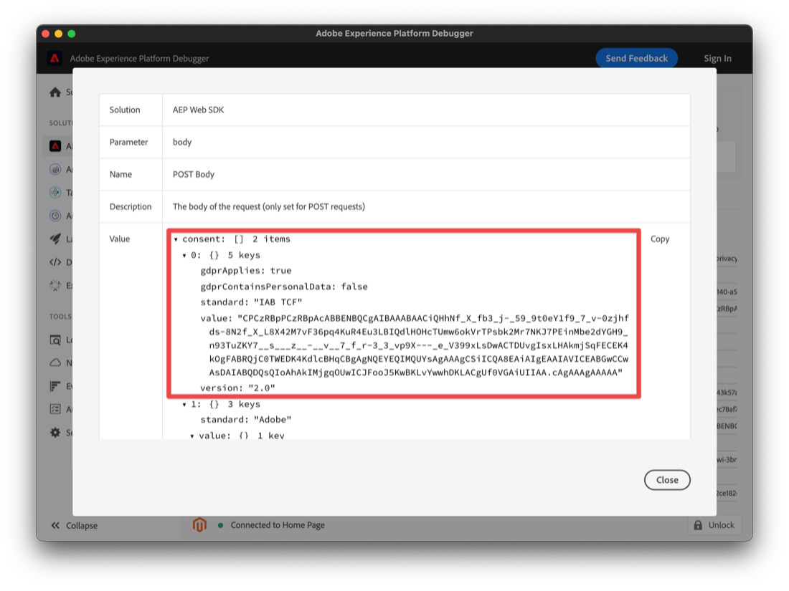

# 使用Platform Web SDK扩展通过同意管理平台(CMP)实施同意

许多法律隐私法规在数据收集、个性化和其他营销用例方面都引入了主动和特定同意的要求。 为了满足这些要求，Adobe Experience Platform允许您捕获单个客户配置文件中的同意信息，并将这些首选项用作决定如何在下游的Platform工作流中使用每个客户数据的因素。

>[!NOTE]
>
>Adobe Experience Platform Launch将作为一套数据收集技术集成到Adobe Experience Platform中。 界面中已推出一些术语更改，在使用此内容时，您应该注意这些更改：
>
> * platform launch（客户端）现在为 **[[!DNL tags]](https://experienceleague.adobe.com/docs/experience-platform/tags/home.html?lang=zh-Hans)**
> * platform launch服务器端现在为 **[[!DNL event forwarding]](https://experienceleague.adobe.com/docs/experience-platform/tags/event-forwarding/overview.html)**
> * 现在已提供边缘配置 **[[!DNL datastreams]](https://experienceleague.adobe.com/docs/experience-platform/edge/fundamentals/datastreams.html)**


本教程将演示如何使用数据收集中的Platform Web SDK扩展实施和激活从同意管理平台(CMP)获取的同意数据。 我们将同时使用Adobe标准和IAB TCF 2.0同意标准来执行此操作，例如，OneTrust或Sourcepoint为CMP。

本教程使用Platform Web SDK扩展将同意数据发送到Platform。 有关Web SDK的概述，请参阅 [本页](https://experienceleague.adobe.com/docs/experience-platform/edge/home.html?lang=en).

## 先决条件

列出了使用Web SDK的先决条件 [此处](https://experienceleague.adobe.com/docs/experience-platform/edge/fundamentals/prerequisite.html?lang=en#fundamentals).

在该页面上，需要一个“事件数据集”，而且，就像它的声音一样，这是一个用于保存您的体验事件数据的数据集。 要通过事件发送同意信息，请 [隐私详细信息字段组](https://github.com/adobe/xdm/blob/master/docs/reference/field groups/experience-event/experienceevent-privacy.schema.md)需要添加到您的体验事件架构中：


对于Platform Consent Standard v2.0，我们还需要访问Adobe Experience Profile以创建XDM个人配置文件架构和数据集。 有关创建模式的教程，请参阅 [使用架构编辑器创建架构](https://experienceleague.adobe.com/docs/experience-platform/xdm/tutorials/create-schema-ui.html?lang=en#tutorials) 和有关所需的“首选项详细信息”配置文件字段组，请参阅 [XDM文档](https://experienceleague.adobe.com/docs/experience-platform/landing/governance-privacy-security/overview.html?lang=en).

本教程假定您拥有数据收集的访问权限，并且已创建了客户端标记属性（其中安装了Web SDK扩展）以及创建和构建的工作库（用于开发）。 这些主题在以下文档中进行了详细说明和演示：

* [创建或配置资产](https://experienceleague.adobe.com/docs/experience-platform/tags/admin/companies-and-properties.html?lang=en#create-or-configure-a-property)
* [库概述](https://experienceleague.adobe.com/docs/experience-platform/tags/publish/libraries.html)
* [发布概述](https://experienceleague.adobe.com/docs/experience-platform/tags/publish/overview.html)

我们还将使用 [Platform Debugger](https://chrome.google.com/webstore/detail/adobe-experience-platform/bfnnokhpnncpkdmbokanobigaccjkpob) 用于检查和验证实施的Chrome扩展。

要在您自己的站点上通过CMP实施IAB TCF示例，您需要访问OneTrust或Sourcepoint等CMP以生成它们提供的数据，或者您只需按照此处查看以下结果即可。

## 在Adobe同意标准（v1.0或v2.0）中使用Web SDK

>[!NOTE]
>
>1.0标准正在逐步取消，以支持v2.0。2.0标准允许您添加可用于手动强制执行同意首选项的额外同意数据。 以下Platform Web SDK扩展的屏幕截图来自版本 [2.4.0](https://experienceleague.adobe.com/docs/experience-platform/edge/release-notes.html?lang=en#version-2.4.0) 与“Adobe同意标准”的v1.0或v2.0兼容的扩展。

有关这些标准的更多信息，请参阅 [支持客户同意首选项](https://experienceleague.adobe.com/docs/experience-platform/edge/consent/supporting-consent.html).

### 步骤1:在Web SDK扩展中配置同意

在标记资产中安装Platform Web SDK扩展后，我们可以在扩展配置屏幕上配置用于寻址同意数据的选项：


如果用户之前未提供同意首选项，则“隐私”部分会设置SDK的同意级别。 这可设置SDK中同意和事件数据收集的默认状态。 所选设置回答了“如果用户尚未提供明确的同意首选项，SDK应该怎么做？”的问题。

* 在中 — 收集在用户提供同意首选项之前发生的事件。
* Out — 删除在用户提供同意首选项之前发生的事件。
* 待定 — 在用户提供同意首选项之前发生的队列事件。
* 由数据元素提供

如果默认的同意设置为“In”，则会告知SDK，它不应等待明确同意，而且它应收集在用户提供同意首选项之前发生的事件。 这些首选项通常在CMP中处理和存储。

如果默认的同意设置为“Out”，则会告知SDK，它不应收集在设置用户选择加入首选项之前发生的任何事件。 在设置同意首选项之前发生的访客活动将不会包含在SDK在设置同意后发送的任何数据中。 例如，如果您在选择同意横幅之前滚动并查看网页，并且使用了此“退出”设置，则当用户稍后明确同意数据收集时，将不会发送滚动活动和查看时间。

如果默认的同意设置为“待定”，SDK将对用户提供同意首选项之前发生的任何事件进行排队，因此这些事件可能会在同意首选项设置之后以及SDK最初在访问期间配置之后发送。

在此“待定”设置下，尝试执行任何需要用户选择加入首选项的命令（例如，事件命令）将导致命令在SDK中排入队列。 在将用户的选择加入首选项告知SDK后，才会处理这些命令。

CMP收集用户首选项后，我们便可以将这些首选项告知SDK。 在下面的后续部分中，我们将了解如何获取该选择加入数据并将其与Web SDK扩展一起使用。

利用“由数据元素提供”，可访问包含由您网站或数据层中的自定义代码或CMP捕获的任何同意首选项数据的数据元素。 用于此目的的数据元素应解析为“in”、“out”或“pending”。

请注意：SDK的此配置设置不会持久保留到用户配置文件，它特定于在访客明确同意首选项之前设置SDK的行为。

要了解有关配置Web SDK扩展的更多信息，请参阅 [平台Web SDK扩展概述](https://experienceleague.adobe.com/docs/experience-platform/edge/extension/web-sdk-extension-configuration.html?lang=en#configure-the-extension) 和 [支持客户同意首选项](https://experienceleague.adobe.com/docs/experience-platform/edge/consent/supporting-consent.html).

在本例中，我们选择“Pending”选项，然后选择 **保存** 以保存我们的配置设置。

### 步骤2:传达同意首选项

现在，我们已设置SDK的默认行为，接下来可以使用标记将访客的明确同意首选项发送到平台。 使用Adobe1.0或2.0标准发送同意数据，可以在您的标记规则中使用Web SDK的setConsent操作轻松实施。

#### 使用平台同意标准1.0设置同意

让我们创建一个规则来演示此内容。 在平台标记属性中，选择规则，然后选择蓝色的添加规则按钮。 让我们将规则命名为“setAdobeConsent”，然后选择以添加事件。 对于事件类型，选择“Window Loaded”（已加载窗口），该规则将在页面加载到我们的网站时触发此规则。 接下来，在“操作”下选择“添加”以打开操作配置屏幕。 我们将在此处设置同意数据。 选择“扩展”下拉列表，选择“Platform Web SDK”，然后选择“操作类型”并选择“设置同意”。

在“同意信息”下，选择“填写表单”。 在此规则操作中，我们将使用Web SDK通过填写显示的表单来设置Adobe1.0同意标准的同意：


我们可以选择通过此“设置同意”操作传递“输入”、“输出”或“由数据元素提供”。 此处的数据元素应解析为“in”或“out”。

在此示例中，我们将选择“In”，以指示访客同意允许Web SDK将数据发送到平台。 选择蓝色的“Keep Changes”按钮以保存此操作，然后选择“Save”以保存此规则。

注意：网站访客选择退出后，SDK将不允许您在中设置用户同意。

您的标记规则可通过各种内置或自定义触发 [事件](https://experienceleague.adobe.com/docs/experience-platform/tags/extensions/adobe/core/overview.html?lang=en) 用于在访客会话期间的适当时间传递此同意数据。 在上例中，我们使用window loaded事件触发规则。 在后面的部分中，我们将使用CMP中的同意首选项事件触发“设置同意”操作。 您可以在由您喜欢的任何事件触发的规则中使用“设置同意”操作来指示选择加入首选项设置。

#### 使用平台同意标准2.0设置同意

平台同意标准版本2.0适用于 [XDM](https://experienceleague.adobe.com/docs/platform-learn/tutorials/schemas/schemas-and-experience-data-model.html?lang=zh-Hans) 数据。 它还要求将隐私详细信息字段组添加到平台中的用户档案架构。 请参阅 [平台中的同意处理](https://experienceleague.adobe.com/docs/experience-platform/landing/governance-privacy-security/consent/adobe/overview.html) 有关Adobe标准版本2.0和此字段组的详细信息。

我们将创建一个自定义代码数据元素，以将数据传递到以下架构中显示的同意对象的收集和元数据属性：


此首选项详细信息字段组包含 [同意和首选项XDM数据类型](https://experienceleague.adobe.com/docs/experience-platform/xdm/data-types/consents.html?lang=en#prerequisites) 其中将包含我们在规则操作中通过Platform Web SDK扩展发送到Platform的同意首选项数据。 目前，实施Platform Consent Standard 2.0所需的唯一属性是收集值(val)和元数据时间值，上面以红色突出显示。

让我们为此数据创建一个数据元素。 选择数据元素和蓝色的添加数据元素按钮。 让我们将此命名为“xdm-consent 2.0”，然后使用核心扩展选择自定义代码类型。 您可以输入以下数据，或将这些数据复制并粘贴到自定义代码编辑器窗口中：

```js
var dateString = new Date().toISOString();

return {
  collect: {
    val: "y"
  },
  metadata: {
    time: dateString
  }
}
```

时间字段应指定用户上次更新其同意首选项的时间。 我们在此处使用JavaScript Date对象上的标准方法创建时间戳作为示例。 选择保存以保存自定义代码，然后再次选择保存以保存数据元素。

接下来，我们选择规则，然后选择蓝色的添加规则按钮，输入名称“setConsent onLoad - Consent 2.0”。 我们选择Window Loaded事件作为规则触发器，然后在Actions下选择Add。 选择“平台Web SDK扩展”，然后对于“操作类型”，选择“设置同意”。 标准应为Adobe，版本应为2.0。对于值，我们将使用我们刚刚创建的数据元素，该数据元素包含发送到平台所需的收集值和时间值：


要查看此示例操作，我们将从Platform Web SDK扩展中调用设置同意，并从表单中传入标准和版本，同时从之前创建的数据元素中传递收集和时间值。

选择蓝色的“保存”按钮，然后再次选择以保存规则。

我们现在有两个规则，每个规则适用于平台同意标准。 在实践中，您可能会在整个网站中选择一个标准。 接下来，我们将使用IAB TCF 2.0同意标准创建一个示例。

## 在IAB TCF 2.0同意标准中使用Web SDK

您可以在 [IAB欧洲网站](https://iabeurope.eu/transparency-consent-framework/).

要使用此标准设置同意首选项数据，我们需要将隐私详细信息字段组添加到Platform中的体验事件架构：


此字段组包含IAB TCF 2.0标准所需的同意首选项字段。 有关架构和字段组的更多信息，请参阅 [XDM系统概述](https://experienceleague.adobe.com/docs/experience-platform/xdm/home.html?lang=zh_Hans).

### 步骤1:创建同意数据元素

为了使用IAB TCF 2.0同意标准从标记发送同意事件数据，我们首先使用必需的同意字段设置一个xdm数据元素：


在您的标记客户端属性中，选择数据元素和蓝色的“添加数据元素”按钮。 我们将为此示例的此数据元素命名为“xdm-consentStrings”。 这些xdm字段将包含IAB TCF 2.0标准所需的用户同意数据。

在“扩展”下拉菜单中，选择“Platform Web SDK”，然后对于“数据元素类型”，选择“XDM对象”。 此时应会显示xdm映射器，允许您选择和展开“consentStrings”项目，如上面的屏幕截图所示。

我们将按如下方式设置每个consentStrings:

* **`consentStandard`**:  `IAB TCF`
* **`consentStandardVersion`**:  `2.0`
* **`consentStringValue`**:  `%IAB TCF Consent String%`
* **`containsPersonalData`**:  `False` （从“选择值”按钮中选择）
* **`gdprApplies`**:  `%IAB TCF Consent GDPR%`

consentStandard和consentStandardVersion只是我们所使用标准（即IAB TCF版本2.0）的文本字符串。consentStringValue引用名为“IAB TCF同意字符串”的数据元素。 文本周围的百分比符号表示数据元素的名称，我们稍后将看到该名称。 containsPersonalData属性指示IAB TCF 2.0同意字符串是否包含任何具有“True”或“False”的个人数据。 gdprApplies字段会指示GDPR应用为“true”、GDPR不适用为“false”，或GDPR是否适用为“undefined”（未知）。 目前，Web SDK将“未定义”视为“true”，因此随“gdprApplies”一起发送的同意数据：“未定义”将被视为与访客位于适用GDPR的区域一样。

请参阅 [同意文档](https://experienceleague.adobe.com/docs/experience-platform/edge/consent/iab-tcf/with-launch.html?lang=en#getting-started) ，以了解有关这些属性和标记中IAB TCF 2.0的更多信息。

### 步骤2:创建规则以使用IAB TCF 2.0标准设置同意

接下来，我们创建一个规则，以在网站访客设置或更改此标准的同意数据时，使用Web SDK设置同意。 在此规则中，我们还将了解如何从CMP（如）中捕获这些同意更改信号 [OneTrust](https://www.onetrust.com/products/cookie-consent/) 或 [源点](https://www.sourcepoint.com/cmp/).

#### 添加规则事件

在平台标记属性中选择规则部分，然后单击蓝色的添加规则按钮。 让我们将规则setConsent - IAB命名为，然后在“事件”下选择“添加”。 让我们将此事件命名为addEventListener ，然后选择打开编辑器以打开自定义代码编辑器。

将以下代码复制并粘贴到编辑器窗口中：

```js
// Wait for window.__tcfapi to be defined, then trigger when the customer has completed their consent and preferences.
function addEventListener() {
  if (window.__tcfapi) {
    window.__tcfapi("addEventListener", 2, function (tcData, success) {
      if (success && (tcData.eventStatus === "useractioncomplete" || tcData.eventStatus === "tcloaded")) {
        // save the tcData.tcString properties in data elements
        _satellite.setVar("IAB TCF Consent String", tcData.tcString);
        _satellite.setVar("IAB TCF Consent GDPR", tcData.gdprApplies);
        trigger();
      }
    });
  } else {
    // window.__tcfapi wasn't defined. Check again in 100 milliseconds
    setTimeout(addEventListener, 100);
  }
}
addEventListener();
```

此代码只需创建并执行一个名为addEventListener的函数即可。 函数检查窗口是否。__tcfapi对象存在，如果存在，则会根据API的规范添加事件侦听器。 您可以在 [IAB存储库](https://github.com/InteractiveAdvertisingBureau/GDPR-Transparency-and-Consent-Framework) 在GitHub上。 如果成功添加此事件侦听器，并且网站访客已完成其同意和首选项选择，则代码会为tcData tcString设置标记自定义变量，并为GDPR区域设置指示器。 要进一步了解IAB TCF，请参阅IAB [网站](https://iabeurope.eu/transparency-consent-framework/) 和 [GitHub存储库](https://github.com/InteractiveAdvertisingBureau/GDPR-Transparency-and-Consent-Framework) ，以了解技术详细信息。 设置这些值后，代码会执行触发器函数，该函数会触发此规则的运行。

如果是窗口。__tcfapi对象在首次执行此函数时不存在，该函数将每100毫秒再次检查一次，以便可以添加事件侦听器。 最后一行代码只需执行在其上方代码行中定义的addEventListener函数即可。

总之，我们创建了一个函数，用于检查网站访客使用CMP（或自定义）同意横幅设置的同意状态。 设置同意首选项后，此代码将创建两个自定义变量（自定义代码数据元素），我们可以在规则操作中使用这些变量。 将上述代码粘贴到我们事件的自定义代码编辑器窗口中后，选择蓝色的Save按钮以保存规则事件。

现在，让我们设置Set Consent规则操作以使用这些值并将它们发送到Platform。

#### 添加规则操作

在操作部分中选择添加。 在Extension下，从下拉菜单中选择Platform Web SDK。 在“操作类型”下，选择“设置同意”。 让我们将此操作命名为setConsent。

在同意信息下的操作配置中，选择填写表单。 对于Standard，选择IAB TCF，对于版本，输入2.0。对于值，我们将使用事件中的自定义变量，然后输入%IAB TCF同意字符串%，该字符串%来自 [tcData](https://github.com/InteractiveAdvertisingBureau/GDPR-Transparency-and-Consent-Framework/blob/master/TCFv2/IAB%20Tech%20Lab%20-%20CMP%20API%20v2.md#tcdata) 我们在上述规则事件自定义函数中捕获了。

在“GDPR应用”下，我们将使用我们事件中的其他自定义变量，并输入%IAB TCF同意GDPR%，该变量也来自我们在上述规则事件自定义函数中捕获的tcData。 如果您知道GDPR将绝对或不会适用于此网站的访客，您可以根据需要选择是或否，而不是使用自定义变量（数据元素）选项。 您还可以在数据元素中使用条件逻辑来检查GDPR是否适用并返回相应的值。

在GDPR包含个人数据下，选择选项以指示此用户的数据是否包含个人数据。 此处的数据元素应解析为true或false。


选择蓝色的保存按钮以保存操作，选择蓝色的保存（或保存到库）按钮以保存规则。 此时，您已成功地在标记中实施了数据元素和规则，以在IAB TCF 2.0同意标准中使用Web SDK扩展设置同意。

### 步骤3:保存到库并构建

如果您使用 [工作库](https://experienceleague.adobe.com/docs/platform-learn/implement-in-websites/configure-tags/add-data-elements-rules.html?lang=en#use-the-working-library-feature) 先决条件是，您已保存这些更改并构建了开发库：


### 步骤4:Inspect和验证数据收集

在我们的网站上，我们刷新页面并确认中的库内部版本 [Debugger](https://chrome.google.com/webstore/detail/adobe-experience-cloud-de/ocdmogmohccmeicdhlhhgepeaijenapj) Chrome扩展，在标记菜单部分中：


我们还可以在Debugger Platform Web SDK部分中检查Adobe1.0或2.0标准的setConsent调用，方法是在网络请求的POST正文行中进行选择，您可以在该行中看到 `{"consent":[{"value":{"general":"in"},"version…`:


要验证setConsent调用和IAB TCF 2.0标准的规则，我们将在测试站点上使用OneTrust同意横幅来设置我们的同意首选项并创建前面所述的tcData:


选择“I Accept”后，我们可以在Debugger Platform Web SDK部分中检查IAB TCF 2.0标准的setConsent调用，方法是在网络请求的POST正文行中进行选择，您可以看到 `{"consent":[{"value":"someAlphaNumericCharacters…`.



在这里，我们可以看到我们之前在数据元素和标记规则中设置的数据。 value属性包含我们之前看到的编码tcString数据。

实施IAB TCF 2.0标准的OneTrust、Sourcepoint和其他CMP都会在我们的页面中生成类似的数据。 我们可以捕获该数据，并使用我们在上面创建的规则中的自定义代码事件，将其与标记中的Web SDK扩展一起使用。 无论用于生成IAB TCF 2.0数据的CMP是什么，自定义代码都将是相同的。 自定义代码还可以与平台同意标准（1.0或2.0）中的任一标准一起使用。

## 使用体验事件发送同意数据

您可能已注意到，我们未引用之前在任何规则的数据元素字段中创建的“xdm-consentStrings”数据元素。 当您需要通过体验事件发送同意数据时，此数据元素可供使用。


由于此数据元素包含IAB TCF 2.0标准所需的所有字段，因此在使用体验事件发送此xdm数据时，您只需引用该数据元素即可：


## 结论

现在，我们已检查并验证数据，您应该了解如何使用适用于Platform的Platform Web SDK扩展实施和激活从CMP获取的同意数据。
