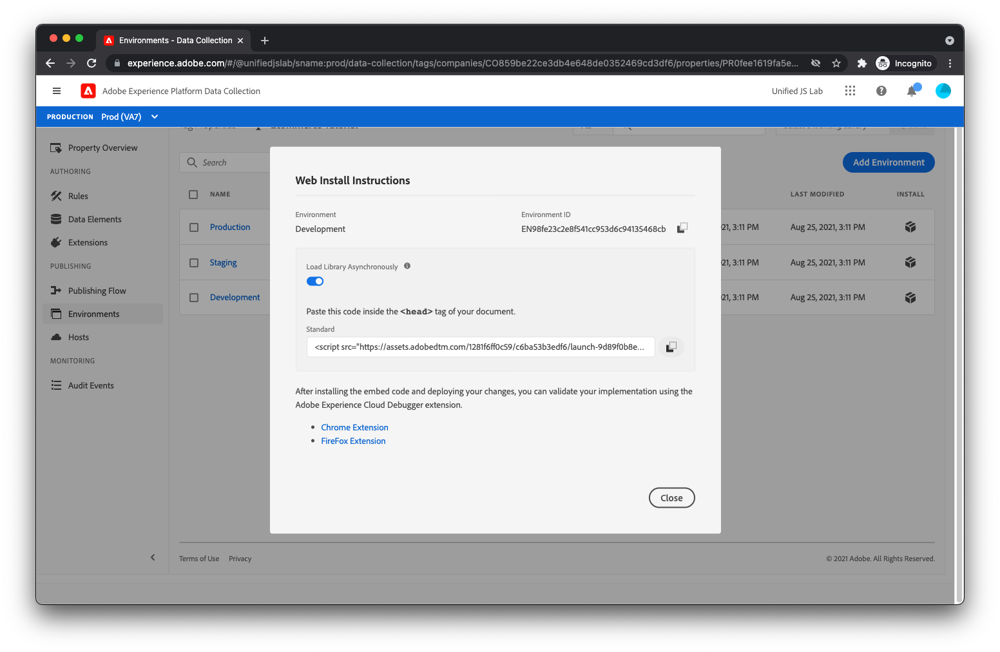

# 发布库

现在，该将标记库部署到您的网站上了。

## 创建库

首先，必须创建一个库，其中包含您创建的扩展、规则和数据元素。 要创建库，请选择 [!UICONTROL 发布流程] 菜单中。

选择 [!UICONTROL 添加库].

您应会看到库创建视图。


为库命名，如 _演示_. 选择 [!UICONTROL 开发] 在 [!UICONTROL 环境] 下拉列表。 然后，单击 [!UICONTROL Add All Changed Resources].

此时，您应会在 [!UICONTROL 资源更改]. 单击 [!UICONTROL 保存并构建到开发环境].

## 将嵌入代码添加到HTML

现在，您必须向加载新构建标记库的产品页面HTML中添加脚本标记。

首先，单击 [!UICONTROL 环境] 菜单中。 您应会看到列出三个不同的环境。


单击 [!UICONTROL 开发] 环境行。 您应会看到有关在页面上安装Launch库脚本的说明。



复制脚本标记（为方便起见，有一个复制到剪贴板按钮）。 打开您的产品页面HTML，并在 `</head>` 标记。 您的最终HTML应如下所示：

```html
<!DOCTYPE html>
<html lang="en">
  <head>
    <title>Product Page</title>
    <script>
      window.adobeDataLayer = window.adobeDataLayer || [];
      window.adobeDataLayer.push({
        "event": "pageViewed",
        "web": {
          "webPageDetails": {
            "name": "Foam Roller",
            "siteSection": "Equipment"
          },
        },
        "productListItems": [
          {
            "SKU": "eqfr08",
            "currencyCode": "USD",
            "name": "Foam Roller",
            "priceTotal": 18.95
          }
        ]
      });
      window.adobeDataLayer.push({
        "event": "productViewed"
      });
      window.onAddToCartClick = function() {
        // In a real implementation, you would change this condition to 
        // only pass if a cart doesn't already exist. You would typically 
        // do this by checking a cookie or variable value.
        if (true) {
          window.adobeDataLayer.push({
            "event": "cartOpened",
          });
        }
        window.adobeDataLayer.push({
          "event": "productAddedToCart"
        });
      };
      window.onDownloadAppClick = function() {
        window.adobeDataLayer.push({
          "event": "downloadAppClicked",
          "eventInfo": {
            "web": {
              "webInteraction": {
                "URL": "https://example.com/download",
                "name": "App Download",
                "type": "download"
              }
            }
          }
        });
      };
    </script>
    <!--Swap this script tag with your own-->
    <script src="https://assets.adobedtm.com/xxxxxxxxxxxx/xxxxxxxxxxxx/launch-xxxxxxxxxxxx-development.min.js" async></script>
  </head>
  <body>
    <h1>Foam Roller</h1>
    <p>This foam roller is composed of durable material that holds its shape and delivers deep tissue therapy. Purchase now for only $18.95!</p>
    <button type="button" onclick="onAddToCartClick()">Add to cart</button>
    <a href="https://example.com/download" onclick="onDownloadAppClick()">Download the app</a>
  </body>
</html>
```

查看 [发布标记文档](https://experienceleague.adobe.com/docs/experience-platform/tags/publish/overview.html) 如果您想进一步了解发布流程，请参阅。

接下来，您将测试新实施！
