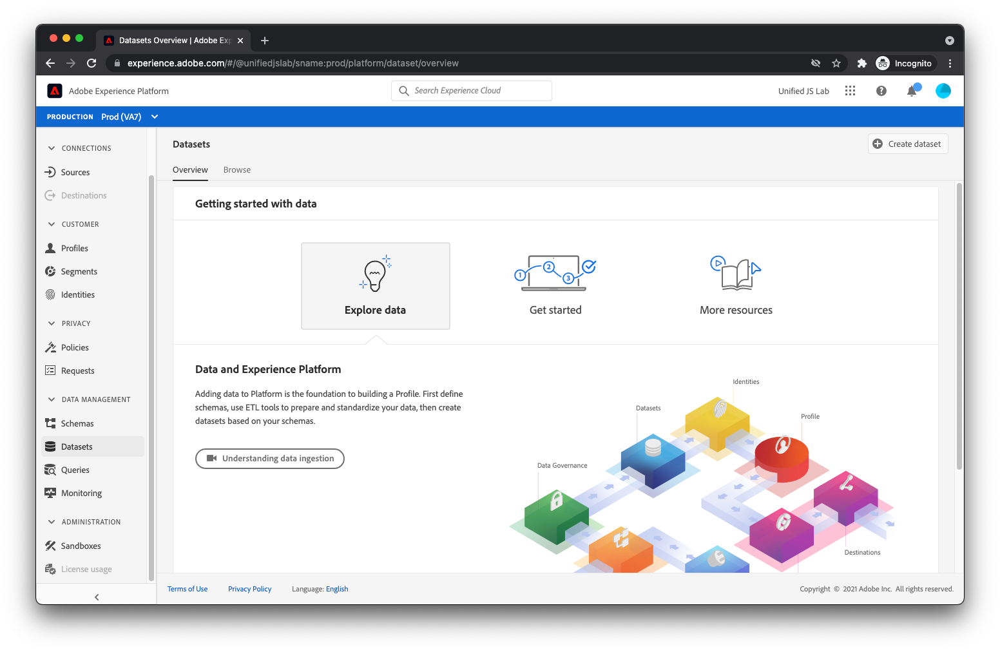

# 创建数据集

除了描述要发送到Adobe Experience Platform的数据之外，您还需要一个位置来保留数据。 在Adobe Experience Platform中，您可以放置数据的存储段称为数据集。

要创建数据集，请导航到 [!UICONTROL 数据集] 查看Adobe Experience Platform。

单击 [!UICONTROL 创建数据集] 中。

在数据集创建过程中，选择 [!UICONTROL 从架构创建数据集] 选择 [您之前创建的架构](create-a-schema.md).

单击 [!UICONTROL 下一个] 和提供名称和描述。

单击[!UICONTROL 完成]。您的数据集已创建，可接收数据。

在您开始将数据发送到数据集时，Adobe Experience Platform将验证您尝试放入数据集的数据是否符合应用的架构。 如果数据与架构不一致，则数据将被拒绝，并且不会放入数据集中。 通过此验证步骤，数据集的消费者(Adobe产品、第三方或您自己的公司)可以对数据集数据的结构和整洁程度有一定程度的确定性。

有关创建数据集的更多信息，请参阅 [数据集UI指南](https://experienceleague.adobe.com/docs/experience-platform/catalog/datasets/user-guide.html?lang=zh-Hans).
