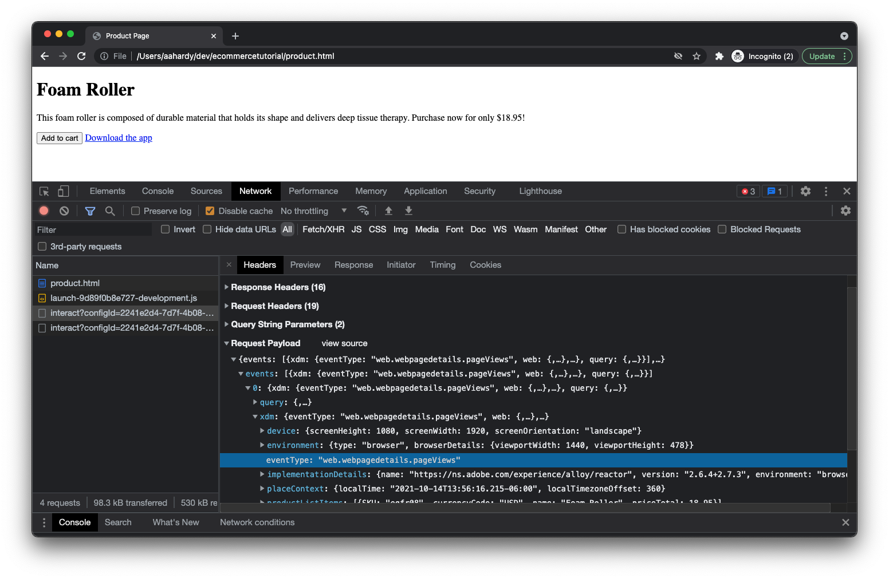

# 测试实施

现在，您已设置网页并部署了Adobe Experience Platform标记库，接下来该测试实施了。

在浏览器中打开产品页面。 您可以通过单击 _文件_ 则 _打开文件……_ 或者，您可以将页面托管在Web服务器上，并输入相应的URL。

加载页面后，您应会看到如下所示的内容：

它并不漂亮，但能起到作用。

## Inspect页面查看和产品查看事件

在浏览器中打开开发人员工具，然后单击“网络”面板。 刷新页面。

此时，您应该会看到四个请求：

1. product.html — 您的网页。
2. launch-###########-development.js - Launch库。
3. interact — 正在发送到服务器的页面查看事件。
4. interact — 发送到服务器的产品视图事件。

请随时检查每个请求的有效负载。 对于第一个 `interact` 请求时，您应该能够看到通过 `eventType` 之 `web.webpagedetails.pageViews`.

对于第二个 `interact` 请求时，您应该能够看到通过 `eventType` 之 `commerce.productViews`.

您可以随意浏览正在发送的其余数据，包括产品信息。

## Inspect打开的购物车并添加到购物车事件

现在，单击 _添加到购物车_ 按钮。

您应该会看到两个其他请求，第一个是带有的 `eventType` 之 `commerce.productListOpens` （用于打开新购物车）和具有 `eventType` 之 `commerce.productListAdds` （用于将产品添加到购物车）。

## Inspect下载应用程序链接点击事件

根据浏览器的不同，单击某个链接可使您离开当前页面，此时可能会清除您的网络面板。 由于您希望在离开页面之前检查链接点击事件的网络请求，因此您需要配置浏览器以跨页面保留网络日志。 这可以通过检查 _保留日志_ 复选框(Chrome、Safari、Edge)，或单击齿轮图标并选中 _保留日志_ 项目(Firefox)。

现在，单击 _下载应用程序_ 链接。

您应该再看到一个 `interact` 请求将显示在“网络”面板中。 如果检查请求，您应会找到 `eventType` 之 `web.webinteraction.linkClicks` 以及所点击的链接的详细信息。

## 检查数据是否到达Adobe Experience Platform数据集

现在，请求已发送，您还需要检查数据是否安全地抵达您创建的Adobe Experience Platform数据集。 首先，导航到 [!UICONTROL 数据集] 在Adobe Experience Platform中查看。

选择您之前创建的数据集。

您可能需要等待几分钟，但很快您应该会看到数据正在处理并插入到数据集中的指示。 您还应查看处理成功还是失败。 如果失败，您将能够了解失败的原因。 失败通常是因为您发送的数据与架构不匹配，您需要相应地调整数据或架构。

## 使用Adobe Experience Platform Debugger扩展

要更深入地了解您的实施在浏览器和Adobe服务器上的表现，请查看Adobe Experience Platform Debugger浏览器扩展！

[适用于Chrome的Adobe Experience Platform Debugger扩展](https://chrome.google.com/webstore/detail/adobe-experience-platform/bfnnokhpnncpkdmbokanobigaccjkpob)

[适用于Firefox的Adobe Experience Platform Debugger扩展](https://addons.mozilla.org/zh-CN/firefox/addon/adobe-experience-platform-dbg/)
