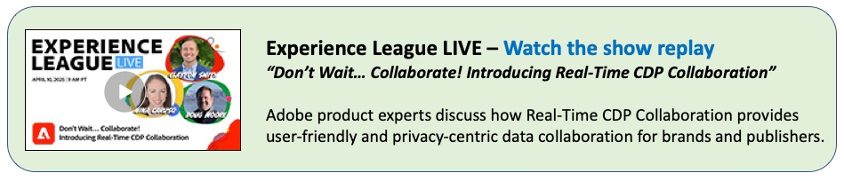

# Real-Time CDP Collaboration概述

借助Adobe Real-Time CDP Collaboration，您可以发现、激活和衡量高价值受众，而无需依赖第三方Cookie。 此解决方案支持协作者之间的高级数据协作，可帮助您在安全隐私的集中环境中创建个性化的、有影响力的客户体验。

在下面您将找到视频和其他资源，以帮助您了解如何设置、使用Real-Time CDP Collaboration并从中获益。 其他资产将会添加到此页面和网站，因此请经常回来查看。 祝您学习顺利！

有关详细信息，请参阅Real-Time CDP Collaboration [文档](https://experienceleague.adobe.com/en/docs/real-time-cdp-collaboration/using/home){target="_blank"}。

## 快速入门

<!-- CARDS
{cta=Watch}
* real-time-cdp-collaboration-intro.md
* rtcdp-overview-for-agency-practitioners.md
* rtcdp-collaboration-process-and-people.md

-->
<!-- START CARDS HTML - DO NOT MODIFY BY HAND -->

    

        

            

                <figure class="image x-is-16by9">
                    
                </figure>
            

            

                

                    

                        <a href="real-time-cdp-collaboration-intro.md" target="_blank" rel="referrer" title="Real-Time CDP Collaboration简介">Real-Time CDP Collaboration简介</a>
                    

                    
了解 Adobe Real-Time CDP Collaboration——一款专为数据协作打造的应用程序，可帮助您发现并激活高价值受众，并通过衡量功能推动实际业务成果。

                

                <a href="real-time-cdp-collaboration-intro.md" target="_blank" rel="referrer" class="spectrum-Button spectrum-Button--outline spectrum-Button--primary spectrum-Button--sizeM" style="align-self: flex-start; margin-top: 1rem;">
                    观看
                </a>
            

        

    

    

        

            

                <figure class="image x-is-16by9">
                    
                </figure>
            

            

                

                    

                        <a href="rtcdp-overview-for-agency-practitioners.md" target="_blank" rel="referrer" title="面向代理从业者的Real-Time CDP概述">面向代理从业者的Real-Time CDP概述</a>
                    

                    
代理和付费媒体团队可以快速了解Real-Time CDP — 它是什么、其工作方式以及数据源和受众如何推动协作工作流。

                

                <a href="rtcdp-overview-for-agency-practitioners.md" target="_blank" rel="referrer" class="spectrum-Button spectrum-Button--outline spectrum-Button--primary spectrum-Button--sizeM" style="align-self: flex-start; margin-top: 1rem;">
                    观看
                </a>
            

        

    

    

        

            

                <figure class="image x-is-16by9">
                    
                </figure>
            

            

                

                    

                        <a href="rtcdp-collaboration-process-and-people.md" target="_blank" rel="referrer" title="Real-Time CDP Collaboration — 流程和人员">Real-Time CDP Collaboration — 进程和人员</a>
                    

                    
此视频为Real-Time CDP Collaboration用户（包括代理从业人员和营销技术团队）提供了指南，介绍这些跨职能团队应如何在不同的用例、数据源、受众和目标中开展合作，以确保在采用Real-Time CDP Collaboration时获得成功并提高运营效率

                

                <a href="rtcdp-collaboration-process-and-people.md" target="_blank" rel="referrer" class="spectrum-Button spectrum-Button--outline spectrum-Button--primary spectrum-Button--sizeM" style="align-self: flex-start; margin-top: 1rem;">
                    观看
                </a>
            

        

    

<!-- END CARDS HTML - DO NOT MODIFY BY HAND -->

## 设置

要开始配置，请联系您的Adobe Experience Platform管理员，以确保您拥有设置Real-Time CDP Collaboration权限的适当访问权限，如后续教程中所述。 如果您无法识别Experience Platform管理员，请联系您的Adobe帐户团队。

<!-- CARDS
{cta=Watch}
* ../admin/add-product-administrators.md
* set-permissions-for-collaboration.md
* set-up-an-advertiser-account.md

-->
<!-- START CARDS HTML - DO NOT MODIFY BY HAND -->

    

        

            

                <figure class="image x-is-16by9">
                    
                </figure>
            

            

                

                    

                        <a href="../admin/add-product-administrators.md" target="_blank" rel="referrer" title="为基于Adobe Experience Platform的应用程序添加产品管理员">为基于Adobe Experience Platform的应用程序添加产品管理员</a>
                    

                    
了解如何为Adobe Experience Platform和基于平台的应用程序添加产品管理员。

                

                <a href="../admin/add-product-administrators.md" target="_blank" rel="referrer" class="spectrum-Button spectrum-Button--outline spectrum-Button--primary spectrum-Button--sizeM" style="align-self: flex-start; margin-top: 1rem;">
                    观看
                </a>
            

        

    

    

        

            

                <figure class="image x-is-16by9">
                    
                </figure>
            

            

                

                    

                        <a href="set-permissions-for-collaboration.md" target="_blank" rel="referrer" title="为Real-Time CDP Collaboration设置权限">为 Real-Time CDP Collaboration 设置权限</a>
                    

                    
了解如何设置访问和使用Real-Time CDP Collaboration所需的权限

                

                <a href="set-permissions-for-collaboration.md" target="_blank" rel="referrer" class="spectrum-Button spectrum-Button--outline spectrum-Button--primary spectrum-Button--sizeM" style="align-self: flex-start; margin-top: 1rem;">
                    观看
                </a>
            

        

    

    

        

            

                <figure class="image x-is-16by9">
                    
                </figure>
            

            

                

                    

                        <a href="set-up-an-advertiser-account.md" target="_blank" rel="referrer" title="在Real-Time CDP Collaboration中设置广告商帐户">在 Real-Time CDP Collaboration 中设置广告商帐户</a>
                    

                    
了解如何在 Real-Time CDP Collaboration 中设置广告商帐户（组织）。

                

                <a href="set-up-an-advertiser-account.md" target="_blank" rel="referrer" class="spectrum-Button spectrum-Button--outline spectrum-Button--primary spectrum-Button--sizeM" style="align-self: flex-start; margin-top: 1rem;">
                    观看
                </a>
            

        

    

<!-- END CARDS HTML - DO NOT MODIFY BY HAND -->

## 广告商工作流程

<!-- CARDS
{cta=Watch}
* reference-audiences-as-an-advertiser.md
* connect-with-publishers.md
* create-a-project.md
* discover-audience-overlaps-in-projects.md
* activate-audiences-in-projects.md
* brand-to-brand-collaboration.md

-->
<!-- START CARDS HTML - DO NOT MODIFY BY HAND -->

    

        

            

                <figure class="image x-is-16by9">
                    
                </figure>
            

            

                

                    

                        <a href="reference-audiences-as-an-advertiser.md" target="_blank" rel="referrer" title="在Real-Time CDP Collaboration中将受众引用为广告商">在 Real-Time CDP Collaboration 中作为广告商引用受众</a>
                    

                    
作为广告商，了解如何引用受众，将他们带入您的界面，以便在您与伙伴合作时使用他们。

                

                <a href="reference-audiences-as-an-advertiser.md" target="_blank" rel="referrer" class="spectrum-Button spectrum-Button--outline spectrum-Button--primary spectrum-Button--sizeM" style="align-self: flex-start; margin-top: 1rem;">
                    观看
                </a>
            

        

    

    

        

            

                <figure class="image x-is-16by9">
                    
                </figure>
            

            

                

                    

                        <a href="connect-with-publishers.md" target="_blank" rel="referrer" title="与Real-Time CDP Collaboration中的发布者联系">在 Real-Time CDP Collaboration 中与发布者建立联系</a>
                    

                    
作为广告商，了解如何与发布者建立连接以便与他们协作。

                

                <a href="connect-with-publishers.md" target="_blank" rel="referrer" class="spectrum-Button spectrum-Button--outline spectrum-Button--primary spectrum-Button--sizeM" style="align-self: flex-start; margin-top: 1rem;">
                    观看
                </a>
            

        

    

    

        

            

                <figure class="image x-is-16by9">
                    
                </figure>
            

            

                

                    

                        <a href="create-a-project.md" target="_blank" rel="referrer" title="在Real-Time CDP Collaboration中创建项目">在 Real-Time CDP Collaboration 中创建项目</a>
                    

                    
了解在 Collaboration 中创建项目的基础知识，并简要了解受众发现、激活与衡量功能。

                

                <a href="create-a-project.md" target="_blank" rel="referrer" class="spectrum-Button spectrum-Button--outline spectrum-Button--primary spectrum-Button--sizeM" style="align-self: flex-start; margin-top: 1rem;">
                    观看
                </a>
            

        

    

    

        

            

                <figure class="image x-is-16by9">
                    
                </figure>
            

            

                

                    

                        <a href="discover-audience-overlaps-in-projects.md" target="_blank" rel="referrer" title="发现Collaboration项目中的受众重叠">发现Collaboration项目中的受众重叠</a>
                    

                    
了解如何在Real-Time CDP Collaboration项目中比较受众重叠。

                

                <a href="discover-audience-overlaps-in-projects.md" target="_blank" rel="referrer" class="spectrum-Button spectrum-Button--outline spectrum-Button--primary spectrum-Button--sizeM" style="align-self: flex-start; margin-top: 1rem;">
                    观看
                </a>
            

        

    

    

        

            

                <figure class="image x-is-16by9">
                    
                </figure>
            

            

                

                    

                        <a href="activate-audiences-in-projects.md" target="_blank" rel="referrer" title="在Collaboration项目中激活受众">在Collaboration项目中激活受众</a>
                    

                    
了解如何在Real-Time CDP Collaboration项目中向协作合作伙伴激活受众。

                

                <a href="activate-audiences-in-projects.md" target="_blank" rel="referrer" class="spectrum-Button spectrum-Button--outline spectrum-Button--primary spectrum-Button--sizeM" style="align-self: flex-start; margin-top: 1rem;">
                    观看
                </a>
            

        

    

    

        

            

                <figure class="image x-is-16by9">
                    
                </figure>
            

            

                

                    

                        <a href="brand-to-brand-collaboration.md" target="_blank" rel="referrer" title="品牌到Collaboration">品牌到Collaboration</a>
                    

                    
了解品牌到品牌协作支持的用例以及为支持这些工作流而引入的特定功能。

                

                <a href="brand-to-brand-collaboration.md" target="_blank" rel="referrer" class="spectrum-Button spectrum-Button--outline spectrum-Button--primary spectrum-Button--sizeM" style="align-self: flex-start; margin-top: 1rem;">
                    观看
                </a>
            

        

    

<!-- END CARDS HTML - DO NOT MODIFY BY HAND -->
