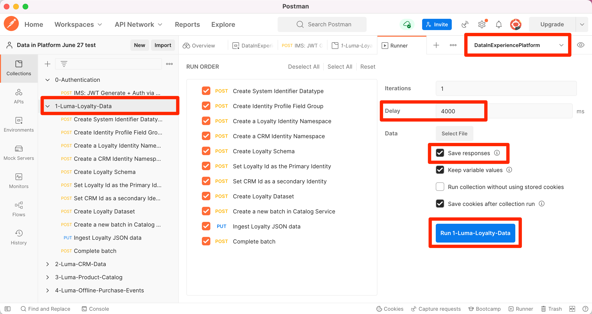

# 将样本数据导入到 Adobe Experience Platform

了解如何使用示例数据设置 Experience Platform 沙盒环境。使用 Postman 集合，您可以创建字段组、架构和数据集，然后将示例数据导入 Experience Platform。

## 示例数据用例

Experience Platform业务用户通常必须完成一系列步骤，包括确定字段组、创建模式、准备数据、创建数据集，然后摄取数据，然后才能探索Experience Platform提供的营销功能。 本教程将自动执行一些步骤，以便您能够尽快将数据导入Platform沙盒。

本教程重点介绍一个虚构的零售品牌Luma。 他们投资于Adobe Experience Platform以将忠诚度、CRM、产品目录和离线购买数据合并到实时客户档案中，并激活这些档案以提升其营销水平。 我们为Luma生成了示例数据，在本教程的其余部分中，您会将此数据导入您的一个Experience Platform沙盒环境。

>[!NOTE]
>
>本教程的最终结果是一个沙盒，其中包含与 [面向数据架构师和数据工程师的Adobe Experience Platform快速入门教程](https://experienceleague.adobe.com/docs/platform-learn/getting-started-for-data-architects-and-data-engineers/overview.html).

## 先决条件

* 您有权访问Experience PlatformAPI并知道如何进行身份验证。 如果没有，请查看 [教程](https://experienceleague.adobe.com/docs/platform-learn/tutorials/platform-api-authentication.html?lang=zh-Hans).
* 您有权访问Experience Platform开发沙盒。
* 您知道Experience Platform租户ID。 您可以通过进行身份验证来获取该域 [API请求](https://experienceleague.adobe.com/docs/experience-platform/xdm/api/getting-started.html?lang=en#know-your-tenant_id)
或者，在您登录到Platform帐户时，从URL中提取该帐户。 例如，在以下URL中，租户为“
`techmarketingdemos`&quot; `https://experience.adobe.com/#/@techmarketingdemos/sname:prod/platform/home`.

## 使用Postman {#postman}

### 设置环境变量

在执行这些步骤之前，请确保已下载 [Postman](https://www.postman.com/downloads/) 应用程序。  让我们开始吧！

1. 下载 [platform-utils-main.zip](../assets/data-generator/platform-utils-main.zip) 文件，其中包含本教程所需的所有文件。

   >[!NOTE]
   >
   >包含在 [platform-utils-main.zip](../assets/data-generator/platform-utils-main.zip) 文件是虚构的，仅用于演示目的。

1. 从下载文件夹中，移动 `platform-utils-main.zip` 文件到计算机上的所需位置，然后将其解压缩。
1. 在 `luma-data` 文件夹，打开所有 `json` 文件，并替换所有实例 `_techmarketingdemos` 使用您自己的租户id，前面有一个下划线。
1. 打开 `luma-offline-purchases.json` 在文本编辑器中更新所有时间戳，以便事件在上个月发生(例如，搜索 `"timestamp":"2022-06` 和替换年份和月份)
1. 请注意解压缩文件夹的位置，因为您稍后在设置 `FILE_PATH` Postman环境变量：

   >[!NOTE]
   > 要在Mac上获取文件路径，请导航到 `platform-utils-main` 文件夹，右键单击文件夹并选择 **获取信息** 选项。
   >
   > 

   >[!NOTE]
   > 要在窗口上获取文件路径，请单击以打开所需文件夹的位置，然后在地址栏中右键单击路径的右侧。 复制地址以获取文件路径。
   > 
   > 

1. 打开Postman，然后从 **工作区** 下拉菜单：\
   
1. 输入 **名称** 可选 **概要** ，请单击 **创建工作区**. Postman将在您创建时切换到新工作区。
   
1. 现在，调整一些设置以在此工作区中运行Postman收藏集。 在Postman的标题中，单击齿轮图标，然后选择 **设置** 以打开设置模式窗口。 您还可以使用键盘快捷键(CMD/CTRL + 、)打开模式窗口。
1. 在 `General` 选项卡，在ms中更新请求超时 `5000 ms` 启用 `allow reading file outside this directory`
   

   >[!NOTE]
   > 如果文件是从工作目录中加载的，则如果同一文件存储在其他设备上，则文件将跨设备顺利运行。 但是，如果希望从工作目录外部运行文件，则必须打开设置以声明相同的意图。 如果 `FILE_PATH` 与Postman的工作目录路径不同，则应启用此选项。

1. 关闭 **设置** 的上界。
1. 选择 **环境** 然后选择 **导入**:
   
1. 导入下载的json环境文件， `DataInExperiencePlatform.postman_environment`
1. 在Postman中，从右上方的下拉菜单中选择您的环境，然后单击眼睛图标以查看环境变量：
   

1. 确保填充以下环境变量。 要了解如何获取环境变量的值，请查看 [验证Experience PlatformAPI](/help/platform/authentication/platform-api-authentication.md) 分步说明教程。

   * `CLIENT_SECRET`
   * `API_KEY`—`Client ID` 在Adobe Developer控制台中
   * `TECHNICAL_ACCOUNT_ID`
   * `META_SCOPE`
   * `IMS`
   * `IMS_ORG`—`Organization ID` 在Adobe Developer控制台中
   * `PRIVATE_KEY`
   * `SANDBOX_NAME`
   * `CONTAINER_ID`
   * `TENANT_ID` — 例如，确保以下划线开头 `_techmarketingdemos`
   * `platform_end_point`
   * `FILE_PATH` — 使用已解压缩的本地文件夹路径 `platform-utils-main.zip` 文件。 例如，确保包含文件夹名称 `/Users/dwright/Desktop/platform-utils-main`

1. **保存** 更新的环境

### 导入Postman集合

接下来，您需要将收藏集导入Postman。

1. 选择 **收藏集** 然后选择导入选项：

   

1. 导入以下集合：

   * `0-Authentication.postman_collection.json`
   * `1-Luma-Loyalty-Data.postman_collection.json`
   * `2-Luma-CRM-Data.postman_collection.json`
   * `3-Luma-Product-Catalog.postman_collection.json`
   * `4-Luma-Offline-Purchase-Events.postman_collection.json`

   

### 身份验证

接下来，您需要验证并生成用户令牌。 请注意，本教程中使用的令牌生成方法仅适用于非生产用途。 本地签名从第三方主机加载JavaScript库，远程签名将私钥发送给Adobe拥有和运行的Web服务。 虽然Adobe不存储此私钥，但生产密钥绝不应与任何人共享。

1. 打开 `Authentication` 收藏集，选择 `IMS: JWT Generate + Auth via User Token` POST请求，然后单击 `SEND` 验证并获取访问令牌。

   

1. 查看环境变量，并注意 `JWT_TOKEN` 和 `ACCESS_TOKEN` 现已填充。

### 导入数据

现在，您可以准备数据并将其导入平台沙盒。 您导入的Postman系列将完成所有的繁重工作！

1. 打开 `1-Luma-Loyalty-Data` 收藏集，单击 **运行** 在“概述”选项卡上，启动“收藏集运行者”。

   

1. 在收集运行器窗口中，确保从下拉菜单中选择环境，更新 **延迟** to `4000ms`，请查看 **保存响应** 选项，并确保运行顺序正确。 单击 **运行Luma忠诚度数据** 按钮

   

   >[!NOTE]
   >
   >**1-Luma-Loyaty-Data** 创建客户忠诚度数据架构。 此架构基于XDM个人用户档案类、标准字段组以及自定义字段组和数据。 该集合使用架构创建一个数据集，并将示例客户忠诚度数据上传到Adobe Experience Platform。

   >[!NOTE]
   >
   >如果在Postman收集运行程序期间有任何收集请求失败，请停止执行并逐个运行收集请求。

1. 如果一切顺利， `Luma-Loyalty-Data` 收藏集应通过。

   

1. 现在，让我们登录 [Adobe Experience Platform界面](https://platform.adobe.com/) 和导航到数据集。
1. 打开 `Luma Loyalty Dataset` 数据集，然后在“数据集活动”窗口下，您可以查看成功的批量运行，该运行已摄取1000条记录。 您还可以单击预览数据集选项以验证摄取的记录。 您可能需要等待几分钟才能确认1000 [!UICONTROL 新配置文件片段] 创建。
   
1. 重复步骤1-3以运行其他集合：
   * `2-Luma-CRM-Data.postman_collection.json` 为客户的CRM数据创建架构并填充数据集。 此架构基于XDM个人用户档案类，该类包含人口统计详细信息、个人联系详细信息、首选项详细信息和自定义身份字段组。
   * `3-Luma-Product-Catalog.postman_collection.json` 为产品目录信息创建架构并填充数据集。 此架构基于自定义产品目录类，并使用自定义产品目录字段组。
   * `4-Luma-Offline-Purchase-Events.postman_collection.json` 为客户的离线购买事件数据创建架构并填充数据集。 此架构基于XDM ExperienceEvent类，包含自定义标识和商务详细信息字段组。

## 验证

样例数据经过设计，以便运行集合后，可构建可合并多个系统数据的实时客户配置文件。 例如，这是忠诚度、CRM和离线购买数据集的第一个记录。 查找该用户档案以确认已摄取数据。 在 [Adobe Experience Platform界面](https://platform.adobe.com/):

1. 转到 **[!UICONTROL 用户档案]** > **[!UICONTROL 浏览]**
1. 选择 `Luma Loyalty Id` 作为 **[!UICONTROL 身份命名空间]**
1. 搜索 `5625458` 作为 **[!UICONTROL 标识值]**
1. 打开 `Danny Wright` 个人资料

通过浏览 **[!UICONTROL 属性]** 和 **[!UICONTROL 事件]** 选项卡，您应该看到配置文件包含来自各种数据文件的数据：

## 后续步骤

如果您想了解合并策略、数据管理、查询服务和区段生成器，请跳转到 [数据架构师和数据工程师快速入门教程中的第11课](https://experienceleague.adobe.com/docs/platform-learn/getting-started-for-data-architects-and-data-engineers/create-merge-policies.html?lang=en). 您可以手动构建刚刚由这些Postman收藏集填充的所有内容，并享受开端！

如果要构建一个用于链接到此沙盒的Web SDK实施示例，请执行
[使用Web SDK实施Adobe Experience Cloud教程](https://experienceleague.adobe.com/docs/platform-learn/implement-web-sdk/overview.html?lang=zh-Hans). 在设置Web SDK教程的“初始配置”、“标记配置”和“设置Experience Platform”课程后，使用 `luma-crm.json` 使用密码的文件 `test` ，以查看配置文件片段与本教程中上传的数据合并。

如果要构建一个用于链接到此沙盒的Mobile SDK实施示例，请执行
[在移动设备应用程序中实施Adobe Experience Cloud教程](https://experienceleague.adobe.com/docs/platform-learn/implement-mobile-sdk/overview.html?lang=zh-Hans). 在设置Web SDK教程的“初始配置”、“应用程序实施”和“Experience Platform”课程后，使用 `luma-crm.json` 文件，以查看与本教程中上传的数据合并的配置文件片段。

## 重置沙盒环境 {#reset-sandbox}

重置非生产沙盒会删除与该沙盒（架构、数据集等）关联的所有资源，同时维护沙盒的名称和关联的权限。 对于有权访问该“干净”沙盒的用户，该沙盒将继续以相同的名称提供。

按照步骤操作 [此处](https://experienceleague.adobe.com/docs/experience-platform/sandbox/ui/user-guide.html?lang=en#reset-a-sandbox) 重置沙盒环境。
