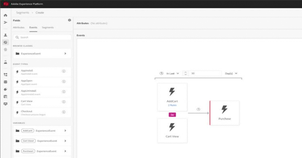

# Adobe Experience Platform教程

Adobe Experience Platform是市场上功能最强大、最灵活、最开放的系统，用于构建和管理可推动客户体验的完整解决方案。  Experience Platform 让组织可以实现源自任何系统的客户数据和内容的集中化和标准化，并应用数据科学和机器学习来显著改进丰富的个性化体验的设计和交付。通过这些视频和教程，您可以了解Experience Platform的许多组件。

## 新增功能

* **[配置基于属性的访问控制（视频）](admin/configure-attribute-based-access-control.md)**

   *限制对特定资源的访问*
* **[数据卫生概述（视频）](/help/platform/data-hygiene/overview.md)**

   *改进数据最小化实践*
* **[删除数据集（视频）](/help/platform/data-hygiene/delete-datasets.md)**

   *为数据集设置生存时间*

## 员工精选

<table style="margin-top: 0">
<tr>
  <td>
    
    

      <a href="intro-to-platform/a-customer-experience-powered-by-experience-platform.md">
    <strong>由Experience Platform提供支持的客户体验</strong>
    </a>
    

    

    <em>了解如何使用Platform来改善客户体验</em>
    

  </td>
  <td>
    
    

      <a href="https://experienceleague.adobe.com/docs/platform-learn/getting-started-for-data-architects-and-data-engineers/overview.html">
    <strong>数据架构师和数据工程师使用入门</strong>
    </a>
    

    

    <em>开始动手练习</em>
    

  </td>
  <td>
    
    

      <a href="sources/overview.md">
    <strong>了解源连接器</strong>
    </a>
    

    

    <em>轻松摄取数据</em>
    

  </td>
   <!--
   <td>
    
    

      <a href="data-ingestion/create-datasets-and-ingest-data.md">
    <strong>Create Datasets and Ingest Data</strong>
    </a>
    

    

    <em>Ingest your dataset.</em>
    

  </td>
  <td>
    
    

      <a href="segments/create-segments.md">
    <strong>Create Segments</strong>
    </a>
    

    

    <em>Build segments based on your data.</em>
    

  </td>-->
</tr>
</table>

